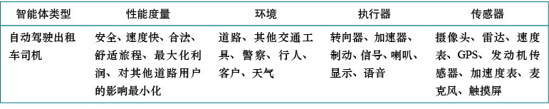

## **第一章：Introduction（引言）**
### **什么是AI？**
   - 探讨了AI的四种定义：
     - **类人行为**（如通过图灵测试）；
     - **类人思考**（认知建模）；
     - **理性思考**（基于逻辑的推理）；
     - **理性行为**（理性智能体方法）
       - 智能体(agent)就是某种能够采取行动的东西。
       - 理性智能体(rational agent)需要为取得最佳结果或在存在不确定性时取得最佳期望结果而采取行动。
       - 标准模型：人工智能专注于研究和构建做正确的事情的智能体，其中正确的事情是我们提供给智能体的目标定义。
   - 强调了现代AI的核心是**理性智能体**，即在环境中通过感知和行动最大化目标效用的系统。

> 摘抄：

> The quest for “artificial flight” succeeded when engineers and inventors stopped imitating birds and started using wind tunnels and learning about aerodynamics.

### **AI的历史与现状**
   - 从早期逻辑推理（如亚里士多德）到现代机器学习（如深度学习）的演变。
   - 当前AI的应用领域：自动驾驶、医疗诊断、游戏（如AlphaGo）、自然语言处理等。
   - 讨论了AI的潜在风险（如伦理问题、就业影响）与未来挑战（如超级智能的控制）。

### **AI的学科基础**
   - 哲学（理性与知识表示）、数学（逻辑与概率）、经济学（决策理论）、神经科学（脑模型）、心理学（认知、人机交互）、计算机工程（算法与硬件）、控制理论、语言学等领域的贡献。

## **第二章：Intelligent Agents（智能体）**
### **智能体的定义**
   - 智能体通过**传感器**感知环境，通过**执行器**行动，其行为由**智能体函数**（从感知序列到行动的映射）决定。
   - 示例：真空吸尘器智能体（根据当前位置和灰尘状态决定移动或清洁）。

    

### **理性与性能度量**
   - 一般原则：根据要实现目标而不是根据智能体如何表现来设计性能度量
     - 例如，对于吸尘器智能体，通过地板的干净程度而不是清理的灰尘量来度量。对于后者，理性智能体会选择反复倾倒后再次清扫。
   - **理性智能体定义**：在给定感知序列和先验知识下，选择能最大化性能度量的行动。
   - 需区分**理性**（基于可用信息的最优决策）与**全知**（完美预知结果）。

### **任务环境（PEAS描述）**
   - **性能（Performance）、环境（Environment）、执行器（Actuators）、传感器（Sensors）**。
     
   - 任务环境的属性：
     - 完全可观测、部分可观测、不可观测
     - 单智能体、多智能体
     - 确定性、非确定性：环境的状态是否完全由当前状态和智能体执行的动作决定
     - 回合式（每个回合，智能体执行单个动作。下一回合不依赖前几回合采取的动作）、连续式（当前决策可能会影响未来所有决策）
     - 静态的、动态的：环境是否在智能体思考时发生了变化
     - 离散的、连续的：离散/连续的区别适用于环境的状态、处理时间的方式以及智能体的感知和动作。
     - 已知的、未知的：严格来说，这种区别不是指环境本身，而是指智能体（或设计者）对环境“物理定律”的认知状态。
   - 示例：自动驾驶汽车的环境复杂（动态、连续、多智能体），而解谜游戏简单（静态、完全可观察）。

### **智能体结构**
   - 智能体=架构+程序
     - 智能体程序：实现从感知到动作的映射
     - 智能体架构：该程序将运行在某种具有物理传感器和执行器的计算设备上，称之为智能体架构
   - 四种基本智能体程序：
     - **简单反射型（Simple Reflex Agents）**：
       - 基于当前感知直接采取行动（如“如果前方刹车灯亮，则刹车”）。
       - 适用于完全可观察环境，在部分可观察环境中可能失效。
     - **基于模型的反射型（Model-Based Reflex Agents）**：
       - 通过转移模型（世界如何随时间变化）和传感器模型（世界状态如何反映在智能体感知中）跟踪世界的状态
     - **基于目标型（Goal-Based Agents）**：
       - 智能体还需要某种描述理想情况的目标信息
       - 智能体通过将**目标**与**模型**相结合，选择实现目标的动作
     - **基于效用型（Utility-Based Agents）**：
       - 在多个目标之间权衡，选择**期望效用（Expected Utility）**最大的动作（如平衡速度与安全）。
   - **学习型（Learning Agents）**：
     - 通过**学习元素（Learning Element）**优化性能，适应未知环境（如强化学习）。
     - 上述各种类型的智能体都可以构建成学习型智能体

### **环境表示方法**
   - **原子表示（Atomic）**：状态无内部结构（如“城市A”或“城市B”）。
   - **因子表示（Factored）**：状态由多个变量描述（如位置、油量、速度）。
   - **结构化表示（Structured）**：包含对象及其关系（如“卡车挡住奶牛”）。
