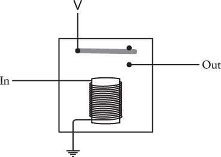
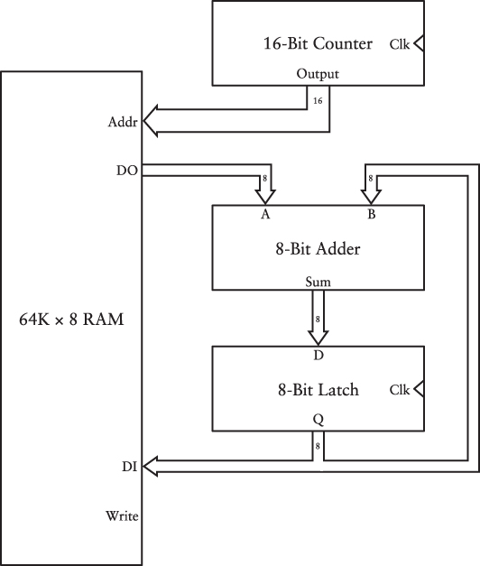
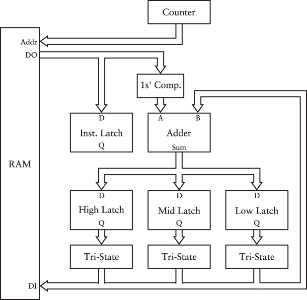
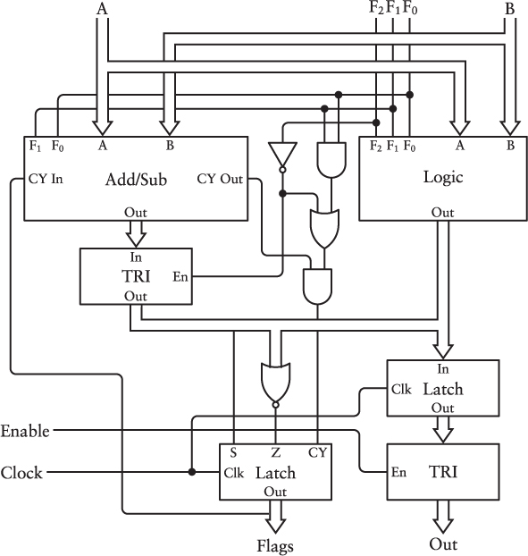
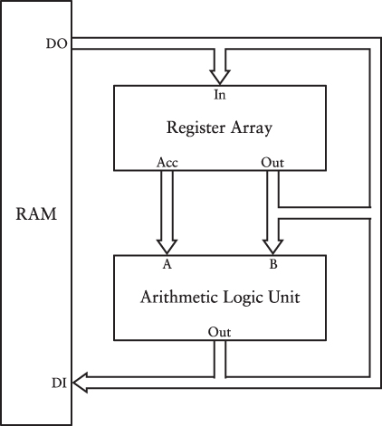
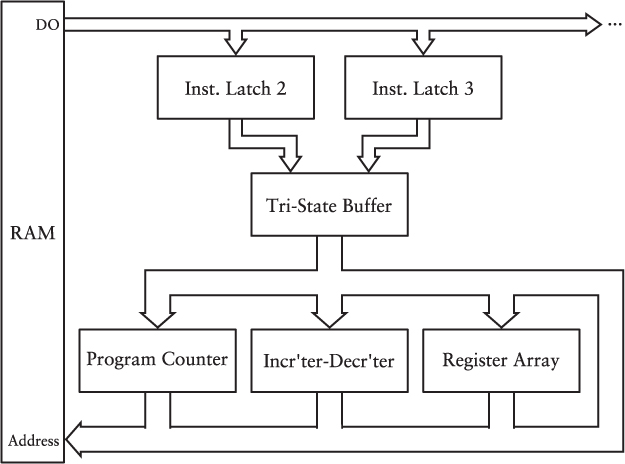

编码

1. 通过手电筒的明暗可以传递信息；使用摩斯码相比第几个字母闪几下的方式更高效。
2. 讨论摩斯码的编码与解码；摩斯码的编码从短到长，可以编码数量不同的字母，如最常用的E和T只用一位编码。指出`2`/二进制在摩斯码中的重要性。
3. 讨论盲文编码。最初设计盲文的是视力正常的人（Valentin Haüy (1745–1822)），陷入一个思维定式（paradigm）：盲文的A也是A的形状。这与用闪的次数表示第几个字母类似（vs 摩斯码）。
   现代盲文的来源是"night writing"：士兵需要在黑暗中安静地传递信息，使用凸出的点来编码信息。
   本章大部分篇幅讨论了盲文是如何编码的，包括如何防止混淆、如何更高效、如何表达更多字符等。
4. 手电筒的电路基础：电池、电阻、电压、电流等的概念
  > The “water and pipes” analogy is quite common in explanations of how electricity works,but eventually it breaks down, as all analogies must.
5. 用电路传递信息：包含电池-导线-开关-灯泡，通过A处的开关可以控制B处灯泡的亮和灭，从而传递信息。
   引入了地线的概念
6. 布尔代数基础。以及用电路表示布尔代数：串联的开关可以表示与，并联开关表示或。
7. 用电路传递信息与摩斯码结合，即用电话传递摩斯码，就是电报的基本原理。电报使用电磁铁而不是灯泡来表示摩斯码。
   远距离传输有个问题，随着距离增长，电阻增大，因此需要继电器。继电器可以放大原有信号，从而延长实际的传输距离。
   
8. 继电器可以作为一种可以通过电力而非手指来控制的开关。本章基于继电器设计基础的门电路，包括AND、OR、NOT、NOR、NAND等。门电路的组合可以表达更复杂的布尔逻辑。
9. 数字的表示：1. |的数量；2. 罗马数字；3. 阿拉伯数字
   阿拉伯数字与之前的数字系统的区别主要有三点：1. 有数位的概念；2. 没有特殊的符号表示10；3. 有数字0。
   阿拉伯数字的特点使得1. 做算术运算非常简单；2. 很容易应用到其他进制。

   > Our number system is so familiar to us that we don’t often recognize the elegance of its underlying structure.
10. 八进制、四进制、二进制的数字表示。
    用门电路制作3-8解码器和3-8编码器，进行二进制到八进制的相互转化。
    bit的来源是binary digit。
11. bit是信息的最小单位。bit表示的信息需要解码（需要知道每一位是0或1对应的实际意义）。
    本章详细解释了条形码(UPS Code)和二维码(QR Code), 可以看作使用多个位表示信息的例子。
    ## 本章的条形码、二维码及之前摩斯码、盲文的例子，还有另一个共性：在设计编码时，需要把编码解码的可靠性、实用性等考虑进来。也就是编码和使用该编码的环境是紧密关联的。
12. 字节与16进制。1Byte对应8bit，每个字节可以用两位16进制表示。
13. 讨论字符编码：ASCII Unicode以及一些历史上的其他编码方案
14. 用逻辑门实现累加器。
    半加器：输入两个被加数（各1bit），输出进位=AND，和=XOR
    全加器：第三个输入：进位，输出进位，和
    把全加器串联，就可以实现更多位的加法。
15. 真实的计算机是像上一章中的那种继电器制作的吗？引出了本章的计算机的历史。
    提到了早期的继电器机器：Z1（1935）&Z2 by Conrad Zuse；K1（1937）by George Stibitz；Harvard Mark I/Mark II；
    模拟计算机更早，如Differential Analyzer constructed by MIT professor Vannevar Bush；
    更早的巴贝奇的差分机和分析机；以及Ada在其中的贡献。(以及所谓第一个程序员)
    接下来，到1945年，真空管（电子管）已经基本替代继电器。ENIAC，EDVAC是真空管计算机。
    然后是晶体管替代真空管，集成电路替代晶体管。
16. 反码与补码；以及基于此的加/减法器
17. 反馈与震荡电路。本章依次构建了如下组件：
    振荡器（oscillator）；时钟即振荡器。原理是反相器的输出与输入连到一起，因为输入到输出总会有一个延迟，因此就形成了振荡。
    触发器（flip-flop）：在时钟触发下，改变并保持其状态的元件。
    R-S flip-flop：当开关都打开时，有两个稳定状态。或者说，记忆上次闭合的开关（Reset或Set）。
    level-triggered D-type flip-flop. The D stands for Data. Level-triggered means that the flip-flop saves the value of the Data input when the Clock input is at a particular level.
    edge-triggered D-type flip-flop: is constructed from two stages of level-triggered D-type flip-flops. 在时钟边沿触发。
    frequency divider: 边沿D触发器的输出 $\bar{Q}$连到输入D上，使得输出Q的频率是输入时钟的一半。
    Ripple counter: 多个frequency divider串联起来，每个输出作为二进制数值的一位，就变成了一个counter，每个时钟周期加一。
    edge-triggered D-type flip-flop with preset and clear：给边沿触发器增加set/clear端口。
18. 使用门电路制作钟表。大致分成两部分：
    - 通过一个1 Hz的时钟信号，制作二进制钟表，时间的数字使用BCD编码。通过灯泡亮暗表示二进制数。
    - 不同的显示十进制数字的方法，如常用的七段数码管（seven-segment display）、LED。（LED的显示原理挺有意思，利用了人的视觉暂留，逐列快速点亮LED灯）
19. 内存。内存的地址线、读、写电路实现。如65536字节 x 8位的内存。
    （按字节寻址，因此一个时钟周期只能读写一字节；另一方面，一个字节的8位是一起读写的。在电路层面，字节寻址与字节内的位寻址有本质的不同。这也反映在机器指令上，位运算需要单独的指令，不只是逻辑上的需要，也是物理上的限制）。
20. 自动累加器：内存、全加器、counter、latch再加上时钟，组成一个自动累加内存中值的机器。
    
    进一步，构造支持三字节、加减法的机器：    
    - 需要区分指令（add/sub/store/halt）和数据；
    - 在指令的机器码也需要精心设计：如add/sub共享很多硬件逻辑，那么最好也共享指令位。
    - 减法运算通过补码实现；
    - 数据存储：小端序
    基于三字节累加器，可以定义**软件**和**硬件**。
21 算术逻辑单元（ALU）:  
   - 算术加减：支持进位/借位标志
   - 逻辑操作：位运算 - 按位与或异或
   - 比较操作：减法，但不使用结果，而是需要进位标志和零标志（相等）
22 寄存器与总线
   - 寄存器就是之前电路中出现过的锁存器。8088定义了ABCDEHL几个寄存器，其中HL一般用于间接寻址。
     同样的指令操作不同寄存器时，对应着不同的机器码。
   - 寄存器A（Accumulator）相对特殊，所有算术或逻辑指令都会把结果存储到累加器中；ALU的一个INPUT直接连的是累加器。
   - 本章介绍了8088的指令的一个子集。add、sub、mvi、mov、位操作等。
   - 并实现它们。
   - 数据总线（data bus）：图中所有输入和输出的连接称为数据总线。这些输入输出连接到公共的数据总线上，当连接到数据总线的三态缓冲器启用时，该字节可用于数据总线上的所有位置，并且可以由数据总线上的任何其他组件使用。
   - 地址总线：用于访问内存。 
23 CPU控制信号
   控制信号大体上上归为两类：把值放到总线；从总线获取值。
   本章重点在于指令的执行过程，分析了指令集对应的信号设计，从而完成每条指令的功能。
   本章中设计的指令执行流程为：取指&PC+1、执行。
24 分支 - 循环、跳转、函数调用
   任何包含有条件跳转的语言本质上是等价的 —— 它们是图灵完备的。
   跳转指令可以继续在上一章设计的CPU基础上实现。
   本章给出了两种乘法的实现：1. 被乘数累加乘数次；2. 类似手算的方式，一位一位计算。
   本章介绍了call/ret指令以及相关的栈，但并没有继续实现。
25 外设，谈到了如下主题
   - MMIO，如GPU
   - IN/OUT指令：特殊的IO端口，不同外设分配不同的端口
   - 中断 vs polling
   - 数模转换 - 麦克风、扬声器
   - 图片 - 格式、压缩
   - 音频 - CD、压缩
   - 持久存储 - 软盘、硬盘、SSD
26 操作系统
   - 硬件建造好之后，需要软件/操作系统才能实际执行有意义的工作。
   - 首先，需要把代码加载到CPU开始执行指令的位置（对于8080来说是00h）。
     - 可以使用控制面板手动写入内存，但是当掉电后内存被重置；
     - 更好的方案是把代码存储在ROM中。这个ROM会占用一定的内存地址空间。
   - 可以实现命令处理器，允许用户交互；进而引入更复杂的功能。
   - 简要介绍了操作系统的历史，个人感觉写的不错。
27 编码
   - 简要描述了从机器指令到汇编到高级语言的自举的过程。
   - 简要介绍了高级语言的历史：FORTRAN、COBOL、ALGOL、BASIC、C、JavaScript
   - 浮点数的表示和精度问题
28 世界脑 - 互联网、知识共享、信息检索等。
