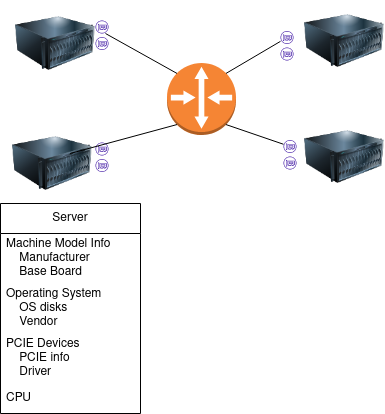
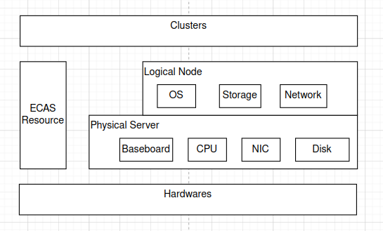

## 数据中心分层模型
```
        +----------------+
        |    Cluster     | Kubernetes/Openstack/ESS
  ECAS  +----------------+
        |    Hardware    | Server/Rack/Router
        +----------------+
        | Infrastructure | Power/Cooling/Physical security
        +----------------+
```

ECAS位于Hardware层之上，提供：

* 基础硬件模型
* 基础服务
  * 定义Boot Protocol，实现bootloader部分：
   Cluster的bootstrap，并把控制权转移给Cluster。不同类型的cluster都遵循该protocol。
  * 运行时功能：硬件管理


## 硬件模型


| 信息类型                  | 获取方式                              | 备注 |
|---------------------------|---------------------------------------|------|
| 机器基本信息              | dmidecode -t 1                        |      |
| 虚拟化信息                | systemd-detect-virt -v                |      |
| CPU                       | lscpu: dmidecode -t 4                 |      |
| Memory                    | dmidecode -t 16,17                    |      |
| Numa                      | numactl                               |      |
| Disk                      | /sys/block; /dev/disk; smartctl       |      |
| NIC                       | /sys/class/net; ethtool; ip; pyroute2 |      |
| PCI devices               | lspci -vDnnmm                         |      |
| NVME/SATA/SAS/USB devices |                                       |      |
| 带外 ipmi/bmc             | ipmitool /手动输入                    |      |
| OS基本信息                | cat /etc/os-release                   |      |

边界划定：
Linux (kernel)的标准化硬件

获取方式

1. linux kernel 导出的信息，如sysfs, procfs。
2. 业界标准对应的核心linux命令。 如lscpu, lspci， dmidecode，smartctl，ipmitool, numactl
3. 不包括第三方厂商等提供的命令。

问题：

1. 只能算大原则，针对具体硬件有模糊地带。linux kernel本身似乎并没有有意构建硬件模型，反而是在实现过程中自然形成的。
2. 大部分命令输出非标准化，大部分是惯例；我们不了解所有细节，无法预知在所有硬件上的输出。
3. 信息很多，需要取舍

实现考量：

* 信息首次采集（boot）与更新方式（事件，如netlink，udev）
* 需要能支持热更新硬件信息获取方案，以兼容不同硬件。
* 是否提供硬件框架，以允许其他组件注册/更新硬件？？

------------------

Q: 是否所有硬件都由ECAS管理？如何划分边界？

A: ECAS视角下分成两类：
   1. 有明确规范的组件：如PCIE设备；设备驱动。
      规范主要是根据业界规范，也可以是ECAS自定义的规范。
   2. 其他组件。**如果某个cluster使用到，该cluster需要自己管理。**

   对单个硬件实体来说，它的不同部分可以落到两类里。例如加密狗驱动属于第一类，但是加密狗的硬件信息收集属于第二类。

Q: 上述分类有没有清晰的边界，针对具体硬件如何归类？如ESS需要raid卡信息；VM/Container需要GPU

A: 似乎没有；根据经验，组织架构等综合来研判？另外对于一些标准硬件上的非标准扩展，也是类似的逻辑，比如智能网卡，dpdk。

Q: 不同类型Cluster/不同组件都需要某些硬件信息，没有统一管理会造成难以维护

A: 总会有取舍。比如同一类cluster下不同组件可以统一管理非标准化硬件。

### 兼容性模型
基于ECAS硬件模型构建兼容性模型。

兼容性可以分为两个层面：
   1. ECAS层面的兼容：如硬件可以被ECAS识别；操作系统；driver等。该层面与具体Cluster无关。
   2. Cluster层面的兼容性，跟具体Cluster类型有关。 例如：EOS不支持龙芯架构，但裸机可以支持；Raid卡/GPU型号支持，即使ECAS支持，包含相关驱动，上层cluster也不一定可用。

兼容性等级设定：生产/POC/理论分析/不兼容

## ECAS功能边界
硬件初始化 + ECAS基础配置 + 操作系统 + ECAS Services

ECAS**不能依赖**上层服务或Cluster。

Q: ECAS 与 EOS 的关系？

A1: ECAS服务不应该依赖EOS，只依赖基础操作系统 -> ECAS服务本身可能非云原生;

A2: ECAS依赖EOS，EOS在ECAS更下层-> 但EOS需要ECAS来发起安装，有些矛盾

Q: 如果上个问题是A1，那么基础服务(例如认证，DB，消息队列，GUI框架，HA机制)谁来提供？

A: 自包含在ECAS内部，跟具体Cluster中提供的服务无关。ECAS功能应该保持最简且闭环。

**ECAS services 提供以下功能：**

### 自管理
* ECAS自身初始化
* ECAS升级

### Bootstrap 不同cluster
* 定义Boot Protocol，发起Cluster初始化，并把控制权转移给Cluster。

### 硬件管理
* 硬件信息获取与展示
* 增删硬件到ECAS
  * 节点：负责节点的操作系统等具体cluster无关的初始化
  * 其他硬件：操作系统driver
* 硬件增删改等场景下与上层Cluster互动
  * 例如事件通知；API调用

### 与当前ECAS在功能层面对比
ECAS不再是某个特定类型Cluster的安装工具或升级工具/运维工具。所以针对特定集群类型的操作都不属于ECAS范畴。
这可能排除了当前ECAS的大部分功能，如集群部署升级；拓扑规划；任务编排；许可管理等。

Q: 是否应该提供一种插件机制，管理/对接上层Cluster相关逻辑，例如：
   * 对硬件管理，允许注册插件，管理扩展硬件；
   * 对于集群初始化，ECAS提供统一但插件化的Installer
   * 对于集群运维，抽象出通用运维操作，如节点维护；通过插件机制允许不同集群有不同操作。

A1: 不提供，保持ECAS简单且边界清晰；严格维持层级边界，避免互相依赖；也不会因插件质量影响ECAS的质量。

A2: 提供。优缺点：
   * 复杂性：上述例子中要求的每种插件机制都没有明确的边界和API；而且因为上层CLuster的开放性，在灵活性和设计稳定性上需要取舍
   * 可能一定程度上打破依赖层级。
   * 便于上层Cluster在相关层面的开发，减少维护工作量，减少重复工作等。

Q: 甚至ECAS的名称都不准确了？

A:


---------------
<br />



### 物理模型：从物理硬件角度
```
serversHardware:
  Base:
    name: HP 14s-cr2xxx
    SN: xxxx-xxxx
  CPU:
    capacity: 4
    current:
    - name: Intel(R) Core(TM) i5-10210U CPU @ 1.60GHz
  baseboard:
    name: HP-8658
    version: 62.16
    SN: PJGHB00WBE90PN
  nic:
  - name: Intel Corporation I350 Gigabit Network Connection (rev 01)
  nvme:
  - name: SK hynix BC511 HFM256GDJTNI-82A0A
    SN: CY06N101210906S1H
  raidController:
  - name: AVAGO_3108_MegaRAID
  GPU: {}
  PCI:
  - name: Comet Lake-U v1 4c Host Bridge/DRAM Controller
    slot: 0000:00:00.0
```

nic, disk, GPU是一个维度，以硬件功能区分，
PCI, USB是另一个维度，从连接/总线角度区分

### 逻辑模型
Node主要基于操作系统对硬件的*额外*抽象，可能关联到具体硬件，也可能不关联。
除了node，可能还有cluster等
```
Node:
  OS:
    name: "ESCL"
    version: "6.1"
    id: "escl"
  storage:
  - disk: disk/by-path/pci-0000:00:08.0
    name: sda
    size: 322122547200
  network:
  - name: ens4
    mac: aa:bb:cc:00:01:ff
    ip: 192.168.10.1/24
  driver: {}
```

ECAS需要
* 建立与维护物理模型与逻辑模型，以及针对兼容硬件的数据收集方法。
   例如
   1. 新类型硬件：支持DPU，需要更新模型字段和收集方法
   1. 新硬件：新款raid卡和raid卡工具，需要更新收集方法

* 操作系统管理。操作系统是逻辑模型的一部分，ECAS需要安装/升级操作系统

* 驱动管理。
  例如：
  1. 新硬件发现 -> 硬件信息更新 -> OS驱动更新 -> 软件信息更新

### 数据存储格式
数据存储，假设CRD+operator模式。

|                                                                  | Y                                                              | N               |
|------------------------------------------------------------------|----------------------------------------------------------------|-----------------|
| 分离存储：不同硬件存储到不同的CRD/yaml                           | 事件处理和权限管理可以更细粒度；server关联信息获取复杂         | 简单，CRD数量少 |
| ECAS侧硬件信息聚合：相同型号的硬件聚合成一个object，其他地方引用 | 只有部分信息可以聚合；聚合规则可能变化；server关联信息获取复杂 |                 |
| 中心化硬件信息聚合：在线上工具端聚合硬件信息                     | 应对ECAS侧聚合的问题；兼容性检查等不受影响                     | 重复数据较多    |

建议方案：分离存储+中心化硬件信息聚合。

示例，聚合后硬件组件：
```
  Server:
    HP Laptop 14s-cr2xxx:
      Manufacturer: HP
      Version: Type1ProductConfigId
      Serial Number: 5CG039BK3F
      Family: 103C_5335KV HP Notebook

  CPU:
    Intel(R) Core(TM) i5-10210U CPU @ 1.60GHz:
      manufacturer: Intel(R) Corporation
      family: Core i5
      ID: EC 06 08 00 FF FB EB BF

  BaseBoard:
    HP-8658:
      Manufacturer: HP
      Product Name: 8658
      Type: Motherboard

  NVME:
    SK hynix BC511 HFM256GDJTNI-82A0A: {}

  PCI:
    Comet Lake-U v1 4c Host Bridge/DRAM Controller:
      vendor: Intel
```

---------------
<br />

1. 单个硬件标准化问题
   * 如何确定特定硬件类型包含哪些信息
   * 从收集的单个硬件信息找到/生成对应的flavor和instance
     - 所有/部分字段hash，（hash冲突处理；修改逻辑转为增删逻辑）
     - 字段拼接

2. server内硬件之间关系
   * 如NIC，CPU隶属于server or baseboard

2. 兼容性
   * 平台升级后如何保证对已认证硬件的兼容性

3. 性能
   * 单个机器上网卡，磁盘数量可能比较多，最终cr数量可能比节点数高一个数量级

