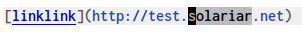
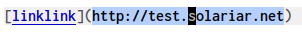

Load lisp file

https://stackoverflow.com/questions/2580650/how-can-i-reload-emacs-after-changing-it

You can use the command load-file (M-x load-file, then press return twice to accept the default filename, which is the current file being edited).

You can also just move the point to the end of any sexp and press C-xC-e to execute just that sexp. Usually it's not necessary to reload the whole file if you're just changing a line or two.

clangd
sudo dnf install clang-tools-extra

grub2.02
$ ./autogen.sh
$ ./configure
$ bear make

https://releases.llvm.org/9.0.0/tools/clang/tools/extra/docs/clangd/Installation.html

https://www.mortens.dev/blog/emacs-and-the-language-server-protocol/

clangd 用不了
8.0 不会index project
9.0 会自动index，但是很快coredump


https://github.com/porterjamesj/virtualenvwrapper.el/blob/5649028ea0c049cb7dfa2105285dee9c00d189fb/virtualenvwrapper.el#L93-L102
(projectile-project-root)


https://lists.fedoraproject.org/pipermail/devel/2012-January/160917.html

选中行并插入行号
https://emacs.stackexchange.com/questions/47633/elisp-program-to-insert-line-numbers-into-a-buffer
> Another way: C-x r N (verified). From emacswiki.org/emacs/NumberLines


emaclient desktop
https://debbugs.gnu.org/cgi/bugreport.cgi?bug=41719
https://www.reddit.com/r/emacs/comments/ia2yv4/how_can_i_set_wm_class_for_emacs_27/
https://unix.stackexchange.com/questions/521019/specifying-the-wm-class-of-a-program
https://specifications.freedesktop.org/desktop-entry-spec/desktop-entry-spec-latest.html

recentf: 记录文件访问位置

保存的自定义配置 会把所有配置改到custom.el，有些讨论
https://emacs.stackexchange.com/questions/15069/how-to-not-save-duplicate-information-in-customize
https://debbugs.gnu.org/cgi/bugreport.cgi?bug=21355 emacs 28 解决，可能可以解决这个而问题。
https://www.reddit.com/r/emacs/comments/g46sg2/a_solution_to_the_agony_of_customsetvariables_and/

TODO:
emacs lsp: find implementation short cut

ivy-switch-buffer 添加projectile文件
https://emacs.stackexchange.com/questions/62342/can-ivy-switch-buffer-add-the-current-projects-files-via-projectile
目前不好实现

Tips:
### Clickable text 行为
当用鼠标选择链接的部分字符时，看不到选择区域，选中区域的颜色被链接的高亮显示覆盖。比如在markdown mode，Help mode下



下图选中了相同文本，但鼠标在链接上时，根本看不出来被选中的文本是什么。


Emacs 显示文本时，实际的显示结果会[根据不同的配置合并后显示](https://www.gnu.org/software/emacs/manual/html_node/elisp/Displaying-Faces.html)。
例如markdown 模式下的链接，选中部分文本时，`describe-text-properties`结果为：
```
Text content at position 2286:


There are 2 overlays here:
 From 2241 to 2358
  face                 hl-line
  priority             -50
  window               #<window 5 on ...>
 From 2286 to 2290
  face                 region
  priority             (nil . 100)
  window               #<window 5 on ...>


There are text properties here:
  face                 (highlight-symbol-face markdown-url-face)
  font-lock-multiline  t
  fontified            t
  invisible            markdown-markup
  keymap               [Show]
  mouse-face           markdown-highlight-face
```
跟这个显示结果相关的是：
文本的face和mouse-faces属性分别是文本日常的显示以及鼠标在文本上是的显示。
overlay中定义的face和mouse-face比文本上直接定义的优先级高，多个overlay也根据优先级排序。
所以上面结果最终显示在当前文本上的face和mouse-face分别是`region`和`markdown-highlight-face`

当使用键盘选中区域时，按照`region` face显示，可以看出来选中区域。
但是当用鼠标选中区域时，因为鼠标目前在当前链接位置，会根据mouse-face按照`markdown-highlight-face`显示，这是就没法看出来选中区域了。

> face为`region`的overlay的优先级的值为特殊形式
> <https://www.gnu.org/software/emacs/manual/html_node/elisp/Overlay-Properties.html> 的说明。
> 达到的效果大概是希望选中区域比较大时，选中区域内部还可以显示不同的face。

解决方案：
1. 设置`mouse-highlight`变量为nil，设置后鼠标hover到链接上时，mouse-face不再生效。
2. 设置1后，鼠标hover到链接时没有反馈，可能容易误点。
   - 可以把`mouse-1-click-follows-link`设置为nil，这样只有鼠标中键(mouse-2)点击时才会访问链接。
   - 可以设置链接文本的pointer text-properties，设置为手型。这种方式基本上需要每个mode单独处理，而且mode很可能并没有变量或hook可以设置。比如markdown mode可以修改markdown.el，在相关的位置增加`'pointer 'hand`。
   ```
              ;; Link part (without face)
           (lp (list 'keymap markdown-mode-mouse-map
                     'pointer 'hand
                     'mouse-face 'markdown-highlight-face
                     'font-lock-multiline t
                     'help-echo (if title (concat title "\n" url) url)))
           ;; URL part
           (up (list 'keymap markdown-mode-mouse-map
                     'invisible 'markdown-markup
                     'pointer 'hand
                     'mouse-face 'markdown-highlight-face
                     'font-lock-multiline t))
   ```
[Defining Clickable Text](https://www.gnu.org/software/emacs/manual/html_node/elisp/Clickable-Text.html)
Emacs下很多链接的实现是基于[Button](https://www.gnu.org/software/emacs/manual/html_node/elisp/Buttons.html)的。

### 自动补全
[company-mode](http://company-mode.github.io/)是一个补全框架，设计了模块化frontend和backend接口可以用来对接不同的补全方案。
frontend用来显示与交互，backend用来产生补全的候选词。company本身提供的backend已经基本可以满足需求。

company的后端就是一个函数，company框架通过传递不同的参数实现与后端的交互。
后端函数接收的第一个参数称为命令，根据命令的不同，还可能有更多可选参数。
必须实现的两个command是prefix和candidates。前者返回当前光标处该后端进行补全的prefix，后者返回候选词列表。
需要prefix命令的原因是company框架本身可能会对prefix进行一些预处理，比如prefix长度大于一定阈值才会进行补全。
company框架本身不直接提供prefix，因为不同后端的补全逻辑不同，它的prefix也会不同。

### 移动到下一个括号等
| forward-list  | C-M-n | Move forward across one balanced group of parentheses.  |
| backward-list | C-M-p | Move backward across one balanced group of parentheses. |

