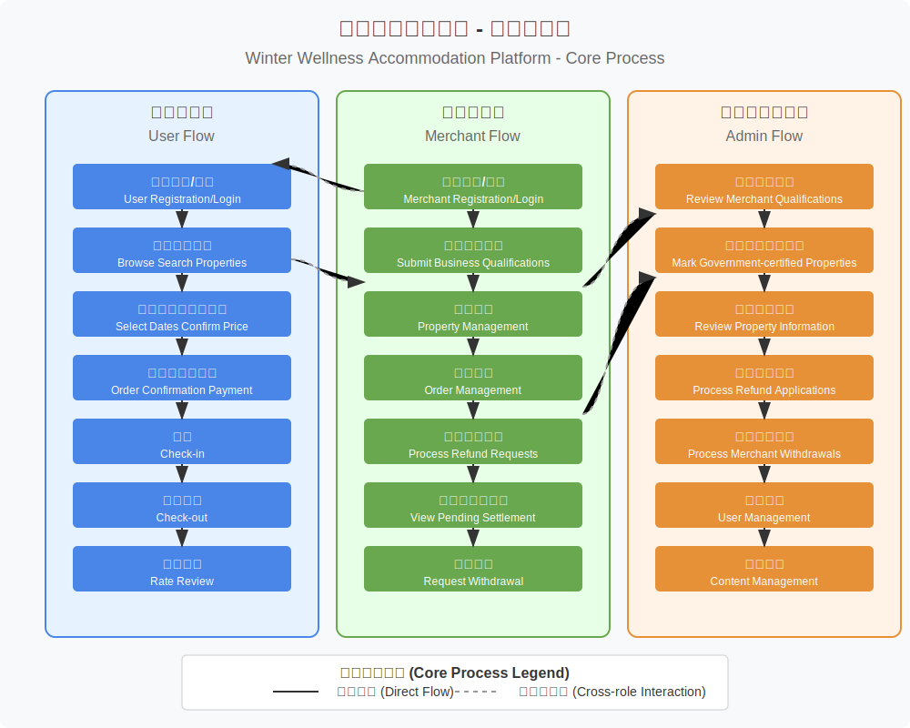

## 原始需求
### 一、平台定位与核心价值
目标用户

1. 需求侧：冬季康养人群（中老年为主，不同消费水平）、候鸟式旅居者、中长期差旅人士
2. 供给侧：某市本地康养型酒店/民宿（10-100间客房规模为主）
3. 核心差异：政府信用背书 + 低佣金模式（5%） + 垂直场景深度服务

### 二、功能模块需求

### 用户端功能（小程序/网站/App）
1. 精准搜索与筛选
   - 支持会员注册，根据用户定位智能推荐相应价位，也可手动搜索及筛选意向区域与价格
   - 支持按「入住时长」（周/月/季度）阶梯计价
   - 特色标签：康养配套（温泉/理疗/无障碍设施）、厨房配置、月租优惠
   - 政府认证标识（文旅局审核通过的优质房源）
   - 地图模式：标注医院、菜市场、公交站等旅居刚需设施
2. 深度房源展示
   - 多维度实拍：冬季采光、通风效果、适老化细节
   - 房东故事模块：本地康养文化、特色服务（如接送站/包月餐饮）
   - 历史客群画像：展示过往住客年龄/居住时长比例（增强信任感）
3. 灵活交易系统
   - 中长期合同在线签署（支持押金分期支付）
   - 费用透明化：水电费计价规则、清洁费说明、长租折扣计算器
   - 政府补贴入口：对接文旅局景点门票赠送/消费券发放系统
4. 社区化运营
   - 旅居攻略UGC：本地人推荐的买菜/就医/活动路线
   - 拼团预订：同一时间段用户自发组队享团体价[并发、硬件费用]
   - 邻里互助板块：二手家具转让、拼车信息发布

### （二）商家端功能（PC+移动端）
1. 极简入驻流程
   - 政府资质快速核验：营业执照自动对接工商数据库[某市工商是否具有该功能，是否能接入]
   - 房源批量导入工具：支持Excel模板一键生成房源信息
   - 智能定价助手：基于历史数据推荐周/月/季价格梯度
2. 数字化运营工具
   - 宣传素材生成器：自动将房源信息转为小红书/抖音模板
   - 空房期预测看板：结合过往订单预测淡旺季需降价时段
   - 政府合作入口：直达文旅局营销活动报名通道
3. 低成本获客模块
   - 流量扶持计划：新入驻商家前3个月优先展示
   - 老客维系工具：批量发送康养知识/本地活动通知
   - 跨界合作接口：对接本地医院体检套餐/旅行社线路[跟工商一样]

### （三）管理后台
1. 政府监管模块
- 诚信档案系统：整合用户评价、投诉记录、卫生抽查结果
- 应急响应中心：极端天气预警、突发停水停电通知推送
- 数据驾驶舱：实时监控过冬人群流入趋势、房源空置率
2. 风控体系
- 人脸识别入住核验（防黄牛炒房）
- 资金监管账户：预付款按日释放至商家[定金、待调研]
- 纠纷调解通道：政府人员介入的线上仲裁流程

### （四）商家结算与平台财务系统
1. 支付与结算模块
   - a. 多层级账户体系
      - 平台账户：政府监管的专用资金存管账户（与某市农商银行合作）
      - 商家虚拟账户：自动生成独立子账户，区分「待结算金额」「可提现金额」
      - 用户预付账户：支持押金/预付款冻结与按日释放
   - b. 智能分账规则
      - 自动化抽佣：订单支付时直接扣除5%佣金，剩余95%实时进入商家虚拟账户
      - 分场景结算策略：
        -  周租订单：入住3天后释放50%资金，退房后结算剩余部分
        - 月租及以上订单：按周分批结算（降低双方资金风险）
   - c. 结算周期灵活性
      - 商家自助设置提现周期：T+1（需付0.1%手续费）/ 周结/月结
      - 自动提现提醒：当账户余额超过5000元时推送微信提醒
2. 财务对账系统（平台端）
   - a. 双向穿透式对账[银行数据库对接]
      - 自动化交易核对：实时比对支付机构流水、商家账单、平台佣金数据
      - 异常订单预警：手续费不符/退款金额超限/重复支付等自动标红
   - b. 可视化财务报表
      - 多维数据看板：
      - 实时佣金地图：按行政区/房源类型显示抽成分布
      - 现金流预测：基于预订数据预估未来30天平台收入
   - c.  商家健康度评估：结算延迟率、退款纠纷率排名
   - d. B端财务工具
      - 电子账单批量导出：支持按「时间/房源/交易类型」生成标准CSV文件
      - 发票管理模块：[发票平台需要花钱]
      - 商家侧：自助申请开票（平台服务费电子发票）
      - 用户侧：代房东开具住宿费发票（需房东授权）

3. 资金风控体
   - 动态冻结机制
     - 纠纷触发冻结：当用户投诉且经政府调解员初步判定有效时，自动冻结对应金额
     - 商家违规冻结：卫生抽查不达标/虚假房源，按文旅局指令延迟结算
   - 审计追踪功能
     - 全链路留痕：从用户支付到商家提现的完整资金流时间戳存证
     - 敏感操作二次验证：大额退款（单笔超3000元）需财务主管+政府监管员双人脸识别[人脸识别接口需要花钱，额外花钱，需要权限]

---

## 需求分析

基于`原始需求`的全面梳理，识别出以下关键问题和潜在风险，需要在项目启动前明确并制定应对策略：

1.  **需求范围过大，实施复杂度高：**
    * 原始需求涵盖了从用户端小程序/网站/App、商家端PC+移动端，到具备政府监管和复杂财务功能的管理后台，功能模块众多且深度要求高（如AI推荐、UGC社区、拼团、在线合同、多层级财务系统等）。
    * 一次性开发所有功能，将导致开发周期过长、投入成本巨大、项目管理难度激增，且无法快速验证核心商业模式。
    * **解决思路**，需要进行分期开发。首期（MVP）应聚焦核心交易流程，快速推向市场收集反馈，后续迭代优化。

2.  **外部依赖与不确定性高：**
    * **政府深度整合风险：** 信用背书、资质核验自动对接、补贴发放、政府人员介入仲裁、监管数据驾驶舱等功能，强依赖于与**某市**特定政府部门（文旅局、工商局、可能还有公安/金融监管）的合作意愿、接口开放能力、数据标准和响应效率。这些环节存在政策变动、技术壁垒、沟通成本高等不确定性。
    * **银行/金融接口风险：** 建立政府监管的专用资金存管账户、实现多层级虚拟账户体系、自动化分账、按日释放资金、与银行对账等功能，需要与特定银行（如某市农商银行）进行深度技术对接。银行的合作意愿、接口费用、开发周期、以及合规性（如支付牌照、二清风险）是关键不确定因素。
    * **第三方API依赖：** 实名认证、人脸识别、工商数据对接、电子发票、地图服务、短信通道等均需依赖第三方服务。需评估其稳定性、成本、数据安全及合规性。

3.  **核心功能细节缺失或模糊：**
    * **订单生命周期管理：** 从预订、支付（定金/全款/分期）、确认、入住、完成、评价、取消、退款（规则/流程）、纠纷处理等状态流转不清晰，用户端与商家端如何协同操作未详细定义。
    * **阶梯计价与优惠逻辑：** “周/月/季度”阶梯计价的具体计算规则、与其他优惠（如月租优惠、政府补贴、拼团价）叠加逻辑需要明确定义。
    * **智能推荐/定价：** “智能推荐相应价位”、“智能定价助手”的具体算法、数据来源、冷启动问题未定义。
    * **社区化运营细节：** UGC内容审核机制、拼团失败处理、邻里互助信息安全与真实性保障等需要细化。

4.  **潜在风险：**
    * **信息安全风险：**
        * **资金安全：** 涉及中长期预付款、押金、分期支付、平台抽佣、商家结算等复杂资金流转，需设计极其严密的反欺诈、防盗刷、防挪用机制，确保资金链路安全、透明、可追溯。资金存管方案需严格符合金融监管要求，避免“二清”风险。
        * **数据隐私安全：** 平台需收集用户身份信息（实名认证）、联系方式、入住偏好、交易记录，以及商家经营数据。必须严格遵守《网络安全法》、《个人信息保护法》等法律法规，制定完善的数据加密、脱敏、访问控制、隐私政策，防止数据泄露和滥用。
    * **合规性风险：**
        * **平台运营资质：** 作为在线旅游平台（OTA）或信息服务平台，需确保符合国家及地方关于互联网信息服务、电子商务、旅游住宿业的相关法律法规。
        * **合同与纠纷处理：** 在线合同的法律效力、押金处理规则、政府介入调解的法律依据和流程都需要法律专业人士的评估。
        * **财务合规：** 佣金模式、发票开具（平台服务费 vs. 房东住宿费）、税务处理需符合财税法规。
    * **运营风险：**
        * **政府关系依赖：** 过度依赖政府背书和资源，可能因政策变化或合作中断带来运营风险。
        * **低佣金模式盈利能力：** 5%的低佣金是否能覆盖平台运营成本（技术、人力、营销、合规、风险拨备等）并实现盈利，需要精密的财务测算和持续的成本控制。
        * **市场接受度：** 能否有效获取目标用户和优质商家，形成网络效应，是模式成功的关键。
    * **技术选型与成本风险:** 同时支持多端（小程序、网站、App、PC后台）开发维护成本高。部分高级功能（如人脸识别、AI预测）技术实现复杂且成本不菲。

---

## 产品功能说明（一期 - MVP）

**目标：** 验证核心商业模式——为冬季康养旅居用户提供一个可信赖的、专注于中长期（周/月/季）租赁的房源预订平台，并为本地中小规模康养型酒店/民宿提供一个低成本的获客渠道。**核心是打通“找房 - 预订 - 支付 - 入住”的核心交易流程。**

**原则：** 聚焦核心、快速上线、优先小程序端、简化流程、手动/半自动处理非核心或复杂环节。

---

### (一) 微信小程序（用户端 - 核心）

1.  **用户基础功能：**
    * **注册/登录:**
        * 手机号 + 短信验证码注册/登录。
        * 微信授权一键登录/绑定。
    * **实名认证:**
        * （*必要时*）入住前或首次预订时，需提供姓名 + 身份证号，对接第三方接口进行基本校验。（明确一期是否强制，或仅提示）
    * **个人中心 (简化版):**
        * 查看/编辑基本个人信息（昵称、头像）。
        * 我的订单列表入口。
        * 我的评价入口。

2.  **核心预订流程：**
    * **房源搜索与浏览:**
        * **搜索入口:** 支持按**城市/区域**、**入住/退房日期**、**入住人数**进行搜索。
        * **筛选条件 (核心):**
            * 价格范围（手动拖动选择）。
            * **入住时长倾向选择** (引导用户选择“周租”、“月租”、“季租”，影响价格展示和排序，但不强制完全匹配搜索日期)。
            * **核心特色标签筛选:** 如“带厨房”、“近医院”、“近菜市场”、“温泉”、“无障碍设施”。
        * **房源列表展示:**
            * 封面图、标题（房型/特色）、**参考起价**（例如显示月租起价）、核心标签、商家名称。
            * **“政府认证”标识**（由管理员后台手动标记）。
        * **房源详情页:**
            * 多图展示（确保包含关键设施照片，如卧室、卫生间、厨房、采光、必要时提供适老化细节照片）。
            * 房源描述、详细地址（可模糊到小区或街道）。
            * 设施清单（勾选展示）。
            * **价格日历:** 展示不同日期范围内的可用性及对应的**阶梯价格**（根据下方确认的计价策略计算）。
            * 费用说明（清晰列出租金、押金（如有）、清洁费（如有）、水电费计价方式预估或说明）。
            * 商家基本信息（名称，可留联系电话入口，但初期不强制在线沟通功能）。
            * 用户评价列表（如有）。

    * **预订与支付:**
        * **选择日期与价格确认:** 用户在日历选择入住、退房日期后，系统根据**阶梯计价策略**自动计算总价。
        * **填写预订信息:** 入住人姓名、联系电话（默认使用注册手机号）。
        * **订单确认页:** 展示房源信息、入住日期、费用明细（租金、押金、其他费用）、总金额。
        * **支付:**
            * 对接**微信支付**、**支付宝支付**。
            * 支付方式：**全款支付**（包含租金+押金，如有）。*一期暂不做分期支付*。
            * 支付至**平台指定对公账户**或**合作银行监管账户**（需明确一期方案）。

3.  **订单管理 (简化版):**
    * **我的订单列表:** 展示订单状态（待支付、待入住、已入住、已完成、已取消、退款中/完成）。
    * **订单详情:** 查看订单所有信息、房东联系方式（支付成功后可见）、入住凭证（如订单号/二维码）。
    * **申请取消/退款:** 用户可在特定规则下（如入住前X天）发起取消申请。退款流程初期可由**管理员后台人工审核处理**。
    * **订单评价:** 入住完成后，用户可对房源、服务进行评分和文字评价（带审核机制）。

---

### (二) 商家后台（Web端 - 核心）

1.  **商家入驻与管理:**
    * **注册/登录:** 手机号+验证码 或 用户名+密码。
    * **资质提交:** 手动上传营业执照、法人身份证等信息。由**管理员后台人工审核**。（*暂不接工商接口*）
    * **基本信息管理:** 维护酒店/民宿名称、地址、联系方式等。

2.  **房源管理:**
    * **房源发布/编辑:**
        * 手动创建房源：填写房源标题、描述、选择区域、地址、房型、面积、可住人数等。
        * 上传房源图片。
        * 勾选/自定义设施标签。
        * **设置价格:**
            * 设置基础日价。
            * 设置**周/月/季度的阶梯优惠价**（按下方确认的策略）。
        * **设置库存/可预订日历:** 手动管理房源在未来一段时间内的可预订状态（开放/关闭）。
    * **房源列表:** 查看、上架/下架、删除房源。
    * *暂不提供批量导入、智能定价。*

3.  **订单管理:**
    * **订单列表:** 查看所有来源本店的订单（状态：待确认（如需）、待入住、已入住、已完成、已取消等）。
    * **订单详情:** 查看住客信息、入住日期、费用构成。
    * **接单/确认订单:** （可选流程，若需商家确认）商家手动确认订单。
    * **处理退款请求:** 查看用户退款申请，（配合平台规则）同意或拒绝退款（*最终操作由管理员后台执行*）。

4.  **结算管理 (极简版):**
    * **查看可结算金额:** 显示根据平台结算规则（例如，用户入住后X天结算部分款项，离店后结算尾款 - *具体规则需明确*）计算出的待结算/已结算金额。
    * **提现申请:** 手动发起提现请求。*初期由管理员后台人工处理打款*。
    * *暂不做复杂的虚拟账户、自动分账、多种结算周期选择。*

---

### (三) 管理员后台（Web端 - 核心）

1.  **用户管理:**
    * 查看用户列表、基本信息、实名认证状态。
    * 管理用户账户（如冻结违规用户）。

2.  **商家管理:**
    * 审核商家入驻申请（核对资质）。
    * 管理商家信息、房源信息。
    * **手动标记“政府认证”房源**。
    * 管理商家账户（如冻结违规商家）。

3.  **房源管理:**
    * 审核商家发布的房源信息（图片、描述等合规性）。
    * 管理平台房源标签库。

4.  **订单管理:**
    * 查看平台所有订单列表及详情。
    * **处理取消/退款申请:** 根据平台规则审核用户的退款请求，执行退款操作（线上或线下）。
    * 处理订单纠纷（初期人工介入）。

5.  **内容管理:**
    * 管理平台公告、帮助中心等基础内容。
    * 评价审核与管理。

6.  **财务管理 (简化版):**
    * 查看平台交易流水。
    * **处理商家提现申请:** 审核商家提现请求，线下或通过网银完成打款操作，并记录状态。
    * 基础的数据统计（如订单量、交易额）。
    * *暂不做复杂报表、自动化对账、佣金地图等。*

---

### (四) 其他（一期需确认和包含）

1.  **必需的第三方接口对接:**
    * **短信服务:** 用于注册、登录验证码。
    * **支付接口:** 微信支付、支付宝支付。
    * **实名认证接口:** （如一期强制）用于校验用户身份。
    * **小程序地图服务:** （可选，用于展示房源大致位置，非POI标注）
2.  **明确核心业务规则:**
    * **入住时长阶梯计价策略:** 必须明确具体计算逻辑，例如：
        * 入住 `d` 天。
        * 若 `d < 7`，总价 = 日价 * `d`
        * 若 `7 <= d < 30`，总价 = (周价 / 7) * `d`
        * 若 `30 <= d < 90`，总价 = (月价 / 30) * `d` (按30天计还是自然月？)
        * 若 `d >= 90`，总价 = (季价 / 90) * `d` (按90天计还是自然季？)
        * *需要产品、运营、技术共同确认此逻辑的合理性和实现方式。*
    * **押金策略:** 是否收取押金？金额规则？何时退还？
    * **取消与退款规则:** 不同时间点取消的退款比例？平台是否收取手续费？
    * **商家结算规则:** 结算周期（e.g., 用户入住后 T+3 结算 50%，离店后 T+3 结算剩余 - 平台佣金）？提现处理时效？
    * **平台佣金:** 确认一期是否收取5%佣金，以及如何从结算款中扣除（初期可能手动计算）。
3.  **基础部署与合规:**
    * 服务器、数据库等基础设施选型与部署。
    * 微信小程序注册、备案、发布流程。
    * 隐私政策和服务协议的拟定。

