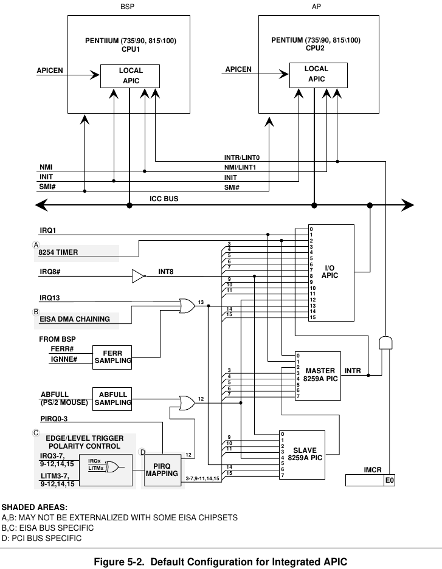
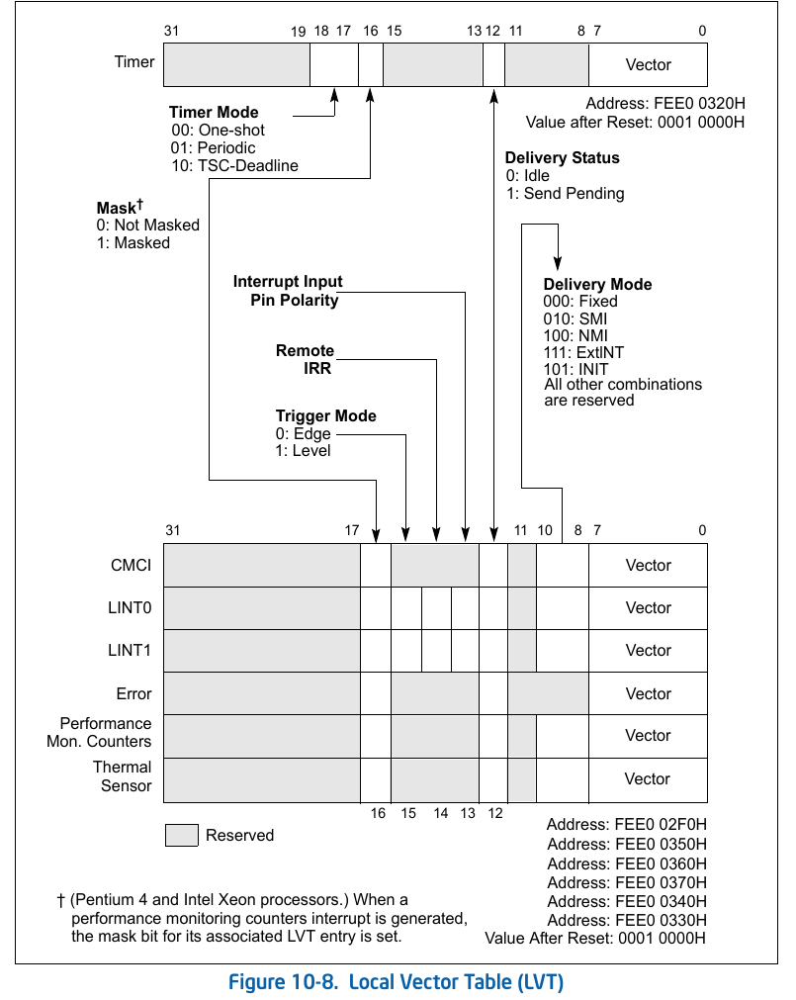
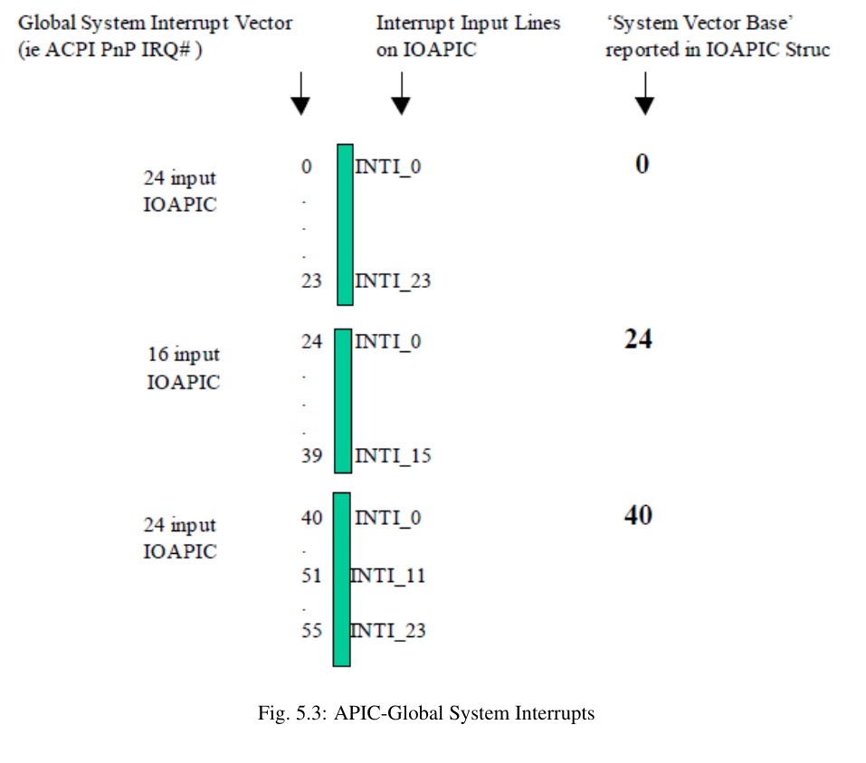

本文主要描述x86架构下硬件中断相关的信息。

x86_64的硬件中断需要中断控制器的参与。
[Intel 8259](https://en.wikipedia.org/wiki/Intel_8259)是一个可编程中断控制器(programmable interrupt controller, PIC)，
最初为Intel 8085和8086 处理器设计，后来被APIC设计取代，APIC可以支持多核以及更多中断。直到现代x86架构的CPU一直保持这对PIC模式的兼容。

Timetomb的中断实现基于APIC。

## PIC
每片8259芯片包含8个输入和一个输出(INTR)。
大多数系统都包含两个PIC，串联在一起，slave PIC的输出连接到master的第三个输入(input #2)。
产生中断的其他硬件设备连接到master和slave PIC的其他输入上。master的输出连接到CPU的INTR pin。

中断信号经过 `设备 --> (slave PIC -->)  master PIC --> CPU` 最终到达 CPU，
如果操作系统已经进行了中断处理的setup，(包括IDT等)，就会进入对应的中断处理程序。

```
                     ____________                          ____________
Real Time Clock --> |            |   Timer -------------> |            |
ACPI -------------> |            |   Keyboard-----------> |            |      _____
Available --------> | Secondary  |----------------------> | Primary    |     |     |
Available --------> | Interrupt  |   Serial Port 2 -----> | Interrupt  |---> | CPU |
Mouse ------------> | Controller |   Serial Port 1 -----> | Controller |     |_____|
Co-Processor -----> |            |   Parallel Port 2/3 -> |            |
Primary ATA ------> |            |   Floppy disk -------> |            |
Secondary ATA ----> |____________|   Parallel Port 1----> |____________|
```
上图来自<https://os.phil-opp.com/hardware-interrupts/>

标准ISA IRQ列表，可参考：<https://wiki.osdev.org/Interrupts> 或 PC/AT Technical Reference，sec 1-13: System Interrupts 1-13，这里摘录几个如下：

| IRQ | Description                                             |
|-----|---------------------------------------------------------|
| 0   | Programmable Interrupt Timer Interrupt                  |
| 1   | Keyboard Interrupt                                      |
| 2   | Cascade (used internally by the two PICs. never raised) |
| 3   | COM2 (if enabled)                                       |
| 4   | COM1 (if enabled)                                       |

每个PIC可以通过PIC寄存器(IO端口)来配置，关于8259 PIC寄存器的细节可参考[PCH9 datasheet, 12.4]。可以编程的项目主要包括：
1. 进行PIC的初始化；
1. 可以设置中断向量偏移，避免硬件中断和CPU异常的向量号冲突；
1. 可以屏蔽某些中断；
1. 接收EOI。

## APIC
APIC是PIC的进一步发展，可以提供更复杂的中断重定向，例如指定某个中断的目标处理器；可以在在处理器之间发送中断。

APIC由两部分组成，local APIC和IO APIC。前者一般作为处理器的一部分，多核处理器中，每个处理器有自己的LAPIC。
后者是芯片组(如PCH)的一部分。连接IO设备，把IO设备中断转发到LAPIC，进而进入处理器的处理流程。

APIC也有几个不同版本：最初的Discrete APIC，以及后来的Integrated APIC(包括xAPIC和x2APIC)。
Discreted APIC和Integrated APIC架构上的主要区别是，前者的Local APIC跟处理器是独立的，后者作为处理器的一部分。



[MultiProcessor spec]定义了三种中断模式，前两者都可以兼容PC/AT的PIC，硬件系统可以实现两者之一。
- PIC mode: 相当于物理上绕过所有APIC模块。这种模式应该只能在discrete APIC架构下实现。
- virtual wire mode: 中断信号会经过APIC到达CPU，但是对上层软件实现来说，兼容PC/AT的PIC。Qemu的PIC兼容使用了该模式。
- symmetric IO mode: 使用APIC的功能，系统可以使用多处理器。

## Local APIC
Local APIC也定义了一些寄存器，如LVT, SVR，请参考官方文档。

针对LVT做一点说明。LVT用来配置本地中断，如下图：


可以参照上面的图 Default Configuration for Integrated APIC来理解：
* LINT0 主要用于virtual wire mode，它和INTR逻辑上是共享CPU pin的；
* LINT1 用于NMI中断

### Enable Local APIC
APIC相比PIC灵活性和复杂性大大提高，有些信息都需要通过ACPI的MADT表([ACPI spec, sec 5.2.13])动态获取。

为了保持兼容性，APIC的默认配置是PIC兼容的，要使用symmetric IO mode，基本的setup包括：

1. 验证`CPUID.01h:EDX[bit 9]==1`，表明CPU有内置的Local APIC；
1. 验证MSR`IA32_APIC_BASE`，bit 11：全局LAPIC使能标帜；
1. Disable PIC。因为为了兼容，上电后的默认配置PC/AT兼容的，需要关闭PIC中断，避免冲突。
   1. 初始化PIC；
   1. remap PIC IRQ 到32之后的中断向量；因为即使屏蔽后，还有可能产生spurious中断。
   1. 屏蔽所有的PIC中断。
1. 配置APIC
   1. 从ACPI的MADT表获取信息，例如Local APIC和IO APIC的物理地址，Interrupt Source Override条目等。
   1. 注意APIC的寄存器通过MMIO访问，所以需要把物理地址加入到页表中。UEFI GetMemoryMap给出的memory map很可能不包含APIC使用的MMIO地址。
   1. 配置LVT。我们不使用PC/AT兼容模式，所以LINT0不需要配置。可以把LNIT1作为NMI中断。
   1. 配置SVR寄存器。TODO spurious interrupt
   1. 配置TPR寄存器，允许任意优先级的中断；

### Local APIC 中断: APIC Timer
Local APIC包含一个32位的可编程定时器。定时器有两个计数器：初始值和当前值。当设置初始值后，定时器以一定的频率倒计，直至当前值变为0后产生一个Timer中断。

APIC timer的频率并非跟PIT一样是固定的，而是从处理器总线的频率除以一个因子(通过Divide Configuration寄存器配置)计算得来的。因此，要获取一个特定周期(比如100ms)的定时器，首先需要计算该时间段对应APIC timer多少tick。这就需要一个外部时间源，我们使用PIT。

因此在上面APIC配置完后，APIC Timer的配置过程为：
1. 初始化APIC timer为one-shot模式，并配置divide因子
2. 启动PIT，设置为10ms倒计时；
3. 设置APIC timer的初始化值为`u32::MAX`；
4. 等待PIT的10ms计时完成，读取APIC timer的当前值，初始值-当前值就是10ms中APIC timer的tick数；
6. 换算可以得到特定周期所需要的tick数；
7. 把上步得出的数作为初始值，通过配置Timer LVT寄存器把APIC timer设置为period模式，设置中断向量，并启用该中断，APIC timer就可以周期性产生中断了。
8. 对应的中断处理程序可以进行中断处理。

## IO APIC
对于外部中断，中断信号到达CPU的路径为：`中断源 --> IOAPIC --> Local APIC --> CPU`。

外部中断对应的中断向量号如何确定：
1. 系统中可以有多个IOAPIC。ACPI Spec定义了Global System Interrupts(GSI)，可以理解为ACPI标准下的全局中断号，
   系统中ACPI的每个IOAPIC结构体定义了该IOAPIC的GSI Base。如下图，根据GSI Base，IOAPIC的input line和GSI可以一一对应。
   
1. ISA IRQ是标准的，例如PIT中断对应IRQ#0，keyboard对应IRQ#1。但是IRQ number和GSI不一定相等。
   ACPI提供 Interrupt Source Override Structure来定义IRQ和GSI的对应关系。
   > ACPI标准中并没有提到这里的GSI一定是第一个IOAPIC上的
1. IOAPIC的input line和中断向量的关系通过REDIR_TBL寄存器来来指定。

总结下来，前两者从ACPI获取，操作系统可以通过REDIR_TBL来指定中断向量号。

## 其他
### 外部中断处理流程
简化的外部中断处理流程可以描述如下：
1. 外部中断到达IO APIC；
2. IOAPIC把中断转发给local APIC, local APIC设置该中断对应的IRR位；
3. 当CPU准备好处理中断时，local APIC 清除IRR中最高优先级的位，并设置ISR的对应位，把该中断分发到处理器处理。
4. 操作系统的中断处理程序完成前(IRET指令前)，需要写local APIC的EOI寄存器。local APIC接收到EOI后，清除最高优先级的ISR位，进入下一个处理周期。

注意IRR, ISR都是256位的寄存器，分别对应256个中断向量；它们是local APIC来设置和清除，不是操作系统的中断处理程序来操作的。

### spurious interrupt
当中断发生时，CPU先接收到中断信号(INTR)，然后通过INTA获取中断向量，这会产生竞争条件：如果IRQ在PIC告诉CPU有一个中断之后但在PIC将中断向量发送到CPU之前消失，
为了解决这个问题，PIC/APIC会告诉CPU一个假中断号。
对PIC，spurious interrupt是相应 PIC 芯片的最低优先级中断号（主 PIC 为 IRQ 7，从 PIC 为 IRQ 15）。
对于APIC来说，spurious interrupt是在SVR寄存器中指定的。

中断消失的原因有多种。可能是软件在错误的时间发送EOI；IRQ/INTR线上的噪声；中断被屏蔽等。

local APIC在分发spurious interrupt时不会设置ISR,所以对应的中断处理程序也不能写入EOI。

## Reference:
- APIC和Local APIC
  * Interl SDM 3.10 Advanced Programmable Interrupt Controller (APIC)
  * <https://wiki.osdev.org/APIC>
  * [MultiProcessor Specification](https://web.archive.org/web/20121002210153/http://download.intel.com/design/archives/processors/pro/docs/24201606.pdf)
- APIC Timer
  * https://wiki.osdev.org/APIC_timer
  * Interl SDM 3.10.5.4 APIC Timer
- IOAPIC
  * 现代PC中，大部分北桥功能继承在CPU中，南桥功能和部分北桥功能继承到了[PCH](https://en.wikipedia.org/wiki/Platform_Controller_Hub)。
  * [PCH (Platform_Controller_Hub) Datasheet](https://www.intel.com/content/dam/www/public/us/en/documents/datasheets/9-series-chipset-pch-datasheet.pdf) 5.9, 5.10节是PIC和APIC相关的说明。
  * PCH和处理器之间通过DMI(Direct Media Interface)连接。
    见[intel processor datasheet](https://www.mouser.com/datasheet/2/612/4th-gen-core-family-desktop-vol-1-datasheet-263629.pdf) 2.3节
  * 12.4 12.5 PIC/APIC registers
  * <https://wiki.osdev.org/IOAPIC>
- 中断处理流程： Intel SDM 3.10.8 Handling Interrupts
- spurious interrupt
  * APIC: Intel SDM 3.10.9 SURIOUS INTERRUPT
  * 8259 PIC: <https://wiki.osdev.org/PIC#Spurious_IRQs>
- [PC/AT Technical Reference](http://bitsavers.informatik.uni-stuttgart.de/pdf/ibm/pc/at/6183355_PC_AT_Technical_Reference_Mar86.pdf )
- 其他
  * [stackoverflow](https://stackoverflow.com/questions/40583848/differences-among-various-interrupts-sci-smi-nmi-and-normal-interrupt)
    这篇回答比较清晰地回答了Intel CPU的不同类型中断及其历史沿革。
  * [What's best? APIC timer or PIT?](https://forum.osdev.org/viewtopic.php?f=1&t=10462)
- ACPI中的中断信息
  * MADT: ACPI spec 5.2.12 Multiple APIC Description Table (MADT)
  * GSI: ACPI spec 5.2.13 Global System Interrupts
- uefi GetMemoryMap/ BIOS e820 不(完全)包含mmio区域。或者说，从memmap中获取所有可用的内存是可以的，但并非所有可用的地址空间区域。
  * https://edk2-devel.narkive.com/F2b1G0c4/edk2-mmio-regions-in-getmemorymap
  * https://www.reddit.com/r/osdev/comments/uguuru/bios_memmap_completeness/
