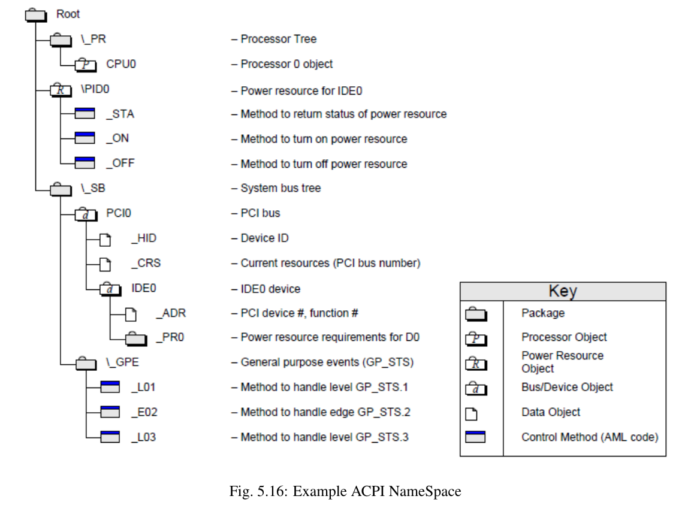

## 概览
> Overview
ACPI全称为Advanced Configuration and Power Interface，高级配置与电源接口。

ACPI最初是1995年左右由Intel, Microsoft, Toshiba, HP 等公司合作开发。
在ACPI之前，操作系统直接调用BIOS接口来进行电源管理、设备发现和配置等操作。
不同的BIOS和硬件提供商没有统一的接口和规范，整机设备提供商需要整合各种不同的硬件，而操作系统开发者也需要针对每款机器单独适配。
ACPI为了解决这种问题，在操作系统和硬件(Firmware)之间定义了一个ACPI层，提供了架构无关的电源管理与硬件配置框架。

> 自2013年至今，ACPI规范归属于 [UEFI Forum](https://uefi.org/)，当前(2023)最新的[ACPI规范](https://uefi.org/specifications)为[ACPI 6.5](https://uefi.org/specs/ACPI/6.5/)，发布于2022年。

ACPI总体架构如下图：


在OS和系统固件之间可以共享两种类型的ACPI数据：数据表(data tables)和定义块(definition blocks)。
数据表的数据可以直接被OS(设备驱动)读取；定义块中包含 AML(ACPI Machine Language) 字节码，由 AML 解释器执行。

> Intel 提供了一个ACPI规范的参考实现：[ACPICA](www.acpica.org)，实现了如AML解释器，ACPI表管理器等。
>
> ACPICA本身是操作系统无关的，集成到OS时，需要实现一个OS Servide Layer。例如Linux也使用了ACPICA,
可以参考 [kernel文档](https://docs.kernel.org/driver-api/acpi/linuxized-acpica.html)。

### ACPI初始化
机器上电自检完成后，系统固件使用固件初始化期间获取的信息来更新各个ACPI表，然后把控制转移到bootloader。
在操作系统加载后，ACPI子系统最开始使用的表是XSDT表，它包含了FADT，SSDT和其他ACPI表的地址。
FADT包含DSDT表的地址，ACPI子系统从DSDT表的定义块中构建ACPI namespace。
初始化过程如下图：


### 运行时模型
当操作系统起来后，操作系统通过中断来处理ACPI事件。中断包含两种ACPI事件：固定事件(fixed events)和通用事件(General purpose events, GPE)。
固定事件在ACPI规范中有预定义的意义；相反通用事件没有预定义的意思，通常通过执行control method来处理。见下文的编程模型。

## ACPI软硬件规范
> chapter 4. ACPI Hardware Specification & chapter 5. ACPI Software Programming Model
### 编程模型
ACPI 规范定义两类硬件编程模型：固定(fixed)硬件编程模型和通用(generic)硬件编程模型。
前者使用固定硬件寄存器作为硬件接口，后者使用通用硬件寄存器和AML(ACPI Machine Language)作为硬件接口。
相应的对于软件接口，OSPM可以直接访问固定硬件寄存器；OSPM需要提供AML解释器来解释执行AML，AML可以访问通用硬件寄存器并提供额外逻辑。

寄存器类型分为两类：
* 状态/使能 寄存器（用于事件）
* 控制寄存器

register block包含一组相关的register。例如，状态/使能寄存器组依次包含一个状态寄存器和一个使能寄存器。
两个register block可以组成寄存器组(register group)。寄存器组中的两个寄存器块，每个bit定义是相同的，每个bit可以在任何一个块上实现。
OSPM在读取时把两个寄存器块的每位取或作为寄存器的值。写入时，只有实现了对应位的寄存器写入才有效。
这允许在硬件实现上可以把一个寄存器的功能使用一块或两块芯片来实现。
OSPM不需要关心具体哪块芯片实现了哪一位。

### 固定硬件编程模型
ACPI定义了如下固定寄存器：


GPEx包含所有通用feature的root level事件。

### Generic Hardware programming model
ACPI允许OEM"增值"("value added")硬件：对外接口不变，但是OEM可以提供不同的实现以实现独特的功能。实现手段是通过AML control method。
ACPI另一个目标是操作系统无关。通过AML代码标准化。OSPM需要提供AML解释器。

### ACPI 系统描述表
详见 5.2 ACPI System Description Tables
ACPI 表都包含相同格式的表头，表头中signature字段表示表的类型。

    XSDT：Extended System Description Table。包含了其他ACPI表的位置信息。
    FADT：Fixed ACPI Description Table，定义了必要的固定硬件ACPI信息，包括固定硬件寄存器的地址。FADT还包含了DSDT的地址。其Signature是“FACP”。
    DSDT：Differentiated System Description Table，包含了AML 代码（定义块）。
    SSDT：DSDT的补充部分，表格式和DSDT一样。SSDT的地址在XSDT中，可能有多个SSDT。加载了DSDT以后会按顺序加载SSDT。SSDT的内容并不能覆盖DSDT，只能作为补充。
    MADT：高级可编程中断控制器。MADT的地址在XSDT中。包含了处理器Local APIC和I/O APIC。signature为APIC。

    RSDP：BIOS刚开机的时候就会加载它到内存1M以内的地方，包含了指向RSDP和XSDT表的指针。ACPI3.0后被XSDT取代。

### ACPI namespace
ACPI 子系统解析DSDT等表时，需要把定义块加载到namespace中。ACPI子系统只维护一个namespace，但namespace中的object是分级的。一个namespace的示例如下：




## ACPI事件编程模型
> chapter 4. ACPI Hardware Specification & chapter 5. ACPI Software Programming Model

### 事件触发：
ACPI事件编程模型基于SCI中断和寄存器模型。OSPM响应SCI中断，根据事件类型做不同的处理。

事件触发过程：
* PM1x_STS/PM1x_EN和GPEx_STS/GPEx_EN寄存器，STS位和EN位都设置时，触发SCI 事件。(某些位可能有更精细的触发规则，参考ACPI spec chapter 4. ACPI Hardware Specification)
* SCI 中断触发。FADT表中包含SCI_INT字段，定义了中断向量号(8259模式下)或全局系统中断号(其他模式，如APIC)。
* CPU中断发生后，会根据CPU的中断处理逻辑调用到操作系统中断处理。如x86下，根据中断向量号调用对应的中断处理程序。
* OSPM实际处理ACPI事件的业务逻辑。

ACPI事件分为两种：
* Fixed event:当收到Fixed ACPI 事件，OSPM直接读取和处理事件寄存器。
  Fixed事件例如电源按钮信号，睡眠按钮信号，RTC alarm等。
* GPE(General Purpose Event):
  GPE的来源可能是 GPEx_BLK STS 位, GPIO 引脚或者中断。(后两者用于Hardware-Reduced ACPI系统中)。
  当收到GPE时，OSPM或者调用ACPI-aware 驱动，或者调用namespace中定义的control method来处理事件。
  - control method: ACPI初始化会构建出namespace，当事件发生时，OSPM根据事件值和类型找到对应的control method。
    例如，假设OEM要实现使用GPE0_STS的bit 4来提供某个com口的唤醒操作，可以实现一个control method：
    ```
    Method (\_GPE._L04) { // GPE 4 level wake handler
      Notify (\_SB.PCIO.COM0, 2)
    }
    ```
    Notify是ACPI标准定义的一个operator，第一个参数是对应设备，的第二个参数2表示唤醒事件：
    ```
    2： Device Wake. Used to notify OSPM that the device has signaled its wake event, and that OSPM
    needs to notify OSPM native device driver for the device. This is only used for devices that
    support _PRW.
    ```
    OSPM需要实现Notify operator，并执行相应的动作。
  - ACPI-aware driver:
    有些设备支持，例如嵌入式控制器或SMBus，操作系统提供该设备对应GPE事件的驱动。（ACPI spec5.6.4.1）

    > 什么情况下会走control method逻辑，什么情况下会走driver逻辑？看Spec，应该是按设备种类划分的。
    > Certain device support, such as an embedded controller, requires a dedicated GPE to service the device.


OSPM 读取寄存器的值，根据Status的为1的位来判断对应的ACPI事件并处理。处理完成前需要清除对应的Status位。这样下次中断处理时，不会重复处理。

> 根据Spec，应该是这个逻辑。清除status位可能是OSPM中的代码直接清除，或者由control method中清除。

示例1:
定义笔记本盖子设备及处理：

> 下划线开头的名字都是ACPI标准预定义的方法或对象的名字。
> OperationRegion, Field, Device 等是ASL的Operator。

使用GPE bit 1来作为事件标志，用来唤醒机器。
在SystemIO地址空间定义了一个LPOL位，用来保存当前盖子的状态。


假设button状态闭合为1, 断开为0。根据上述硬件电路，LID_STS的值为Button与LPOL的异或。真值表如下：

| 编号 | Button | LPOL | LID_STS |
|------|--------|------|---------|
| 1    | 0      | 1    | 1       |
| 2    | 1      | 0    | 1       |
| 3    | 1      | 1    | 0       |
| 4    | 0      | 0    | 0       |

状态转换：
状态3松开按钮会变成状态1，LID_STS被置位，触发事件处理，经过_L01处理后，变为状态4，并notify OSPM，_LID获取到的盖子状态为0(断开)。
状态4按下按钮会变成状态2，LID_STS被置位，触发事件处理，经过_L01处理后，变为状态3，并notify OSPM，_LID获取到的盖子状态为1(闭合)。

同时设备定义了_PRW object，OSPM被notify之后，要根据_PRW执行唤醒操作。

所以最终效果是按钮按下或松开都会触发事件处理，处理完STS被清零，不会再次触发。

```
// Define a Lid switch
OperationRegion (\PHO, SystemIO, 0x201, 0x1)
Field (\PHO, ByteAcc, NoLock, Preserve)
{
    LPOL, 1  // Lid polarity control bit
}
Device (\_SB.LID)
{
    Name (_HID, EISAID ("PNP0C0D"))
    Method (_LID)
    {
        Return(LPOL)
    }
    Name (_PRW, Package (2){
    1,       // bit 1 of GPE to enable Lid wakeup
    0x04})   // can wakeup from S4 state
}
Scope(\_GPE)
{
    Method(_L01)     // uses bit 1 of GP0_STS register
    {
        LPOL ~= LPOL     // Flip the lid polarity bit
        Notify (\_SB.LID, 0x80) // Notify OS of event: lid status changed.
    }
}
```
示例2：
Embeded controller 示例。

OSPM 根据ID PNP0C09来找到对应的driver。(PNP0C09是ACPI中定义的Embedded controller的Plug and Play ID)。
GPE bit 0触发EC事件，然后进入OSPM的ACPI-aware driver中。
ACPI为Embedded controller定义了单独的事件模型。Embedded controller可以定义最多255个事件，对应的control method为_Qxx。
OSPM根据Embedded controller的事件，把对应的_Qxx control method放入队列来执行。

```
Device(EC0) {
    // PnP ID
    Name(_HID, EISAID("PNP0C09"))
    // Returns the "Current Resources" of EC
    Name (_CRS, ResourceTemplate()
    {
        IO(Decode16, 0x62, 0x62, 0, 1)
        IO(Decode16, 0x66, 0x66, 0, 1)
    })
    }

    // Indicate that the EC SCI is bit 0 of the GP_STS register
    Name (_GPE, 0)     // embedded controller is wired to bit 0 of GPE
    OperationRegion (\EC0, EmbeddedControl, 0, 0xFF)
    Field (EC0, ByteAcc, Lock, Preserve)
    {
        // Field units of EC0
    }
    // Query methods
    Method(_Q00)
    { ... }
    Method(_QFF)
    { ... }
}
```


## Terminology

* Operating System-directed Power Management (OSPM): A model of power (and system) management in which
  the OS plays a central role and uses global information to optimize system behavior for the task at hand.

  > 个人猜测 OSPM 这个名字可能来源于历史遗留。实际上可以理解为操作系统中的ACPI实现。

* System Control Interrupt (SCI): A system interrupt used by hardware to notify the OS of ACPI events. The SCI is
  an active, low, shareable, level interrupt.
  The SCI interrupt is defined to be a shareable interrupt and is connected to an OS visible interrupt that uses a shareable
  protocol. The FADT has an entry that indicates what interrupt the SCI interrupt is mapped to.

  SCI会映射成一个系统中断。在FADT表的SCI_INT字段定义中断号。


## Reference
* 内容主要是阅读ACPI Spec的总结。文中图片来源于ACPI spec。
* [Writing an ACPI Driver - an Introduction](https://lwn.net/Articles/367630/): Linux 下开发ACPI driver
