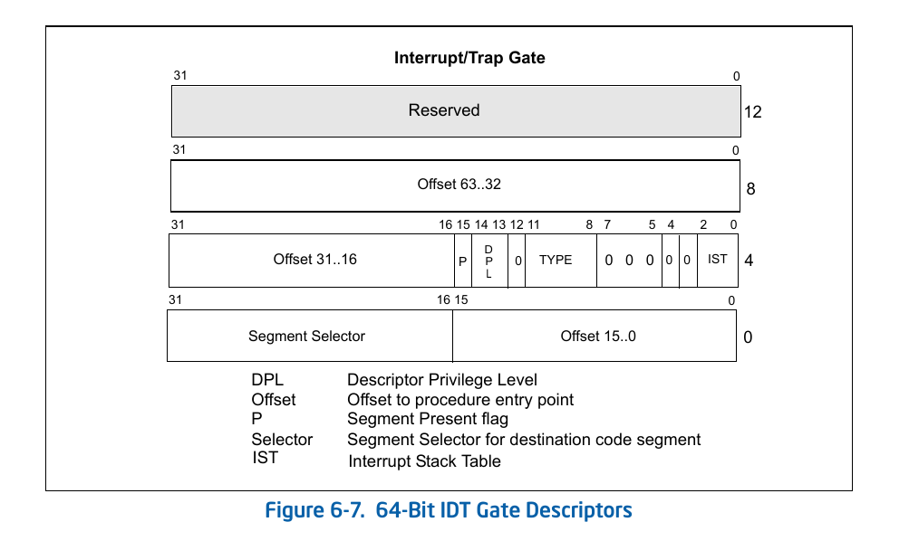
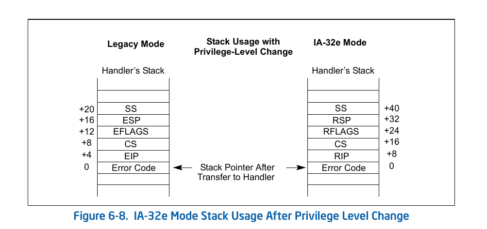

## 概述
在某些情况下，CPU需要当前的执行流，执行其他任务。例如响应键盘输入、硬件故障等。

x86处理器提供了两种中断类型：中断(Interrupts)和异常(Exceptions):
* 中断是异步事件，通常由I/O设备触发
* 异常是同步事件，当处理器在执行指令时检测到预定义的条件时生成。x86 架构下定义了三类异常：fault，trap和abort

处理器处理中断和异常时本质上是一样的。当中断或异常发生时，处理器停止当前执行的任务，根据IDT(中断描述符表)来选择并切换到中断处理程序。
为了中断或异常处理后可以继续原任务，所有中断和异常（除了abort）都在指令边界触发，所以**虽然硬件中断是异步的，但是不会在某个指令执行过程中跳转到中断处理程序。**

fault类型的异常产生时，处理器保存的IP是当前指令的地址，trap类型的异常以及外部中断产生时，处理器保存的IP是下一条指令的地址。所以从异常恢复后，下一条执行的指令也不同。
abort类型的异常产生时，处理器保存的IP是未定义的，因此当abort类型的异常产生时，异常处理应该尝试尽可能优雅的关闭程序，关闭处理器，而不应该恢复原任务执行。

## 中断处理

> 以下中断指中断和异常，非特殊情况，不作区分。

不同类型的中断对应不同的中断向量(0——255的数值)，当中断发生时，处理器根据中断向量查询中断描述符表，找到对应的中断处理程序。在跳转执行前，CPU需要进行特权级检查，以及栈切换。

不同中断类型示例如下：

| Name                   | Vector nr. | Type                                  | Mnemonic | Error code? |
|------------------------|------------|---------------------------------------|----------|-------------|
| Division Error         | 0 (0x0)    | Fault                                 | #DE      | No          |
| Debug                  | 1 (0x1)    | Fault/Trap                            | #DB      | No          |
| Non-maskable Interrupt | 2 (0x2)    | Interrupt                             | -        | No          |
| Breakpoint             | 3 (0x3)    | Trap                                  | #BP      | No          |
| ...                    |            |                                       |          |             |
|                        | 21-31      | Intel reserved. Do not use.           |          |             |
|                        | 32-255     | User Defined (Non-reserved) Interrupt |          |             |

完整CPU异常列表[x86架构下定义的Exception列表](https://wiki.osdev.org/Exceptions)或 Intel SDM, 3.6.3, Sources of Interrupts。

### 中断描述符表(IDT)
IDT中有两类门描述符：interrupt gate和trap gate。当通过interrupt gate调用时，处理器会清除EFLAGS的IF标志，禁用中断。trap gate不会修改IF标志。
`iret`指令会恢复EFLAGS。

> IF flag：
> Clearing the IF flag causes the processor to ignore maskable external interrupts。

单独提一下描述符中的`IST`字段：非64-bit下，IDT中还支持Task Gate，用来自动切换stack，以保证中断发生时stack是好的。
64-bit下，该机制被IST替代。如上图中，IST字段引用TSS中对应index的IST条目，CPU自动切换到对应IST指定的栈地址。（Intel SDM 3.6.14.4, Stack Switching in IA-32e Mode）

#### 特权级检查
中断发生时，特权级检查与调用门的检查类似，但更简单。因为没有中断门的段选择子，所以没有RPL相关的检查。
当通过软件指令主动触发中断或异常时，才会检查CPL<=DPL。
中断处理程序一般位于DPL=0的非一致性代码段，所以中断发生时，当前CPL<=目的DPL成立，跳转到中断处理程序，且CPL=0。

#### Stack Switching
栈切换发生在：
1. 中断描述符的IST不为0时，切换到指定的栈。
1. 中断描述符IST为0，但是发生特权级切换，需要切换到对应特权级的栈。

两种情况下，新的SS选择子都强制置为NULL，新SS选择子的RPL设置为新的CPL。被压入新栈的内容如下图（其中Error Code只有相应的exception有error code时才会入栈）。

使用`iret`返回时，会根据`SS:ESP`回到原来的栈。

### Software-generated interrupt/exception
`INT n， INT3， INTO`指令可以调用对应向量号的中断处理程序。其中`INTO`在64-bit 模式下不可用。
`INT3`单独设计为一个单字节指令，为了在需要断点的地方可以替换当前指令的第一个字节，而不需要考虑对后面的指令产生影响。

INTx指令触发的中断/异常和正常触发的几点区别或限制：
1. gate中的特权级检查: 只有通过INTx指令触发时才会检查DPL。硬件产生的中断和处理器触发产生的异常不会检查DPL；
2. INTx指令触发不受IF flag的影响；
3. INT 2会调用NMI中断处理程序，但是不会激活NMI的硬件处理；
4. INTx不会把error code入栈。因此有error code的exception对应的handler处理INTx触发的中断时，会有问题。

### Calling Convention
因为中断和异常可能在任何指令处发生，所以中断处理函数返回前需要保证恢复所有可能被修改的寄存器。目前Rust实现有两种方案：
1. 使用naked function，在naked function中使用inline asm来保存寄存器等。
   [RFC: Constrained Naked Functions](https://github.com/rust-lang/rfcs/pull/2972)
1. 使用`x86-interrupt` calling convention。
   [PR: Add support for the x86-interrupt calling convention](https://github.com/rust-lang/rust/pull/39832)
   [ISSUE](https://github.com/rust-lang/rust/issues/40180)
   该方案对于编码来说更简单。

两个feature目前都是unstable。

## Reference
* Intel SDM
  - Intel SDM, Chapter 1.6, Procedure Calls, Interrupts, and Exceptions
  - Intel SDM, Chapter 3.6, Interrupt and Exception Handling
* Linux：
  - [一文搞懂内核中断子系统](https://zhuanlan.zhihu.com/p/532338175)
  - [Disabling IRQF_DISABLED](https://lwn.net/Articles/380931/): 从2.6.35 linux kernel中去掉了`IRQF_DISABLED`配置项。去掉后，在中断handler中，会禁用所有中断。
* 除了本文的中断处理机制，x86处理器还支持例如SMI类型的中断进入系统管理模式(SMM)。SMM不可编程，对操作系统是透明的。(Intel SDM, chapter 3.34, System Management Mode)
  - SMM(SYSTEM MANAGEMENT MODE)：SMM提供一种特殊模式，用来处理诸如电源管理，闭源OEM代码等。通过SMI触发进入SMM后，处理器会保存当前状态，并切换到一个独立的执行环境，使用新的地址空间。
  - 关于所有异常和中断的优先级，Intel SDM v3.6.9给出了一个表，可以参考。
