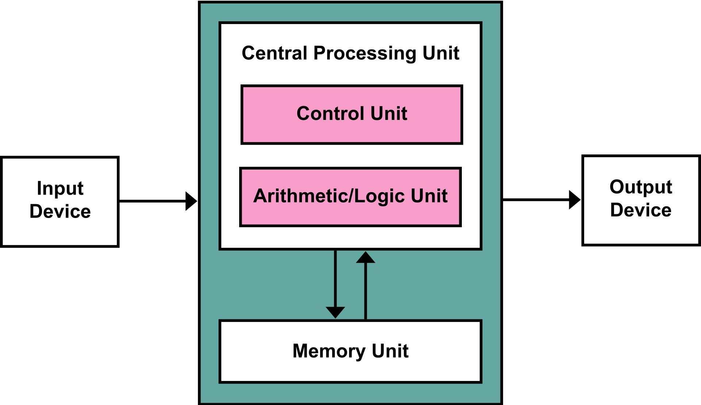

计算理论研究的课题是*计算机的基本能力和局限是什么*。主要包含三个核心领域自动机理论与形式语言，可计算性理论与计算复杂性理论。
* TOC
{:toc}

## 判定问题
在可计算性理论理论中，判定问题（Entscheidungsproblem/Decision Problem）是指一个问题，其答案只有两种可能的情况：是或否。
判定问题的提法是1928年，大卫·希尔伯特（David Hilbert）和威廉·阿克曼（Wilhelm Ackermann）提出。

1900年，希尔伯特在第二届国际数学家大会上提出的23个数学问题中的第十问题，即丢番图方程问题是一个判定问题。

### 判定问题不存在通用解法
1935-1936，阿隆佐·邱奇引入[λ演算](https://en.wikipedia.org/wiki/Lambda_calculus)，并证明没有任何通用算法可以判定任意两个λ表达式是否相等。证明了解决判定问题的通用算法不存在。

1936年，阿兰·图灵发明了图灵机。图灵把解决判定问题的通用解法是否存在的问题归约到停机问题。通过停机问题的不可解证明的判定问题不存在通用解法。
图灵后来证明了λ演算和图灵机是等价的计算模型。

## 图灵机
本节内容主要来自：[Turing Machines and Computability](http://science.slc.edu/~jmarshall/courses/2006/spring/cs30/lectures/TMs/)
### 图灵机

- 图灵机是数学模型而非物理模型
- 控制单元(Control unit)可能处于某个状态，所有可能的状态是有限的
- 每个格子包含一个符号，符号数量有限
- 读写头每步可以修改当前位置的符号
- 读写头每步可以向左或向右移动一格
- 纸带长度无限

图灵机实例：位翻转
| 当前状态 | 当前符号 | 新状态 | 新符号 | 移动方向 |
| 1        | 0        | 1      | 1      | R        |
| 1        | 1        | 1      | 0      | R        |
| 1        | b        | 2      | b      | R        |

起始状态：1
结束状态：2

图灵机的功能是翻转输入的01串的每一位，如输入1100输出0011。

### 通用图灵机
图灵机通过合适的编程，可以模拟任何其他图灵机，这种图灵机称为通用图灵机(UTM, Universal Turing Machine)。

- 通用图灵机接受一个图灵机的编码描述，并模拟该图灵机在对应输入上的行为
- 编码描述充当通用图灵机执行的程序
- 通用图灵机本身的内部程序是固定的

### 存储程序计算机(Stored-program computer)
计算机可以看作通用图灵机的物理实现。当前的计算机基本都属于存储程序计算机，即把程序指令存储在主存中的计算机。
理论上，冯诺依曼架构和哈佛架构都可以认为是存储程序计算机，但是很多时候存储程序计算机会特指冯诺依曼架构。

**冯诺依曼架构 (Von Neumann architecutre)**把指令和数据存储在同样的内存中，而**哈佛架构**的指令和数据存储在不同的内存中。

以下两个示意图来自wikipedia：

冯诺依曼架构

哈佛架构

值得一提的是，现代计算机已经不是严格的冯诺依曼架构或哈佛架构，而是两者的结合。
例如x86及其的主存是共享的，但CPU的L1/L2 cache是指令和数据cache是分开的。

## 可计算性
### 邱奇-图灵论题
**任何在算法上可计算的问题同样可由图灵机计算**
称之为论题而非定理（thesis vs. theory），是因为该论题是对计算特性的一种描述，而不是形式化的表示，所以无法被证明。
反过来，算法的精确概念可以由此定义：算法即图灵机算法，图灵机可以在有限步骤内解决问题。

图灵可计算性也由此定义。更精确地说，一个自然数集合是可计算集合，如果存在一个图灵机，对于一个给定的数`n`，如果`n`在该集合中，图灵机停止并输出1，否则图灵机停止并输出0。
从形式语言的角度，则可以定义为：如果一个语言能被某一图灵机判定(即图灵机识别该语言并停机)，则称之为图灵可判定的。
也即，判定问题与图灵可计算性是紧密关联的。

### 图灵完备与图灵等价
- 图灵完备：可以计算所有图灵可计算函数的系统是图灵完备的；换句话说，这个系统可以仿真通用图灵机
- 图灵等价：一个图灵完备的系统，如果它可以计算算的函数都是图灵可计算的，那么称为图灵等价；即图灵等价的系统可以仿真通用图灵机，也可以用通用图灵机仿真。
目前所有已知的物理实现的图灵完备系统都是图灵等价的。

### 计算模型
[计算模型](https://en.wikipedia.org/wiki/Model_of_computation)是指对于一个输入，一个数学函数如何计算输出的模型。
图灵机，λ演算，递归函数（μ-recursive function）等都是等价的计算模型，也是目前可实现的最强的计算模型。

因为这些计算模型的局限性，数学家也提出了很多[超计算模型](https://en.wikipedia.org/wiki/Hypercomputation)。

## References
- 图灵1936年的论文，《论可计算数及其在判定问题中的应用》:[ON COMPUTABLE NUMBERS, WITH AN APPLICATION TO THE ENTSCHEIDUNGSPROBLEM](https://www.cs.virginia.edu/~robins/Turing_Paper_1936.pdf)
- https://en.wikipedia.org/wiki/Computability_theory
- 可计算与递归
  - [Computability and Recursion](http://www.people.cs.uchicago.edu/~soare/History/compute.pdf)
  - https://cs.stackexchange.com/questions/51770/why-are-computable-functions-also-called-recursive-functions
  - https://math.stackexchange.com/questions/1495998/why-are-all-finite-sets-recursive
  - https://en.wikipedia.org/wiki/Recursion
  - https://zh.wikipedia.org/wiki/%E9%80%92%E5%BD%92%E9%9B%86%E5%90%88
- https://en.wikipedia.org/wiki/Turing_machine
- https://en.wikipedia.org/wiki/Entscheidungsproblem
- [λ-Calculus: The Other Turing Machine](https://www.cs.cmu.edu/~rwh/talks/cs50talk.pdf)：图灵机和λ演算的概述，及λ演算在分析复杂性上的应用
- λ演算：
  - [A Tutorial Introduction to the Lambda Calculus](https://arxiv.org/pdf/1503.09060.pdf)：很好的学习文档
  - [The Lambda Calculus for Absolute Dummies (like myself)](http://palmstroem.blogspot.com/2012/05/lambda-calculus-for-absolute-dummies.html)
