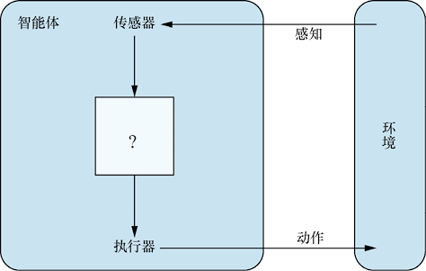
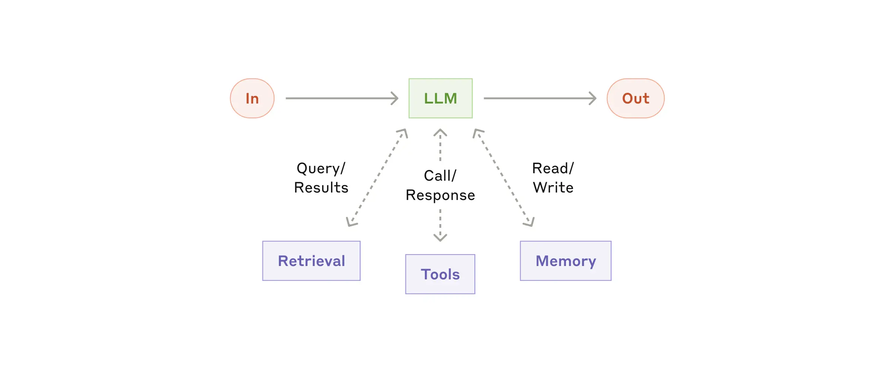
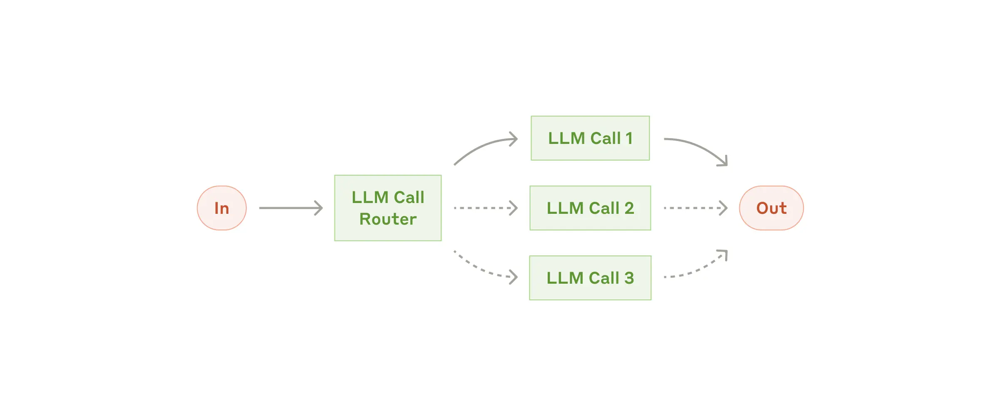
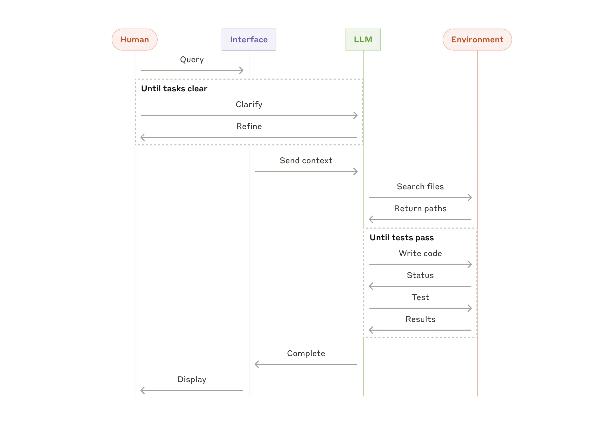

* TOC
{:toc}

## 概述
### 什么是智能体
《人工智能：现代方法》中指出理性智能体是现代AI的核心。
智能体通过**传感器**感知环境，通过**执行器**行动，其行为由**智能体函数**（从感知序列到行动的映射）决定。

**在当前大模型的背景下，Agent在不同语境下的并没有统一的规范定义，本文的Agent特指LLM Agent，但采取相对宽泛的定义，只要求Agent的智能体函数有LLM的参与，并扮演核心的角色，对Agent具体形式、功能特性等不做要求。**一定程度上，Agent可以理解为基于LLM的应用。

### LLM Agent Building Block
大模型推理有两个特点或限制：
1. 无状态：即输出只与当次的输入和模型有关。
   - 没有会话历史
   - 训练好的模型，其内部知识是固定的，不会持续学习。
2. 输入输出的内容是token序列，可以对应文本或多模态内容（图像、音视频等），但无法直接调用外部工具。

这对于大模型的应用带来了一些挑战，也因此，LLM Agent需要基于LLM 推理，对其进行扩展。

Anthropic 的[Building effective agents](https://www.anthropic.com/engineering/building-effective-agents)中，
提出了一个增强型LLM作为构建快（Building Block），基本上是为了应对上述问题：外部知识库、工具调用、会话Memory管理。

### Agent中LLM相关部分的设计
另一方面，根据Agent的产品设计、目标，Agent有各自的业务逻辑，并不一定严格按照build block的方式来构建。
LLM相关的功能可能只是Agent整个产品设计的一部分。总的来说，LLM Agent其中与大模型相关的设计大致要考虑以下几方面：
- 模型
  - 模型选择，如是否需要多模态、tool call、基本能力、微调模型
  - 模型调优：超参数、Prompt调优
- 处理模型输出 —— Response解析与工具使用
  - 解析与处理大模型的Response，tool_use 是其中的重要部分
  - 工具注册与调用
- 提供模型输入 —— Prompt管理
  - 对话历史管理
  - 外部知识：如RAG、代码文件
  - 输入与输出的处理逻辑通常是相关的。从大模型视角看，实质上是在处理单次对话，只不过输入可能包含了之前的输出内容。
- 其他
  - 可观测：API调用等
  - Alignment/Guardrail
  - Multi-Agent 编排
  - Human in the loop

## LLM Agent生态 - 技术&产品领域

本节概述构成LLM Agent生态的关键技术和产品领域。

### 模型
大语言模型（LLM）是整个Agent生态的智能核心和基础，其能力（如推理、代码生成、工具调用、多模态理解）直接决定了Agent的能力上限。模型选择是构建Agent的首要步骤之一。

### Agent Frameworks/SDKs
这类框架旨在简化和标准化Agent应用的开发过程，提供用于构建、管理和编排LLM Agent的工具集和抽象层。它们通常封装了与LLM交互、状态管理（Memory）、工具使用、多Agent协作等常见模式。
- **[Langchain](https://python.langchain.com/docs/get_started/introduction)**: 作为早期流行的框架，提供了广泛的组件和集成。
- **[LangGraph](https://langchain-ai.github.io/langgraph/)**: 基于Langchain，专注于将Agent构建为图形（Graph）结构，特别适合需要循环和状态管理的复杂流程。
- **[crewAI](https://github.com/crewAIInc/crewAI)**: 另一个基于Langchain构建的框架，侧重于多Agent协作，定义了Agent、Task和Crew等概念来编排协作流程。
- **[AutoGen](https://github.com/microsoft/autogen)**: 由微软开发，支持构建具有不同角色和能力的多Agent系统，Agent之间可以通过对话进行协作来完成复杂任务。
- **[OpenAI Agents SDK](https://openai.github.io/openai-agents-python/)**: OpenAI官方推出的SDK，核心概念包括Agent（定义行为）、Handoff（Agent间传递控制权）和Guardrails（安全约束）。
- **[Camel AI](https://github.com/camel-ai/camel)**: 一个专注于探索多Agent协作模式的社区驱动项目，支持多种模型和Agent通信协议。
- **[ChatDev](https://github.com/OpenBMB/ChatDev)**: 由面壁智能主导，模拟一个虚拟软件公司，包含CEO、程序员、测试等多种角色的Agent，通过结构化的工作流（设计、编码、测试等）协作完成软件开发任务。
- **[MetaGPT](https://github.com/geekan/MetaGPT)**: 输入一句话需求，可以输出用户故事、需求、数据结构、API文档等，同样模拟软件开发流程，但更侧重于标准化输出和SOP（Standard Operating Procedures）。

这些框架各有侧重，例如LangGraph适合复杂流程控制，crewAI和AutoGen专注于多Agent协作，而ChatDev和MetaGPT则面向特定的软件开发场景。

### 低代码/编排平台
这些平台提供图形化界面或简化的配置方式，让用户能够通过拖拽、连接组件或填写表单来构建和部署Agent应用，降低了开发门槛。
- **[Langflow](https://docs.langflow.org/)**: 一个可视化的框架，用户可以通过拖拽Langchain组件来构建Agent和RAG应用流程图。
- **[Dify](https://github.com/langgenius/dify/tree/main)**: 一个开源的LLM应用开发平台，集成了Agent工作流、RAG管道、模型管理、可观测性等功能，提供相对完整的应用开发和管理界面。

### 最终用户应用
这类应用直接面向最终用户，利用Agent技术解决特定问题或提供特定能力。
- **通用问题解决/助手**:
    - **[Open WebUI](https://github.com/open-webui/open-webui)**: 增强型的LLM聊天界面，支持本地模型和OpenAI兼容API，集成了RAG、网络搜索、Markdown/LaTeX渲染等功能。
    - **[Manus](https://manus.im/)**: 面向最终用户，旨在自动解决通用问题，减少人工干预。
- **开发辅助**:
    - **[Cursor](https://cursor.sh/)**: AI优先的代码编辑器，深度集成了代码生成、编辑、问答等功能。
    - **[Aider](https://github.com/paul-gauthier/aider)**: 一个命令行工具，让LLM可以直接在本地代码库中进行编码工作。其他命令行工具如**[Claude Code](https://docs.anthropic.com/en/docs/agents-and-tools/claude-code/overview)**

### MCP (Model Context Protocol)
MCP旨在为AI Agent（MCP Hosts，如IDE、桌面应用）提供一个标准化的协议，使其能够安全、可控地访问本地数据源和功能（由MCP Servers提供）。
- **核心概念**: MCP Servers可以暴露三种主要能力：**Resources**（文件等可读数据）、**Tools**（可由LLM调用的函数）和**Prompts**（预设模板）。
- **架构**: MCP Hosts通过MCP Clients与本地运行的MCP Servers通信，这些Servers再与本地文件、数据库或远程服务交互。
- **现状与讨论**: MCP的目标是创建一个开放的生态，让用户可以为各种Agent添加本地能力。但目前也面临一些讨论（参考 [Langchain Blog Post](https://blog.langchain.dev/mcp-fad-or-fixture/)）：
    - **优点**: 解决了为无法控制的Agent（如闭源模型或应用）添加本地工具和数据的需求；生态正在发展。
    - **挑战**: 协议相对复杂（包含工具之外的功能）；Server质量难以保证；目前主要支持本地Server，远程访问的安全和认证问题待解决。
    - **关键**: MCP的成功与否很大程度上取决于能否成为事实标准并形成繁荣的生态，其技术本身相比现有框架的工具机制并无本质优势，但标准化带来的**开放性和可复用能力**是其成功的关键。

### 外部工具、知识库
Agent通过使用工具来扩展其能力边界，与外部世界交互或执行特定任务。很多框架和应用提供了自己的工具调用方案或通过MCP协议调用。

例如[Awesome mcp servers](https://github.com/punkpeye/awesome-mcp-servers)中，把 MCP Servers 分为了以下类别：
- **聚合器 (Aggregators)**: 用于通过单个MCP服务器访问多个应用和工具。
- **艺术与文化 (Art & Culture)**: 访问艺术收藏、文化遗产和博物馆数据库。
- **浏览器自动化 (Browser Automation)**: 提供网页内容访问和自动化能力。
- **云平台 (Cloud Platforms)**: 集成云平台服务，管理云基础设施。
- **代码执行 (Code Execution)**: 在安全环境中执行代码。
- **编码智能体 (Coding Agents)**: 使LLM能够读写、执行代码并解决编程任务。
- **命令行 (Command Line)**: 运行命令、捕获输出并与Shell交互。
- **通信 (Communication)**: 集成通信平台（如Slack、Telegram、Email）。
- **客户数据平台 (Customer Data Platforms)**: 访问客户数据平台中的客户档案。
- **数据库 (Databases)**: 提供安全的数据库访问和模式检查能力。
- **数据平台 (Data Platforms)**: 用于数据集成、转换和管道编排。
- **开发者工具 (Developer Tools)**: 增强开发工作流和环境管理的工具。
- **数据科学工具 (Data Science Tools)**: 简化数据探索、分析和增强数据科学工作流。
- **嵌入式系统 (Embedded System)**: 提供嵌入式设备文档和工作快捷方式。
- **文件系统 (File Systems)**: 提供对本地文件系统的直接访问。
- **金融与金融科技 (Finance & Fintech)**: 金融数据访问和分析工具。
- **游戏 (Gaming)**: 集成游戏相关数据、游戏引擎和服务。
- **知识与记忆 (Knowledge & Memory)**: 使用知识图谱结构的持久化记忆存储。
- **位置服务 (Location Services)**: 基于位置的服务和地图工具。
- **市场营销 (Marketing)**: 创建和编辑营销内容、处理元数据等。
- **监控 (Monitoring)**: 访问和分析应用监控数据。
- **搜索与数据提取 (Search & Data Extraction)**: 提供网络搜索和数据提取能力。
- **安全 (Security)**: 安全相关的工具，如漏洞扫描、代码审计。
- **体育 (Sports)**: 访问体育相关数据、结果和统计信息。
- **支持与服务管理 (Support & Service Management)**: 管理客户支持、IT服务管理和帮助台操作。
- **翻译服务 (Translation Services)**: 提供内容翻译能力。
- **旅行与交通 (Travel & Transportation)**: 访问旅行和交通信息。
- **版本控制 (Version Control)**: 与Git仓库和版本控制平台交互。
- **其他工具与集成 (Other Tools and Integrations)**: 其他未分类的工具和服务。

检索增强生成（Retrieval-Augmented Generation, RAG）是一种将信息检索（Retrieval）与文本生成（Generation）相结合的技术，旨在通过引入外部知识库来增强大型语言模型（LLM）的能力。其核心思想是在生成回答之前，先从一个大规模的文档集合（如公司内部文档、网页、数据库等）中检索出与用户查询最相关的片段，然后将这些检索到的信息作为上下文（Context）提供给LLM，让LLM基于这些具体、实时的信息来生成更准确、更可靠、更有依据的回答。

**基本流程:**
1.  **接收查询 (Query)**: 用户提出问题或请求。
2.  **检索 (Retrieve)**: 系统使用查询在知识库（通常是向量数据库）中搜索相关文档或文本片段。
3.  **增强 (Augment)**: 将检索到的相关信息与原始查询一起组合成一个新的Prompt。
4.  **生成 (Generate)**: 将增强后的Prompt输入给LLM，生成最终的回答。

RAG有效地缓解了LLM知识陈旧、产生幻觉（Hallucination）以及缺乏特定领域知识的问题，使得Agent能够基于最新的、私有的或专业的数据源进行回答和决策。

### [A2A 协议](https://github.com/google/A2A)
A2A协议由[Google推出](https://developers.googleblog.com/en/a2a-a-new-era-of-agent-interoperability/)，
旨在实现不同厂商或框架构建的 AI 代理之间的互操作性。

A2A 的工作方式：A2A 通过 “客户端” 代理和 “远程” 代理之间的交互实现通信，包括能力发现、任务管理、协作和用户体验协商等关键功能，为用户提供灵活的代理组合和高效的任务完成方式。

### 可观测性
随着Agent逻辑变得复杂，理解、调试和监控其内部状态和行为变得至关重要。可观测性工具帮助开发者追踪LLM调用、工具使用、内部状态变化和性能指标。
- **专用平台**:
    - **[Langfuse](https://langfuse.com/)**: 开源的可观测性平台，专注于LLM应用，提供追踪、评估、调试等功能，支持自托管。
    - **[LangSmith](https://smith.langchain.com/)**: Langchain官方提供的可观测性平台，与Langchain深度集成，同样支持自托管。
    - 其他类似平台: 如Helicone, Lunary等。

### 评估 & 基准测试
评估Agent的性能、可靠性和安全性是Agent开发中的重要环节。这通常需要特定的基准测试集和评估框架来衡量Agent在不同任务上的表现。

## LLM Agent生态 - 厂商
### [Anthropic](https://www.anthropic.com/)
产品与服务：
- 模型与API：提供闭源模型: Haiku, Sonnet, Opus系列。
- 终端用户应用：如Claude Code（用于编码辅助）、Claude Desktop（桌面应用）和Claude.ai（在线平台），这些工具利用LLM进行编码辅助和一般问题解决。
- Anthropic的模型被广泛应用于不同的agent，尤其是编码类。可参考https://www.anthropic.com/solutions/agents。
- Anthropic提出并维护MCP协议，目前已被广泛采用。

#### Anthropic Research：[Building effective agents](https://www.anthropic.com/engineering/building-effective-agents)
- Agent的两种类型：
  - 工作流（workflow）：通过预定义代码路径编排LLM
  - 代理（Agent）：LLM动态控制自身流程

- 何时使用Agent：
  - 优先选择最简单的解决方案
  - 工作流适用于任务明确的情况
  - 代理适用于需要灵活性和模型驱动决策的场景

- 框架选择建议：
  - 先直接使用LLM API（许多模式只需简短代码）
  - 若使用框架，需理解底层代码（当前框架抽象层可能模糊prompt和response，不利于调试）

- 不同的Agent模式（基于构建快速原型）：
  - 工作流模式示例：
    - 提示链
    - 路由
    - 并行化
    - 编排-工作者
    - 评估-优化器
  - 更复杂的代理模式

- Routing Workflow模式：
  - 功能：将输入分类并引导至特定后续任务
  - 优势：分离关注点，构建针对性提示
  - 适用场景：复杂任务中存在可准确分类的不同类别
  - 分类处理方式：可由LLM或传统分类模型/算法处理
  - 应用示例：
    - 客户服务查询分类（一般问题/退款请求/技术支持）
    - 模型路由（简单问题→小模型，复杂问题→强大模型）

  

- Coding Agent模式：
  - 领域：软件开发
  - 发展：从代码补全演进到自主解决问题
  - 优势体现：
    - 通过自动化测试验证代码解决方案
    - 问题空间明确结构化
    - 输出质量可客观衡量
  - 注意事项：
    - 自动化测试验证功能
    - 仍需人工审查确保符合系统要求

  

### OpenAI
产品与服务：
- 模型与API：提供生成模型与推理模型，目前最先进的模型闭源。
- chatgpt 应用
- Response API，提供了内置工具和会话状态的能力。[Response API相对Chat Completion API](https://platform.openai.com/docs/guides/responses-vs-chat-completions)的主要提升有：
  1. 通过 `previous_response_id`可以引用历史数据，可以在一定程度上做到stateful。参考https://platform.openai.com/docs/guides/conversation-state?api-mode=chat
  2. 包含built-in tools: web search; file search; computer use
- [Agent SDK](https://openai.github.io/openai-agents-python/) 针对Agent构建提供一些抽象。
- 模型微调、蒸馏
- [知识库管理](https://platform.openai.com/docs/guides/retrieval)

### Meta Llama
产品与服务：
- 模型：提供Llama系列开源模型

### Google
产品与服务：
- 模型与API：提供Gemini系列模型 (如Gemini Pro, Gemini Ultra, Gemini Nano) 以及其他模型 (如Imagen用于图像生成) 的API访问。
- [Vertex AI](https://cloud.google.com/vertex-ai)：Google Cloud上的统一AI平台，提供模型训练、部署、微调、评估、MLOps等服务。
  - [Vertex AI Agent Builder](https://cloud.google.com/vertex-ai/docs/agent-builder/introduction)：用于构建和部署企业级生成式AI Agent（包括搜索和对话Agent）的工具集。
  - 集成了RAG、工具调用、基础模型访问等能力。
- [Google AI Studio](https://aistudio.google.com/)：基于Web的工具，用于快速原型设计和使用Gemini模型。
- 终端用户应用：将AI能力集成到Google搜索、Workspace (Duet AI/Copilot)、Pixel设备等。
- 提出Agent互操作的A2A协议

### Microsoft
产品与服务：
- 模型与API：
  - [Azure OpenAI Service](https://azure.microsoft.com/en-us/products/ai-services/openai-service)：提供对OpenAI模型（如GPT-4, GPT-3.5）的企业级访问，并附加了Azure的安全和合规性。
  - 自研模型：如Phi系列小型语言模型 (SLMs)。
- [Azure AI Studio](https://ai.azure.com/)：统一的AI开发平台，用于构建、训练、部署和管理AI模型及应用，包括生成式AI。
  - 提供Prompt Flow等工具用于编排LLM工作流和Agent。
  - 集成了模型目录、数据管理、评估、部署等功能。
- [Microsoft Copilot](https://copilot.microsoft.com/)：一系列集成在Microsoft 365、Windows、Edge、GitHub等产品中的AI助手。
- [AutoGen](https://github.com/microsoft/autogen)：开源的多Agent对话框架，用于构建复杂的LLM应用。

### [amazon bedrock](https://aws.amazon.com/bedrock/)
产品与服务：
- 模型访问：提供单一API访问来自多家领先AI公司（包括Amazon自家Titan模型、Anthropic、Cohere、Meta、Mistral AI、Stability AI等）的基础模型 (FMs)。
- Agent构建：
  - [Agents for Amazon Bedrock](https://aws.amazon.com/bedrock/agents/)：托管服务，允许开发者构建基于FM的Agent，可以调用API执行任务、查询知识库、编排复杂工作流。
  - 提供可视化界面和SDK进行Agent创建和管理。
- RAG支持：
  - [Knowledge Bases for Amazon Bedrock](https://aws.amazon.com/bedrock/knowledge-bases/)：托管服务，简化将私有数据源连接到FM以实现RAG的过程。
- 模型定制：支持对部分模型进行微调。
- 评估与监控：提供模型评估工具和与CloudWatch的集成。
- 终端应用：Amazon Q，一个面向企业和开发者的AI助手。

### Hugging Face
产品与服务：
- 模型与数据集中心 (Hub)：最大的开放模型（包括LLM）和数据集托管平台，是开源AI社区的核心枢纽。
- 工具库：开发并维护核心开源库，如transformers（模型访问）、datasets（数据集处理）、diffusers（扩散模型）、gradio（快速构建AI应用Demo）。
- 推理与部署：提供Inference Endpoints（托管推理服务）、Spaces（托管AI应用/Demo）等服务。
- 定位：AI领域的“GitHub”，提供模型、数据、工具和社区协作的基础设施，是Agent开发的重要资源库和平台。

### OpenRouter
产品与服务：
- 模型聚合与路由：提供统一的API接口，访问来自不同提供商（OpenAI, Anthropic, Google, Meta, Mistral等）的各种闭源和开源LLM。
- 成本与性能优化：允许用户根据价格、速度或特定能力选择模型，并可能提供模型自动回退或负载均衡功能。
- 标准化API：简化了在不同模型间切换的开发工作。主要作为模型访问层，而非完整的Agent构建平台。

### Together AI / Fireworks AI
产品与服务：
- 高性能推理：专注于为开源LLM（如Llama, Mixtral, Qwen等）提供快速、低成本的云端推理服务API。
- 模型服务：提供大量预训练的开源模型供直接使用。
- Fine-tuning服务：提供针对开源模型的微调服务。
- 自研模型：也训练和发布一些自己的模型。
- 定位：面向开发者的高性能、经济高效的开源模型云平台。

### Perplexity AI
产品与服务：
- AI搜索/答案引擎：提供面向最终用户的对话式AI搜索引擎，旨在提供准确、有来源依据的答案。
- 模型API (pplx-api)：提供API访问其在线LLM，这些模型经过优化，可以访问实时信息并提供引用来源，适合需要高准确性和实时性的Agent任务。
- RAG专长：其核心产品基于强大的实时网页检索和RAG技术。
- 定位：专注于提供高准确性、引用来源的AI信息服务和相应API。

### 字节
产品与服务：
- 模型与API：提供自研的“豆包”（Doubao）系列大模型（通用、角色扮演、语音、图像等）的API访问。
- 火山引擎平台提供模型训练、微调、推理、部署和评估等全链路服务。
  - Agent能力：平台内置或支持构建Agent应用，可能包括工具调用、RAG（向量数据库集成）、流程编排等能力。
- 解决方案：面向中国市场提供企业级的AI解决方案和服务。
- 最终用户产品：Trae等

### 阿里百炼 (Alibaba Bailian)
产品与服务：
- 模型：Qwen系列模型
- 一站式大模型平台：阿里云“百炼”平台提供覆盖模型选择、开发、应用构建的全栈服务。
  - Agent构建框架：提供内置的Agent框架或工具集，支持工具调用、记忆管理、RAG、流程编排等。
  - RAG与知识库：集成向量检索和知识库管理能力。
  - 最近上线了MCP市场
- 解决方案：面向企业提供模型训练、应用开发、AI解决方案。

### deepseek
产品与服务：
- 开源模型：发布了多个高性能的开源大语言模型，并提供API访问其自研模型。
- 提供网页和APP版的对话服务。

### 硅基流动 (Silicon Flow)
产品与服务：
- 模型API：为开源LLM提供提供开箱即用的大模型API。
  - 提供基于国产硬件（如华为昇腾）的推理服务。
- 提供模型微调与部署的托管服务。

### 各类应用&框架厂商
-  [Landscape](https://aiagentsdirectory.com/landscape)
   一个可参考的AI Agent领域的生态系统地图
