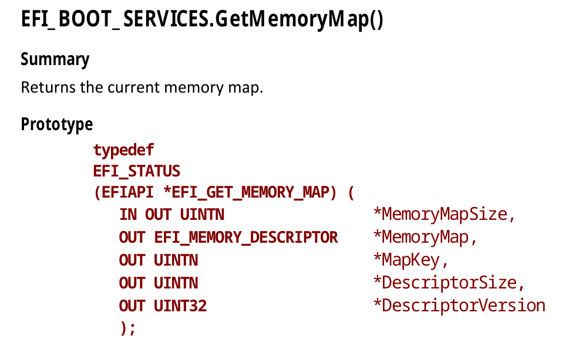
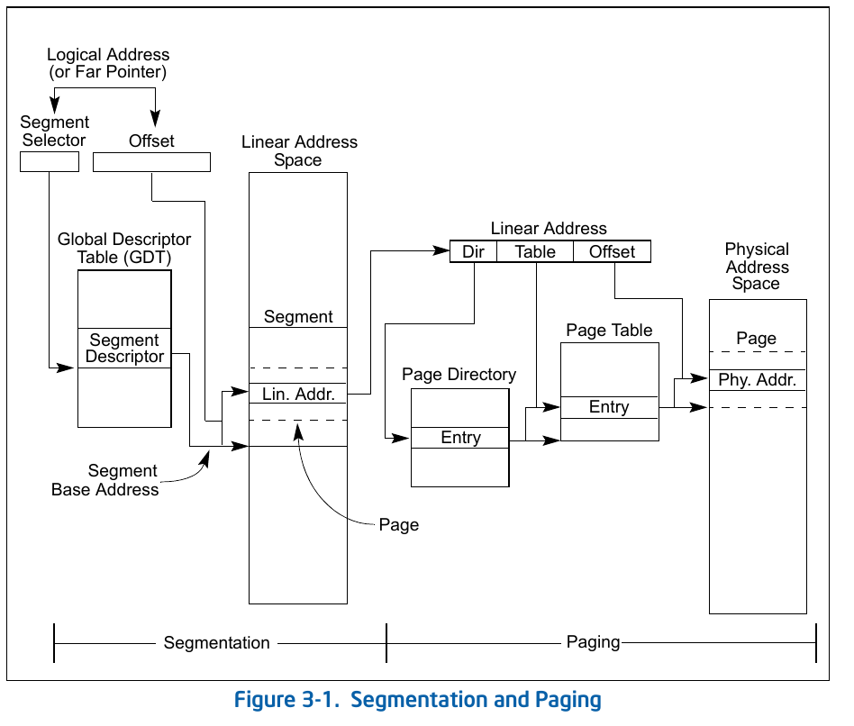
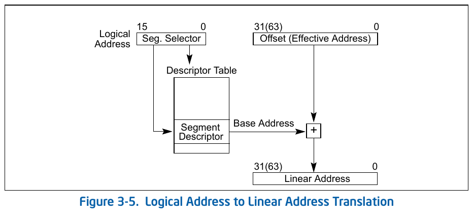
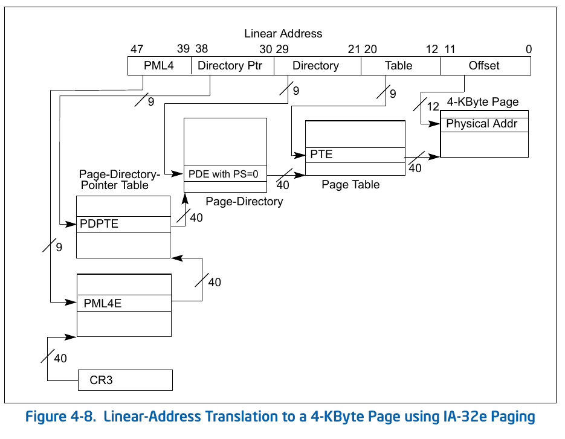

本文主要描述x86_64架构下UEFI的OSLoader如何一步步做到执行用户空间执行代码。
测试环境使用qemu虚拟机。

## Overview
把kernel直接构建为UEFI Image，通过UEFI firmware直接加载执行。本文主要包括一下几个步骤：
1. 配置基本日志系统，通过串口输出日志。
1. 获取UEFI下的物理内存，并退出UEFI Boot Service。
1. 早期内存管理。
1. 配置分页。
1. 关闭中断并配置GDT。
1. 准备用户栈等并跳转到用户代码。

### CPU Mode
相比32位x86架构，x86_64增加了一种CPU模式，long mode（AMD叫法，OSDev, wikipedia基本采用long mode的叫法；Intel sdm中叫IA32-e mode）。

long mode下有两种子模式， compatibility mode and 64-bit mode。compatibility mode用来在long mode下运行32位甚至16位代码。CPU根据`CS.L`位来确定当前处于哪个子模式。

UEFI Firmware运行在64-bit mode下。本文代码也都运行在64-bit mode下，不考虑类似linux内核启动时从real mode或32 bit 模式下切换的问题。

以下对上面步骤具体解析。

## 基础日志系统
### 文本输入输出
UEFI中在ExitBootService之前可以使用Console Support Protocols做输入输出，包括文本和图形，但是在ExitBootService之后，都无法直接使用。但是在操作系统开发早期阶段，输出是debug的重要手段。
在UEFI启动的情况下，想要在ExitBootService之后想要进行输出，大概有两个方案。：
1. 使用串口输出。为了简单，本文使用该方案。
1. 通过frame buffer实现文本输出，可以不依赖串口，显示在图形输出设备上。（可以参考文末的参考链接）

串口相关实现在`src/driver/uart.rs`。具体细节说明也可参考<https://wiki.osdev.org/Serial_Ports>。

### 日志
通过实现`log` trait，采用rust标准的`info!`等宏来实现日志输出到串口。

## 退出 UEFI Boot Service
我们不想对UEFI提供的功能有太多依赖，包括内存管理，输入输出等。相反，我们希望让kernel实现自我管理，这也可以让后续移植到其他架构更容易。

在退出UEFI Boot Service之前，我们必须获取当前的物理内存信息。
UEFI Boot Service提供了`GetMemoryMap`方法来获取物理内存信息。


需要注意两点需要分配内存来保存Memory Map，而分配内存操作也有可能修改MemoryMap，所以需要在调用`GetMemoryMap`时做检查，如果有变化需要重新获取，直到稳定。

然后使用`ExitBootService`来退出BootService。

## 早期内存管理
退出Boot Service后，当前使用的页表，GDT等还是UEFI firmware事先配置的，我们需要kernel自己来管理内存。而内存管理系统本身也需要分配内存，所以需要一个过渡的内存管理系统。
我们实现了类似Linux中的memblock内存分配器。

本文的memblock分配器把内存分为两类：
* `ALL_MEMBLOCKS`: 保存所有的物理内存区域。
* `USED_MEMBLOCKS`: 保存当前已使用的物理内存区域。

每个内存区域是指一段连续的内存空间，如果两个区域相邻，会被合并成一个。
为避免memblock系统本身需要动态分配内存，我们暂时简单地把`ALL_MEMBLOCKS`和`USED_MEMBLOCKS`设定为固定大小，最大只支持128个区域。

上一步获取到UEFI的物理内存映射后，通过`generate_memblock_from_uefi_map`把物理内存映射转换为memblock区域。

## 配置分页
### 地址转换：
x86架构下，地址转换过程为：逻辑地址 -> 线性地址 -> 物理地址。指令的内存地址使用逻辑地址，最终需要转换成物理地址访问内存。关于地址转换的资料很多，本文只截取Intel SDM的两个图作为参考和备忘。




**四级页表的线性地址到物理地址转换**(sdm, v3, chapter 4.5):


注意上图中从CR3 一层层找到各级页表，用到的地址都是物理地址。

另外64-bit下，分页机制是强制打开的。UEFI firmware预设的页表中线性地址和物理地址是相同的。

### Virtual Memory Layout
我们的kernel需要构建自己的页表。目前只支持4级页表，页大小为4K。
```
========================================================================================================================
    Start addr    |   Offset   |     End addr     |  Size   | VM area description
========================================================================================================================
 ffff888000000000 | -119.5  TB | ffffc87fffffffff |   64 TB | direct mapping of all physical memory (page_offset_base)
__________________|____________|__________________|_________|____________________________________________________________
 BY_UEFI_FIRMWARE |            |                  |         | kernel text and data loaded by uefi firmware. identity mapped.
__________________|____________|__________________|_________|____________________________________________________________
```

目前只使用两块虚拟地址空间：
1. 高地址`0xffff888000000000`开始映射所有物理内存。
2. 保留UEFI firmware load的 kernel text, kernel data等区域。保留此区域是为了简化当前开发，否则我们需要做kernel代码的重定位。

### 切换页表，切换内核栈
配置好页表后，更新`cr3`寄存器以切换到新的页表。
在切换页表前，先通过mmemblock分配器分配新的内核栈空间，在切换页表后立即切换到新内核栈。
切换页表和切换内核栈之间不要有任何栈操作，因为我们新的页表中没有映射原来的内核栈。

## 配置GDT和TSS

### GDT
全局描述表位于内存中。全局描述表的条目描述及规定了不同内存分区的基地址、大小和访问等特权如可执行和可写等。GDT第一项为保留项。我们把kernel space和userspace分别配置不同段。

64-bit 模式下，分段机制已经基本禁用，参考Intel SDM的说明：
>
> In 64-bit mode, segmentation is generally (but not completely) disabled, creating a flat 64-bit linear-address
> space. The processor treats the segment base of CS, DS, ES, SS as zero, creating a linear address that is equal to
> the effective address. The FS and GS segments are exceptions. These segment registers (which hold the segment
> base) can be used as additional base registers in linear address calculations. They facilitate addressing local data
> and certain operating system data structures.
>
> Note that the processor does not perform segment limit checks at runtime in 64-bit mode.


`LGDT`把GDT的的**线性地址**加载到GDTR。

### TSS
保护模式下，Intel CPU提供了硬件任务切换的功能，通过TSS保存任务信息，包括通用寄存器，IP，ESP等。CALL/JUMP/IRET等指令跳转到TSS描述符或任务门描述符触发硬件任务切换。
long mode下，CPU不再通过硬件任务切换功能，TSS段不再存储任务状态，而是存储IST指针等，主要在中断处理时用到。
long mode 下系统描述符（包括TSS描述符）占用两个entry（8*2=16字节）。因为它们的基址需要包含64位的线性地址，一个entry长度不够。
TSS只能在GDT中，不能在LDT/IDT中。
sdm说操作系统必须至少创建一个TSS段，而且使用`LTR`加载到`TR`寄存器。（但是技术上似乎应该不是必须的，只是操作系统在中断处理时要用到。）

综上，拟设置的GDT为：

| Offset | Use                      | Base | Limit       | Access Byte | Flags |
|--------|--------------------------|------|-------------|-------------|-------|
| 0x0000 | Null Descriptor          | 0    | 0           | 0x00        | 0x0   |
| 0x0008 | Kernel Mode Code Segment | 0    | 0           | 0x9A        | 0xA   |
| 0x0010 | Kernel Mode Data Segment | 0    | 0           | 0x92        | 0xC   |
| 0x0018 | User Mode Code Segment   | 0    | 0           | 0xFA        | 0xA   |
| 0x0020 | User Mode Data Segment   | 0    | 0           | 0xF2        | 0xC   |
| 0x0028 | Task State Segment       | &TSS | sizeof(TSS) | 0x89        | 0x0   |

当前实现中，GDT和TSS作为全局变量，内存相当于是提前分配的，不需要memblock或其他分配器来分配内存。

`LGDT`指令加载的是线性地址，因此我们把GDT切换放到了页表切换之后。不过当前实现中，GDT所在的内存虚拟地址和物理地址是相同的。

## 切换到用户空间
long mode下，`syscall/sysret`对Intel/AMD是兼容的。对Intel 64 bit CPU，必须设置IA32_EFER.SCE位，才能使用`syscall/sysret`。

切换过程参考sysret的说明即可，具体代码可参考`sysret_to_userspace`。


### 关于 STAR MSR的值如何确定：

<https://wiki.osdev.org/SYSENTER> 中写道：

> In Long Mode, userland CS will be loaded from STAR 63:48 + 16 and userland SS from STAR 63:48 + 8 on SYSRET. You may need to modify your GDT accordingly.

与Intel sdm中sysret指令的说明相符，
```
IF (operand size is 64-bit)
  THEN CS.Selector ← IA32_STAR[63:48]+16;
  ELSE CS.Selector ← IA32_STAR[63:48];
FI;
...
SS.Selector ← (IA32_STAR[63:48]+8) OR 3;
```
所以，在long mode下，GDT中需要USER_SS在USER_CS之前且相邻。写入到`STAR 63:48`的地址是USER_SS上一条entry的偏移，即`offset(USER_SS)-8`

> <https://blog.llandsmeer.com/tech/2019/07/21/uefi-x64-userland.html> 这个blog中设置的STAR MSR中segement selector应该是有问题的。

### 相关权限
1. 为了在user space下依然可以直接使用串口输出，在sysret切换用户空间是配置了eflags的`IOPL=3`
2. 页表项目前都设置了`U/S`位，用户空间代码可以访问所有内存。

## 总结
到目前为止，kernel已经自己来管理内存（包括内核栈，用户栈，页表，GDT等），过渡的memblock分配器也为后续正式的内存分配器的构建提供了可能。只是kernel本身的加载地址依然是UEFI最初的加载地址，为此我们专门在页表中添加了对应区域的identity mapping。

## 附：使用qemu + GDB 调试UEFI程序
### Qemu + GDB远程调试
qemu支持通过`-gdb`参数在guest中启动gdb server，`gdb`或`lldb`就可以连接gdb server进行远程调试。
我们在runner脚本启动qemu时使用`-S -gdb tcp::9000`，qemu启动后不会执行guest中的程序，而是等待client连接。然后可以通过gdb 的`target remote`指令连接：
```
(gdb) target remote :9000
Remote debugging using :9000
warning: No executable has been specified and target does not support
determining executable automatically.  Try using the "file" command.
0x000000000000fff0 in ?? ()
```

GDB远程连接后，还需要有符号表的信息才能方便的进行调试，否则只能看到一条条的二进制指令，很难做有意义的调试工作。

### Build包含正确的debug info的UEFI Image
Rust的`x86_64-unknown-uefi` target [默认生成的debuginfo有问题](https://github.com/rust-lang/rust/issues/87157)。`x86_64-unknown-uefi` target预期生成的是pdb格式的debug 信息，但是gdb不支持该格式，我测试使用lldb加载pdb文件，也无法读取symbol（不清楚是linux上lldb对pdb的支持有问题还是pdb文件本身就有问题）。

所以，我们对内建`x86_64-unknown-uefi`进行修改，使用自定义target，主要修改部分如下：
```
  "is-builtin": false,
  "is-like-msvc": false,
  "post-link-args": {
    "lld-link": [
      "/debug:dwarf",
    ],
  },
```
使用objdump可以看到build出的efi文件包含了debug相关的section，而且能读取到symbol。
```
Sections:
...
  5 .debug_abbrev 00007e21  0000000140023000  0000000140023000  00020000  2**0
                  CONTENTS, READONLY, DEBUGGING
  6 .debug_aranges 000139e0  000000014002b000  000000014002b000  00028000  2**0
                  CONTENTS, READONLY, DEBUGGING
...
SYMBOL TABLE:
[  0](sec  1)(fl 0x00)(ty   20)(scl   2) (nx 0) 0x00000000000058e0 efi_main
...
```

### 远程连接并调试
PE-COFF文件是可重定位的，运行时实际的加载位置和binary文件中定义的位置是不同的，因此需要找出实际加载的地址，从而才可以使用符号进行重定位。

目前程序中有输出`echo`函数的地址，我们发现每次加载的地址都是相同的。例如
```
TO user space: func addr: 0x5d7dda0
```
符号表中看到`echo`函数(注意函数名被mangle过)的(相对.text)偏移是`0x0000000000004da0`，可以算出来加载时.text的地址是`0x5d79000`
```
[324](sec  1)(fl 0x00)(ty   20)(scl   3) (nx 0) 0x0000000000004da0 _ZN8timetomb4arch6x86_644uefi4echo17h2d68502ff3731f30E
```

使用gdb连接qemu的gdb server，并设置断点，可以看到设置断点时计算出来的地址就是偏移后实际加载地址，而且继续运行后可以正常在断点中断。
```
(gdb) add-symbol-file target/x86_64-uefi/debug/timetomb.efi 0x5d79000
add symbol table from file "target/x86_64-uefi/debug/timetomb.efi" at
        .text_addr = 0x5d79000
(y or n) y
Reading symbols from target/x86_64-uefi/debug/timetomb.efi...
(gdb) b efi_main
Breakpoint 1 at 0x5d7e915: file src/arch/x86_64/uefi.rs, line 104.
(gdb) target remote :9000
Remote debugging using :9000
warning: No executable has been specified and target does not support
determining executable automatically.  Try using the "file" command.
0x000000000000fff0 in ?? ()
(gdb) c
Continuing.

Thread 1 hit Breakpoint 1, timetomb::arch::x86_64::uefi::efi_main (hdr=0x6a54598, system=0x75ec018) at src/arch/x86_64/uefi.rs:104
104         let st = unsafe { system.as_ref().unwrap() };
```

如果多次运行的加载位置不同，就需要在单次运行过程中计算加载的偏移。最简单的方法是在代码中手动加一个无限循环，在gdb连上配置好之后跳出循环。

## References:
* [Building an UEFI x64 kernel from scratch: A long trip to userspace](https://blog.llandsmeer.com/tech/2019/07/21/uefi-x64-userland.html): 本文大致思路参考了这篇文章。
* Linux Boot 过程
  - [一组文章介绍linux 内核 efi stub方式启动流程](https://mp.weixin.qq.com/mp/appmsgalbum?action=getalbum&album_id=1376027174058278914)，够细节，但是缺乏高层视角。
  - [Layout of bzImage & boot entry](https://zhuanlan.zhihu.com/p/73077391)
  - [x86 boot protocol](https://www.kernel.org/doc/html/latest/x86/boot.html)
  - <https://0xax.gitbooks.io/linux-insides/content/Booting/linux-bootstrap-1.html>

* Rust asm: 默认使用Intel syntax，其他逻辑跟GCC中内联asm类似。
  - https://doc.rust-lang.org/rust-by-example/unsafe/asm.html
  - https://en.wikipedia.org/wiki/X86_assembly_language#Syntax
  - https://blog.rust-lang.org/inside-rust/2020/06/08/new-inline-asm.html
* Rust type layout
  - https://doc.rust-lang.org/reference/type-layout.html
* null pointer
  - https://stackoverflow.com/questions/2759845/why-is-address-zero-used-for-the-null-pointer
  - https://stackoverflow.com/questions/2761360/could-i-ever-want-to-access-the-address-zero
  - 以上问题和回答主要针对C/C++，Rust应该是类似的逻辑。
    编译器会特殊处理NULL指针，转换为平台相关的某个非法地址，不一定是0。例如：
    ```
    // 指向地址0的指针
    uintptr_t address = 0;
    void *p = (void *) address;

    // NULL指针
    void *p = 0;
    ```
* linux中的物理地址模型
  - <https://www.kernel.org/doc/html/v5.6/vm/memory-model.html>。
    分为FLATMEM（大致连续）, DISCONTIGMEM（分为多个node, 每个node是FLATMEM）, SPARSEMEM（不连续）。
    比如下x86_64下一般是SPARSE。 `arch/x86/Kconfig`
    archlinux的x86_64 kernel使用：
    ```
    CONFIG_ARCH_SPARSEMEM_ENABLE=y
    CONFIG_ARCH_SPARSEMEM_DEFAULT=y
    ```
* UEFI下文本输出
  - <https://forum.osdev.org/viewtopic.php?f=1&t=26796>
  - <https://forum.osdev.org/viewtopic.php?f=1&t=32728>
  - <https://github.com/phil-opp/blog_os/issues/349#issuecomment-695990367>
  - <https://wiki.osdev.org/Uefi.inc>
  - <https://wiki.osdev.org/GOP>
  - <https://wiki.osdev.org/Serial_Ports>
* GDT & TSS
  - intel sdm, volume3, chapter7, Task Management
  - https://wiki.osdev.org/Task_State_Segment
  - http://liujunming.top/2020/01/18/%E6%B5%85%E8%B0%88tss/ x86保护模式下，Linux也没有使用TSS做任务切换，而是采用软件切换。
  - https://wiki.osdev.org/GDT_Tutorial
  - https://wiki.osdev.org/Global_Descriptor_Table
* GDB远程调试UEFI程序。下面两个链接都是C程序示例，原理基本是一样的。
  - <https://wiki.osdev.org/Debugging_UEFI_applications_with_GDB>
  - <https://github.com/tianocore/tianocore.github.io/wiki/How-to-debug-OVMF-with-QEMU-using-GDB>
