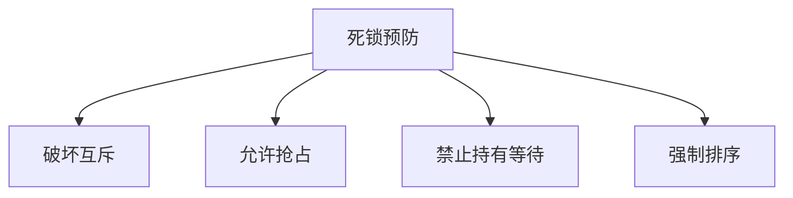

## 第四章：并发与线程

### 4.1 线程的用途
线程用于表示和管理并发任务，适用于以下场景：
1. **程序结构**：表达逻辑上并发的任务（如多任务模拟）。
2. **响应性**：将耗时任务移至后台运行，保持用户界面响应。
3. **性能**：利用多处理器并行执行任务。
4. **I/O管理**：通过并发任务隐藏I/O延迟。

### 4.2 线程抽象
- **定义**：线程是独立的指令序列，可单独调度。
- **特性**：
  - 线程通过调度器在处理器上切换，提供虚拟处理器的抽象。
  - 线程的执行速度和顺序不可预测，需避免依赖时序假设。

### 4.3 简单线程API
- **核心操作**：
  - `thread_create`：创建线程并启动异步过程调用。
  - `thread_yield`：主动让出处理器。
  - `thread_join`：等待线程结束并获取返回值。
  - `thread_exit`：结束线程并返回结果。
- **示例**：多线程“Hello World”程序展示线程创建与同步。

### 4.4 线程数据结构与生命周期
- **线程控制块（TCB）**：存储线程状态（寄存器、栈指针）和元数据（ID、优先级）。
- **共享状态**：代码、全局变量和堆内存由线程共享。
- **生命周期状态**：
  - **INIT**：创建线程并初始化TCB。
  - **READY**：线程可运行，但未分配处理器。
  - **RUNNING**：线程正在执行。
  - **WAITING**：线程等待事件（如I/O完成）。
  - **FINISHED**：线程结束，资源可回收。

### 4.5 线程生命周期管理
- 线程通过调度器在状态间转换（如READY ↔ RUNNING）。
- 等待线程通过条件变量唤醒，移至READY状态。

### 4.6 内核线程实现
- **创建线程**：分配TCB和栈，初始化寄存器并设置启动函数。
- **删除线程**：由其他线程回收资源，避免自删除问题。
- **上下文切换**：
  - **主动切换**：通过`thread_yield`保存当前状态并恢复目标线程状态。
  - **被动切换**：中断触发，保存状态后调度新线程。

### 4.7 内核线程与单线程用户进程的结合
- 进程控制块（PCB）扩展TCB，包含地址空间信息。
- 上下文切换需保存/恢复用户态和内核态状态（如浮点寄存器）。

### 4.8 多线程进程的实现
- **内核支持**：用户线程通过系统调用创建内核线程，共享进程资源。
- **纯用户级线程**：通过库实现，但无法利用多处理器或处理阻塞系统调用。
- **混合模型**：结合内核线程与用户级调度（如调度器激活），提升灵活性和性能。

### 4.9 替代抽象
1. **异步I/O与事件驱动编程**：
   - 单线程通过事件循环处理并发I/O，适用于高延迟任务。
   - 对比线程的优劣：简化逻辑但可能增加代码复杂度。
2. **数据并行编程**：
   - 同一指令并行处理数据（如SIMD或MapReduce），适用于科学计算和媒体处理。
   - GPU加速数据并行任务，提升吞吐量。

### 4.10 总结与未来方向
- **线程的核心价值**：提供并发编程的通用抽象，适用于多核处理器和响应式系统。
- **挑战**：正确性和性能需通过同步机制（如锁和条件变量）保障。
- **趋势**：随着多核普及，线程仍是并发编程的主流模型，但需结合高级抽象（如数据并行）。

### 关键点
- **线程是虚拟处理器**：调度器透明管理物理资源。
- **共享状态需同步**：通过锁和条件变量避免竞态条件。
- **结构化编程**：共享对象封装状态和同步逻辑，简化推理。

## 第5章 同步访问共享对象

### 核心挑战
多线程编程的核心挑战在于**共享状态**的同步访问。当多个线程同时读写共享变量时，程序的行为可能因线程操作的交叉执行（interleaving）而变得不可预测，导致以下问题：
1. **竞态条件（Race Conditions）**：程序结果依赖于线程操作的执行顺序。
2. **非确定性（Nondeterminism）**：程序行为可能因调度、硬件或调试工具的不同而变化。
3. **指令重排序（Reordering）**：编译器和硬件可能优化指令顺序，影响多线程程序的可见性。

### 结构化同步方法
为解决这些问题，本章提出了一种**结构化同步**方法，通过以下方式简化多线程编程：
1. **共享对象（Shared Objects）**：将共享状态封装为对象，限制访问方式。
2. **同步原语（Synchronization Primitives）**：使用锁（Locks）和条件变量（Condition Variables）协调线程访问。
3. **最佳实践（Best Practices）**：遵循固定的设计模式编写共享对象代码。

### 关键同步原语
1. **锁（Locks）**：
   - 提供互斥（Mutual Exclusion），确保同一时间只有一个线程访问共享状态。
   - 接口：`acquire()`和`release()`。
   - 属性：互斥性、进展性（Progress）、有限等待（Bounded Waiting）。

2. **条件变量（Condition Variables）**：
   - 允许线程等待共享状态的特定条件成立。
   - 接口：`wait()`、`signal()`和`broadcast()`。
   - **Mesa语义**：被唤醒的线程需重新检查条件（通过`while`循环），避免虚假唤醒和竞态条件。

### 实现同步原语
1. **单处理器锁**：通过禁用中断实现原子操作。
2. **多处理器自旋锁（Spinlocks）**：利用原子指令（如`test-and-set`）实现忙等待。
3. **队列锁（Queueing Locks）**：结合自旋锁和调度器，减少忙等待的开销。
4. **条件变量实现**：基于锁和等待队列，确保等待和唤醒操作的原子性。

### 信号量（Semaphores）的局限性
信号量虽能实现锁和条件变量的功能，但因其状态性和非模块化设计，代码可读性和正确性较差。推荐优先使用锁和条件变量。

### 案例研究
1. **读者/写者锁（Readers/Writers Lock）**：优化读多写少的场景，允许多个读者同时访问。
2. **同步屏障（Synchronization Barrier）**：确保所有线程到达某一点后再继续执行。
3. **FIFO阻塞队列（FIFO Blocking Queue）**：在Mesa语义下实现公平调度。

### 设计最佳实践
1. **一致性结构**：遵循固定模式（如始终在方法开头获取锁，结尾释放锁）。
2. **避免竞态条件**：共享状态必须通过锁保护。
3. **条件变量等待循环**：始终使用`while`循环检查条件。
4. **避免低效操作**：如忙等待或`thread_sleep`。

### 常见陷阱
1. **双重检查锁定（Double-Checked Locking）**：因指令重排序可能导致错误。
2. **Java同步块**：避免在方法中间使用`synchronized`块，破坏代码清晰性。
3. **共享状态与线程类分离**：避免将共享状态嵌入线程类。

### 总结
多线程编程虽复杂，但通过结构化同步方法（共享对象、锁和条件变量）和严格遵循最佳实践，可以显著降低难度。关键在于：
- **封装共享状态**，限制访问路径。
- **原子化操作**，确保线程安全。
- **模块化设计**，便于推理和维护。

## 第六章：多对象同步

### 6.1 多处理器锁性能
- **核心问题**：多处理器环境下锁成为性能瓶颈，原因：
  - 锁：同一时间只有一个线程持有锁，这限制了并发数量
  - 共享数据通信开销：不同CPU上运行的线程都要访问共享数据，因此共享对象需要从不同CPU的cache中反复移动。这会带来严重的性能损失（cache miss）。
  - 伪共享（False Sharing）：CPU的cache line一般是固定大小，比如64字节。当不同的共享对象共享同一个cache line时，会引起更多的跨处理器通信。

### 6.2 锁设计模式
减轻上述性能影响的一些通用设计模式。

#### 6.2.1 细粒度锁
- 哈希表分桶加锁
- 扩容时的三种解决方案：
  1. 读写锁+互斥锁组合
  2. 获取所有桶锁
  3. 键空间分区

#### 6.2.2 Per-Processor数据结构
- 线程优先访问本地处理器数据
- 示例：内存分配器分区

#### 6.2.3 所有权模式
- 对象移出容器后由单线程独占
- 示例：浏览器多阶段渲染流水线

#### 6.2.4 分层架构
- 系统分阶段处理
- 各阶段通过消息队列通信

### 6.3 锁争用优化
本节讨论两个锁抽象的实现，适用于不同场景下缓解锁的性能瓶颈。
#### 6.3.1 MCS锁
- 适合场景：大量的等待线程（锁通常处于busy状态）
- 基于队列的自旋锁
- 每个线程在独立内存位置自旋

#### 6.3.2 RCU（读-拷贝-更新）
适用场景： 读多写少
主要特性：
- 读者开销小，近乎无锁，写者开销高（需维护多版本）。
- 实现上需要依赖线程调度器的信息，以判断旧版本是否可回收。

### 6.4 多对象原子性
#### 解决方案对比

| 方法          | 优点     | 缺点       |
|---------------|----------|------------|
| 全锁/释放全锁 | 实现简单 | 并发度低   |
| 两阶段锁      | 灵活度高 | 可能死锁   |
| 事务内存      | 编程简单 | 性能开销大 |

### 6.5 死锁
#### 四个必要条件
1. 互斥访问
2. 不可抢占
3. 持有并等待
4. 循环等待

#### 预防策略

#### 银行家算法避免死锁

#### 检测死锁和死锁恢复
恢复：
- Proceed without the resource.
- Transactions: rollback and retry

检测：
- 如果可能发生死锁，就触发repair；
- 更精确的检查：如银行家算法变体

### 6.6 非阻塞并发
不使用锁编写复杂的并发程序。

lock-free：不依赖传统的互斥锁(mutex/lock)来保证线程安全。某些线程保证进展。
wait-free：更进一步，所有线程都保证有进展。

例子：**乐观并发控制**是lock-free的，但不一定是wait-free的：
- Lock-Free性质：
  - 当两个事务冲突时，先提交的会成功
  - 后提交的事务会中止并重试
  - 系统整体仍在前进(至少有一个事务能成功)

- Wait-Free性质：
  - 只有在引入额外机制(如wound-wait)来限制事务重试次数时
  - 才能确保每个事务都能在有限步骤内完成
  - 否则可能发生某些事务不断被中止重试的情况

## 第七章：调度

### 7.1 单处理器调度

| 算法                           | 优点                     | 缺点             | 适用场景       |
|--------------------------------|--------------------------|------------------|----------------|
| **FIFO**                       | 实现简单，低开销         | 长任务阻塞短任务 | 任务长度相近   |
| **Shortest Job  First**        | 最优平均响应时间         | 长任务可能饿死   | 短任务优先场景 |
| **Round Robin**                | 公平性高，无饿死         | 高上下文切换开销 | 交互式系统     |
| **Max-min Fairness**           | IO密集型进程可以快速抢占 | 计算复杂性高     | 带宽分配       |
| **Multi-level Feedback Queue** | 平衡响应与吞吐           | 实现复杂         | 通用操作系统   |

### 7.1 单处理器调度（Uniprocessor Scheduling）
单处理器调度策略的核心目标是在多个任务之间合理分配处理器资源，以优化响应时间、吞吐量和公平性。以下是三种基本调度策略及其特点：
1. **先进先出（FIFO）**
   - **优点**：简单、开销低，适用于任务长度相近的场景。
   - **缺点**：若长任务位于队列前端，短任务需长时间等待，导致平均响应时间较差。
   - **适用场景**：任务长度相近且无优先级差异（如`memcached`）。

2. **最短作业优先（SJF）**
   - **优点**：最小化平均响应时间，适用于短任务优先的场景。
   - **缺点**：长任务可能饿死，响应时间方差大。
   - **适用场景**：静态页面服务器（短任务优先）。

3. **轮转调度（Round Robin）**
   - **优点**：避免饿死，适合混合任务类型。
   - **缺点**：时间片选择影响性能（短时间片增加开销，长时间片降低响应速度）。
   - **适用场景**：流媒体服务（公平分配资源）。

4. **Max-min Fairness**
   - **优点**： IO密集型进程可以快速抢占。
   - **缺点**： 计算复杂性高。
   - **适用场景**： 网络带宽分配，如浏览器访问与下载。

**多级反馈队列（MFQ）**结合了上述策略的优点，通过动态调整任务优先级和时间片，平衡响应时间和公平性。

### 7.2 多处理器调度（Multiprocessor Scheduling）
多处理器调度需解决以下问题：
1. **顺序任务调度**：通过亲和性调度减少缓存失效，提升性能。
2. **并行任务调度**：
   - **Oblivious**：调度器不考虑并发特性，把并发线程当作独立实体来调度。
     - 会有一些问题，如Bulk synchronous delay、生产者-消费者延迟、Lock持有者被抢占等
   - **Gang调度**：同时调度同一应用的所有线程，避免同步延迟。
   - **调度器激活**：定义了一种机制来通知应用它的处理器分配。

### 7.3 能耗感知调度（Energy-Aware Scheduling）
现代系统通过以下方式优化能耗：
- **处理器设计**：动态切换高性能和低功耗模式。
- **处理器使用**：关闭闲置处理器或降低频率。
- **I/O设备管理**：闲置时关闭设备（如WiFi）。

### 7.4 实时调度（Real-Time Scheduling）
实时系统需确保任务在截止时间内完成，主要技术包括：
- **过载配置**：预留冗余资源。
- **最早截止时间优先（EDF）**：优先执行截止时间最近的任务。
- **优先级捐赠**：防止高优先级任务因锁竞争被低优先级任务阻塞。

### 7.5 排队理论（Queueing Theory）
排队理论分析系统负载与响应时间的关系，关键结论：
- **Little定律**：系统中平均任务数 $N = X \times R$（吞吐量 × 响应时间）。
- **响应时间与利用率**：
  - 低利用率时，响应时间接近服务时间。
  - 高利用率时，响应时间非线性增长（如指数分布下 $R = S / (1 - U)$）。
- **突发性影响**：突发任务到达会显著增加队列延迟。

### 7.6 过载管理（Overload Management）
过载时需主动降载：
- **拒绝请求**：如视频流服务限制新连接。
- **降低服务质量**：如简化网页内容或减少更新频率。
- **避免负反馈**：防止任务堆积导致性能进一步下降（如TCP拥塞控制）。

> The key idea in overload management is to design your system to do less work when
overloaded.

### 7.7 案例研究：数据中心服务器（Case Study: Servers in a Data Center）
通过前端服务器分配请求到后端集群，结合负载均衡、亲和性调度和优先级控制，确保高响应性和可扩展性。

### 7.8 总结与未来方向（Summary and Future Directions）
调度策略需平衡响应时间、公平性和资源利用率。未来挑战包括：
- **多核系统**：优化并行应用调度。
- **缓存亲和性**：适应多级缓存架构。
- **能耗管理**：动态调整策略以延长电池寿命。
