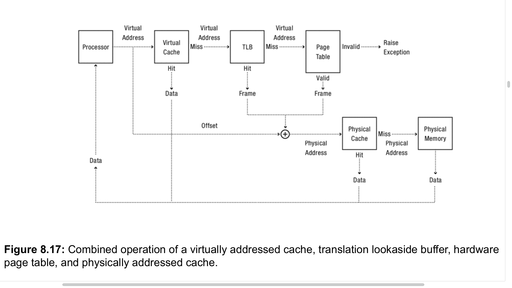

## 第 8 章：地址转换

本章探讨了地址转换的概念，即程序生成的内存地址如何映射到物理内存位置的过程。地址转换使得操作系统能够实现多种高级系统特性。

**8.1 地址转换概念**
地址转换器将程序生成的（虚拟）内存地址转换为物理内存地址，同时检查地址的合法性。  这一过程通常由硬件实现，并由操作系统内核配置。  设计地址转换机制时需要平衡内存保护、内存共享、灵活的内存布局、稀疏地址、运行时查找效率、紧凑的转换表以及可移植性等目标。

**8.2 迈向灵活的地址转换**
本节探讨了如何设计硬件以提供最大的灵活性给操作系统内核。

* **8.2.1 分段内存**
    分段内存通过为每个进程维护一个基址和界限寄存器数组来实现，每个条目控制虚拟地址空间的一部分（段）。  虚拟地址的高位用作段表的索引，段内偏移量与基址相加并与界限比较。  操作系统可以为不同段分配不同权限，如代码段只执行，数据段可读写。  分段内存支持进程间共享某些内存区域（如代码段或共享库），同时保护其他区域。  它还通过写时复制（copy-on-write）技术高效支持 UNIX fork 操作，并通过按需清零（zero-on-reference）高效管理动态分配的内存。  然而，管理大量可变大小和动态增长的内存段会产生外部碎片问题，可能需要代价高昂的内存紧缩操作。

* **8.2.2 页式内存**
    页式内存将物理内存划分为固定大小的块，称为页帧。  每个进程有一个页表，其中的条目指向页帧。  虚拟地址被划分为虚拟页号和页内偏移量；虚拟页号用作页表的索引以获取物理页帧号，然后与页内偏移量组合形成物理地址。  页式内存简化了空闲空间管理，方便了内存共享，并支持写时复制和按需清零等优化。  然而，它可能导致页表本身占用大量空间，尤其是在稀疏的64位虚拟地址空间中，或者因内部碎片而浪费空间。

* **8.2.3 多级转换**
    为解决稀疏地址空间下页表过大的问题，现代系统采用多级转换，如树形结构（分段与分页结合，或多级分页）。  这种方法在灵活性、空间效率、细粒度保护与共享以及查找效率之间取得了平衡。
    * **页式分段 (Paged Segmentation)**：内存首先分段，每个段表条目指向一个页表，该页表再指向构成该段的物理页帧。
    * **多级分页 (Multi-Level Paging)**：虚拟地址被划分为多个部分，每个部分作为一级页表的索引，最终索引到包含物理页帧号的叶级页表。
    * **多级页式分段 (Multi-Level Paged Segmentation)**：结合了前两者，如x86架构，段表（GDT）中的条目指向多级页表。

* **8.2.4 可移植性**
    操作系统需要一个可移植的内存管理层，以适应不同硬件架构的地址转换机制。  这通常涉及维护软件数据结构（如内存对象列表、虚拟到物理转换表、物理到虚拟转换表/核心映射），这些结构可能与硬件页表不同。  一种方法是使用反向页表（inverted page table），即一个哈希表，将虚拟页号映射到物理页帧，其大小与物理页帧数成正比。

**8.3 迈向高效的地址转换**
本节讨论了在不改变逻辑行为的情况下提高地址转换性能的机制，主要通过使用缓存。

* **8.3.1 转换后备缓冲 (TLB)**
    TLB 是一个小型硬件表，缓存了最近的地址转换结果，将虚拟页号映射到物理页帧号和访问权限。  TLB命中时，处理器直接使用该条目形成物理地址；TLB未命中时，硬件执行完整的多级页表查找，并将结果存入TLB。  软件加载的TLB则在未命中时陷入操作系统内核，由内核负责查找并加载TLB。

* **8.3.2 超级页 (Superpages)**
    超级页是将物理内存中一组连续的、特定对齐的页面映射到一个连续的虚拟内存区域，从而减少TLB条目需求，提高TLB命中率。  操作系统负责分配和管理超级页。

* **8.3.3 TLB 一致性**
    当页表条目被修改时，必须确保TLB中的缓存副本保持一致。
    * **进程上下文切换**：带有进程ID标记的TLB (tagged TLB) 允许TLB中保留多个进程的转换条目，切换时只需更改当前进程ID寄存器。
    * **权限降低**：当操作系统降低页面权限时（如实现写时复制），需要从TLB中移除旧的、权限更高的条目。
    * **TLB 击落 (TLB Shootdown)**：在多处理器系统中，修改页表条目时，需要中断所有其他处理器，请求它们从各自的TLB中移除旧条目。

* **8.3.4 虚拟寻址缓存 (Virtually Addressed Caches)**
    在TLB之前使用虚拟寻址缓存可以进一步提高性能，它以虚拟地址为索引存储物理内存内容的副本。  需要处理进程上下文切换时的缓存失效或标记，以及内存地址别名问题（多个虚拟地址映射到同一物理位置）。  通常与TLB协同工作，TLB提供权限，缓存提供数据。

* **8.3.5 物理寻址缓存 (Physically Addressed Caches)**
    许多架构在虚拟寻址缓存和TLB之后、主内存之前使用物理寻址缓存作为二级或三级缓存。  它们可以加速内存引用和处理TLB未命中（因为页表本身可以被缓存）。

**8.4 软件保护**
本节探讨了不依赖硬件地址转换，通过软件技术在受限域内执行代码的方法，主要关注于提高计算机安全。

* **8.4.1 单一语言操作系统**
    限制所有应用程序使用单一、精心设计的安全编程语言编写，如果语言、环境、编译器和运行时系统值得信赖，则无需硬件保护。  示例包括UNIX数据包过滤器和现代Web浏览器中的JavaScript。  这些语言通常提供内存紧缩的垃圾回收，这本身就要求程序不能指向任意内存位置，从而提供了保护。  局限性在于解释器的复杂性和可信度，以及对大量本地代码库的依赖，这些都可能成为攻击向量。

* **8.4.2 语言无关的软件故障隔离**
    通过修改机器指令（例如，在每次加载和存储前插入边界检查，验证间接跳转的目标地址）来确保代码不会访问其自身数据区域之外的内存，从而在不依赖特定语言的情况下隔离代码。  控制流和数据流分析可用于移除不必要的检查。  这种技术可用于在用户级进程内安全执行客户操作系统代码而无需内核支持。

* **8.4.3 通过中间代码实现沙箱**
    编译器生成中间代码，沙箱运行时系统将其中间代码转换为特定处理器架构上的沙箱化机器代码，便于代码修改和数据流分析以强制执行沙箱。  Java虚拟机（JVM）是此类沙箱的一个例子。

**8.5 总结与未来方向**
地址转换是实现多种操作系统服务的强大抽象。  硬件系统已趋向于采用多级段页表和TLB的结构。  软硬件结合的保护机制也日益重要。  未来趋势包括超大规模内存系统、多处理器带来的TLB一致性挑战以及更广泛的用户级沙箱应用。

## 第 9 章：缓存与虚拟内存

本章讨论了缓存在计算机系统设计中的核心作用，特别关注内存值的缓存，以及操作系统如何利用缓存机制实现内存映射文件和虚拟内存。

缓存的设计挑战：
1. Locating the cached copy.
2. Replacement Policy
3. Coherence

**9.1 缓存概念**
缓存存储了可以比原始来源更快访问的数据副本。  内存缓存存储（地址，值）对。  缓存命中指所需数据在缓存中，缓存未命中则不在。  缓存的有效性依赖于较低的命中成本、较高的命中概率（得益于时间局部性和空间局部性）。  缓存通常一次加载一个数据块以利用空间局部性，也可以预取数据。  写操作通常使用写缓冲，可以是写通 (write-through) 或写回 (write-back)策略。

**9.2 内存层级**
计算机系统通常具有多层缓存，从纳秒级的片上缓存到EB级的全球数据中心存储，速度、大小和成本之间存在权衡。  典型的内存层级包括：一级缓存（虚拟寻址）、二级缓存（物理寻址）、三级缓存（共享物理寻址）、多级TLB、主内存(DRAM)、数据中心内存(DRAM，通过协作缓存访问)、本地非易失性内存/磁盘、数据中心磁盘和远程数据中心磁盘。

**9.3 缓存何时有效与无效**
缓存的有效性取决于缓存大小与程序行为的交互。

* **9.3.1 工作集模型 (Working Set Model)**
    程序的“工作集”是指在一段时间内程序频繁访问的指令和数据集合。  如果缓存能够容纳程序的工作集，则缓存命中率高，性能好。  当缓存过小无法容纳工作集时，会发生“颠簸”(thrashing)，导致大部分访问都是缓存未命中。  程序的工作集会随时间变化（阶段性变化），上下文切换也会导致缓存未命中突增。

* **9.3.2 Zipf 模型 (Zipf Model)**
    对于某些访问模式（如Web代理缓存），工作集模型不太适用。  Zipf分布描述了项目的访问频率与其流行度排名成反比的现象。  其特点是重尾分布，即虽然少数项目非常流行，但大量访问仍会流向不那么流行的项目。  在Zipf分布下，增加缓存大小会持续提高命中率，但收益递减。

**9.4 内存缓存查找**
内存缓存查找需要在速度和存储开销之间进行权衡。硬件缓存通常通过限制特定地址的存储位置来加速查找。
* **全相联 (Fully associative)**：地址可以存储在表的任何位置，查找时需检查所有条目。  提供最大的替换灵活性，但硬件开销大。
* **直接映射 (Direct mapped)**：每个地址只能存储在表的一个特定位置（通过哈希确定）。  查找快，但如果多个常用地址哈希到同一位置，会导致颠簸。
* **组相联 (Set associative)**：是前两者的折衷，将直接映射表复制k份（k路组相联），地址可以存储在对应哈希位置的k个副本中的任意一个。  几乎所有现代硬件缓存和TLB都采用组相联。  操作系统需要使用页着色（page coloring）技术，将物理页帧根据其将使用的缓存桶进行分区，以确保应用程序数据均匀分布在缓存中，避免因物理地址分配不当导致的性能下降。

**9.5 替换策略**
当缓存未命中且缓存已满时，需要选择一个内存块进行替换。不同的替换策略适用于不同的工作负载和缓存类型。
* **9.5.1 随机 (Random)**：随机选择一个块替换。  简单，不会出现最差情况（平均而言），但不可预测。
* **9.5.2 先入先出 (FIFO)**：替换在内存中停留时间最长的块。  对于循环扫描远大于缓存大小的内存这类常见工作负载，FIFO性能最差，总是替换下一个将要被访问的块。
* **9.5.3 最佳缓存替换 (MIN)**：替换将来最远才会被访问的块。  这是理论上的最优策略，无法直接实现，但可作为目标。
* **9.5.4 最近最少使用 (LRU)**：替换最长时间未被使用的块。  对于具有良好时间局部性的工作负载表现良好，但在重复扫描内存模式下性能差。
* **9.5.5 最不经常使用 (LFU)**：替换使用频率最低的块。  适用于Zipf分布的引用模式，能保留流行项，即使它们不是最近访问的。
* **9.5.6 Belady 异常 (Belady's Anomaly)**：对于某些替换策略（如FIFO），增加缓存大小反而可能降低缓存命中率。  LRU、LFU和MIN则不会出现此异常。

**9.6 案例研究：内存映射文件**
内存映射文件允许程序将文件内容映射到其虚拟地址空间，像访问内存一样直接通过指令访问文件数据。
* **9.6.1 优点**：包括透明性（无需显式读写）、零拷贝I/O（内核直接映射页表）、流水线操作（无需等待整个文件读入）、进程间通信（通过共享映射文件）以及处理大文件（受限于虚拟地址空间大小）。
* **9.6.2 实现**：内核初始化页表条目为无效；访问无效地址时发生页错误，内核从磁盘读取相应文件块到分配的页帧，更新页表条目为有效，并恢复进程执行。  若需替换页面，内核选择一个页面逐出，更新指向该页的页表条目为无效，若页面被修改（通过硬件“脏位”跟踪）则写回磁盘。
* **9.6.3 近似 LRU**：由于硬件不直接支持完整LRU，操作系统通常使用硬件提供的“使用位”(use bit)来近似LRU。  时钟算法 (Clock Algorithm) 是一种常用方法：内核定期扫描物理内存页，记录并清除使用位，未被使用的页面可被回收。

**9.7 案例研究：虚拟内存**
虚拟内存将每个内存段都用磁盘上的文件做后备，允许系统运行超出物理内存大小的程序。
* **9.7.1 自交换 (Self-Paging)**：为防止恶意或贪婪程序（如“pig”程序示例）占用过多内存导致其他程序颠簸，自交换策略确保每个进程或用户只获得其公平份额的页帧，超出部分则从其自身已分配页中替换。  这可能降低某些情况下的资源利用率。
* **9.7.2 交换 (Swapping)**：当系统总工作集超出物理内存，导致严重颠簸和性能急剧下降时，操作系统可以通过将整个非活动进程的页帧移到磁盘（即交换出去）来防止灾难性性能下降，从而为活动进程释放内存。

**9.8 总结与未来方向**
缓存是计算机科学的核心技术。  操作系统的内存管理是缓存应用的重要案例。  未来趋势包括低延迟后备存储（如固态存储、数据中心远程内存）、可变页大小以及内存感知应用程序。

## 第 10 章：高级内存管理

本章探讨了如何通过捕获和重新解释内存引用及系统调用，利用地址转换机制来构建一系列高级操作系统服务，以提升系统性能、可靠性和安全性。

**10.1 零拷贝 I/O**
为了减少在用户级程序和物理设备（如磁盘、网络硬件）之间流式传输数据时因数据复制跨越保护边界而产生的处理时间开销，可以使用零拷贝I/O技术。  传统方式下，例如Web服务器响应请求，数据需要在网络硬件、内核缓冲区、用户级服务器缓冲区之间多次复制。  零拷贝I/O的两种实用方法是：
1.  **页表操作模拟复制**：对于页对齐的用户级缓冲区，内核通过修改页表指针来模拟用户空间和内核空间之间的数据复制，而非物理复制内存。  例如，从用户空间到内核的写操作，内核将用户缓冲区的页表条目权限改为只读并钉住页面；从内核到用户空间的读操作，内核交换页表条目，使进程页表指向内核缓冲区。
2.  **支持虚拟地址的I/O设备**：某些现代I/O设备可以直接与虚拟地址进行数据传输，内核将用户级缓冲区的虚拟地址交给硬件，由硬件负责遍历多级页表找到物理页帧进行传输。

**10.2 虚拟机**
虚拟机允许宿主操作系统将客户操作系统作为应用程序进程运行。
* **10.2.1 虚拟机页表**
    虚拟机涉及两套页表：一套由宿主操作系统管理，将客户操作系统的“物理”内存（实际上是宿主的虚拟地址）映射到宿主的物理内存；另一套由客户操作系统管理，将其客户进程的虚拟地址映射到客户操作系统的“物理”内存。  当客户操作系统切换到客户进程时，宿主内核需要构建一个影子页表 (shadow page table)，该表是客户页表和宿主页表的组合。  为保持影子页表最新，宿主操作系统需监控客户操作系统对其页表的修改（通常通过将客户页表内存设为只读并捕获写操作）。  Intel等架构已增加硬件支持直接组合页表。  旁路虚拟化 (Paravirtualization) 通过修改客户操作系统以感知虚拟机环境，可以提高效率，例如客户操作系统空闲时可以直接陷入宿主内核。

* **10.2.2 透明内存压缩**
    在数据中心等场景下，为高效运行多个虚拟机，宿主操作系统可以采用透明内存压缩技术以节省内存。  这包括：
    * **共享相同内容的页面**：例如，多个虚拟机内核中的零页可以映射到宿主物理内存中的同一个零页上（设为只读，写时复制）。  宿主内核后台运行的“清道夫”(scavenger)会查找这类可共享的页面。
    * **压缩未使用或相似页面**：对于不完全相同但相似的页面（如不同版本操作系统的细微差异），宿主内核可以将其中一个页面存储为相对于另一个页面的增量（delta）并压缩。  访问时再解压重构。

**10.3 容错**
本节讨论如何管理内存以在系统故障后恢复应用程序数据结构。
* **10.3.1 检查点与重启 (Checkpoint and Restart)**
    通过定期保存进程的完整状态（内存内容、寄存器等）到磁盘（即检查点），可以在故障后从最近的检查点恢复执行（即重启）。  为减少暂停时间，可以在标记应用页面为写时复制后立即重启线程，后台异步完成检查点写入。  此技术也适用于虚拟机迁移。

* **10.3.2 可恢复虚拟内存 (Recoverable Virtual Memory)**
    为实现更细粒度的恢复，可以在初始完整检查点之后，记录一系列对内存的增量更新日志。  故障后，通过读取检查点并按顺序应用日志中的增量检查点来恢复内存状态。  应用程序通常会指定一个持久内存段进行此类恢复。

* **10.3.3 确定性调试 (Deterministic Debugging)**
    通过在虚拟机中记录客户操作系统的初始状态、I/O设备输入数据以及中断的精确时机（如通过指令计数器），可以实现对操作系统和并发应用程序的可重复调试环境。

**10.4 安全**
地址转换是执行不可信代码的基础。  虚拟机可用于创建“蜜罐”(honeypot)，在一个隔离的克隆操作系统中运行可疑应用程序或访问可疑网站，如果发生感染，只需删除虚拟机即可，从而保护底层系统。  这种纵深防御策略通过多层保护增强安全性。

**10.5 用户级内存管理**
现代操作系统允许应用程序在一定程度上管理自己的内存，同时内核保留资源分配和特权内存访问控制权。
* **固定页面 (Pinned pages)**：允许应用程序将虚拟内存页面钉在物理页帧上，防止被换出。
* **用户级页错误处理器 (User-level pagers)**：应用程序可以为内存段指定一个用户级页错误处理器。发生页错误时，内核将控制权传递给该处理器，由其决定如何处理（如从何处获取页面、沙箱行为、替换哪个页面）。

**10.6 总结与未来方向**
地址转换是提供高级操作系统服务的强大工具。  虚拟机层面对检查点、可恢复内存、确定性调试和蜜罐等服务的广泛支持，预示着这些功能可能成为标准操作系统的一部分。  未来，内存管理系统将面临更复杂的内存层级和更多样化的服务需求。  用户级页表和更复杂的运行时系统可能会出现，简化内核的同时赋予应用程序更大的内存管理控制权。
