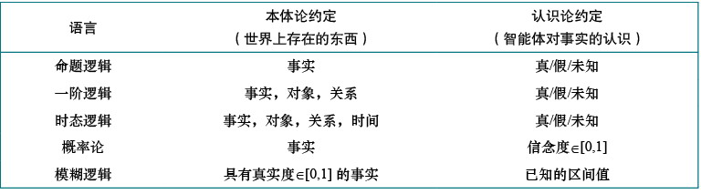

## 第七章：逻辑智能体

### 核心概念
- **知识型智能体**：通过内部知识表示和推理过程决定行动
- **知识库(KB)**：存储关于世界的语句（表示知识）
- **推理机制**：从知识库中推导新结论

### 命题逻辑
- **语法**：命题符号 + 逻辑连接词（¬, ∧, ∨, ⇒, ⇔）
- **语义**：通过真值表定义，模型是命题符号的真值赋值
- **关键概念**：
  - 有效性（永真式）
  - 可满足性
  - 蕴含关系`(α |= β)`

### 推理方法
1. **模型检查**：
   - 枚举所有可能模型
   - 复杂度O(2^n)，不适用于大规模问题

2. **推理规则**：
   - 常用规则：假言推理、与消除、归结
   - 归结规则：完备的推理方法

3. **高效算法**：
   - **DPLL算法**：改进的模型检查，加入：
     - 早期终止
     - 纯符号启发式
     - 单元子句启发式
   - **WALKSAT**：局部搜索算法，适合可满足问题

### 知识型智能体设计
- **知识表示**：
  - 后继状态公理（解决框架问题）
  - 感知与状态表示（带时间上标的命题）

- **状态估计**：
  - 维护表示可能状态的逻辑语句
  - 保守近似（1-CNF表示）

- **规划**：
  - 将规划问题转化为可满足性问题（SATPLAN）
  - 需要添加前提公理和动作互斥公理

### 局限性与扩展
- 命题逻辑表达能力有限
- 无法简洁表示时间、空间和对象间通用关系
- 需要更强大的表示语言（如一阶逻辑）

## 第八章：一阶逻辑
### 逻辑语言

### **一阶逻辑的语法与语义**
   - **语法**：在命题逻辑基础上扩展，引入**项**（表示对象）、**量词**（全称量词∀和存在量词∃）和**变量**。
   - **语义**：模型包括对象集合和解释函数，将常量、谓词和函数符号映射到对象、关系和函数上。量化句子的真值通过扩展解释确定。

### **一阶逻辑的应用**
   - **家族关系**：通过谓词（如Parent、Sibling）和函数（如Mother）定义亲属关系。
   - **数字与集合**：使用Peano公理定义自然数，通过集合论公理描述集合操作。
   - **Wumpus世界**：用一阶逻辑简洁地表示环境状态和规则，避免命题逻辑的冗余。
   - **电子电路**：通过谓词和函数描述电路结构，验证其功能。

### **知识工程**
   - 开发知识库的步骤包括：明确问题、收集知识、选择词汇、编码一般知识、描述具体问题、提出查询和调试。
   - 以电子电路为例，展示了如何通过一阶逻辑表示电路结构和功能，并验证其正确性。
