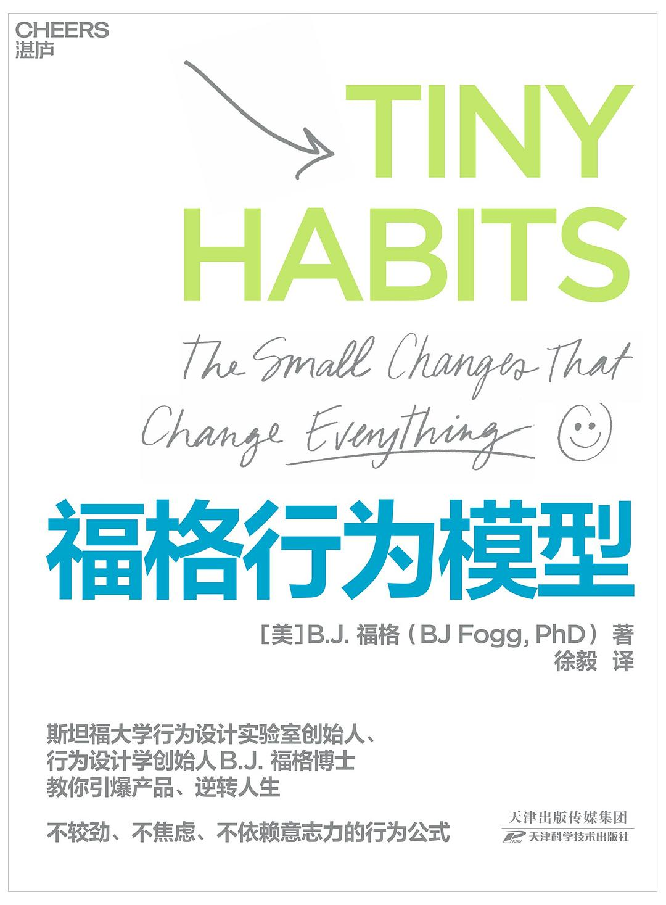
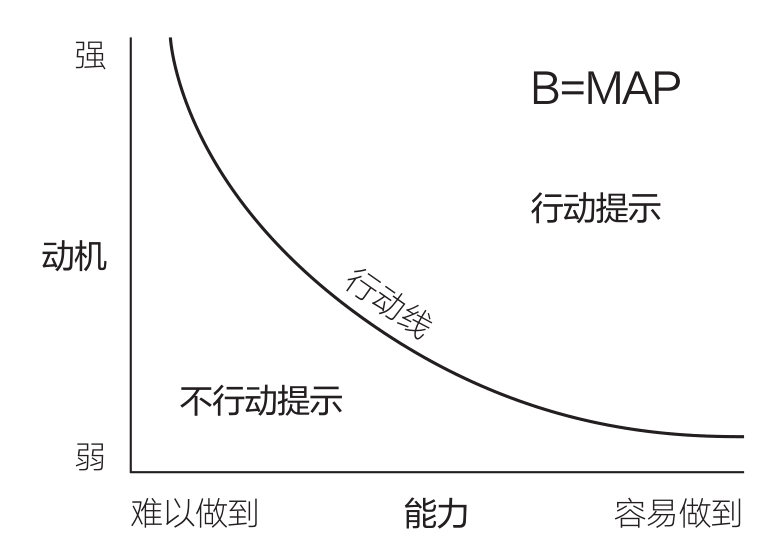
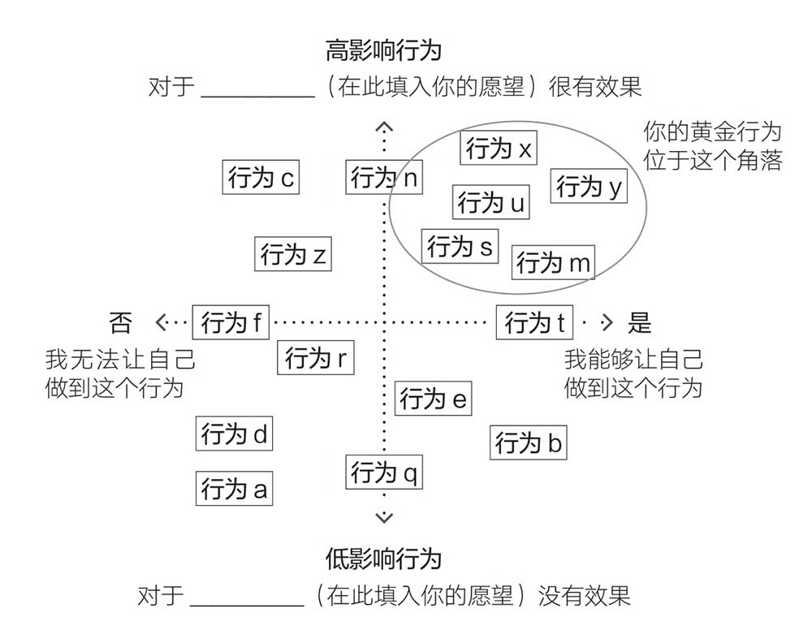

### 书籍信息
<!--

-->
::: {.columns}

:::: column
\
::::

:::: column
* 书名：福格行为模型
* 原作名：Tiny Habits: The Small Changes That Change Everything
* 作者： [美] B.J.福格
* 译者: 徐毅
* 出版社：天津科学技术出版社
::::
:::

<!--

-->

<!--

-->
```{=ignore}
<!--

-->

* 书名：福格行为模型
* 原作名：Tiny Habits: The Small Changes That Change Everything
* 作者： [美] B.J.福格
* 译者: 徐毅
* 出版社：天津科学技术出版社
* 出版年: 2021-10

<!--

-->
```
<!--

-->

### 作者简介
<!--

-->
::: {.columns}

:::: column
\
::::

:::: column
* 斯坦福大学行为设计实验室创始人，行为设计学创始人，深入研究人类行为超过20年，提出了福格行为模型。
* Instagram、Clubhouse创始人的创业导师。
* “微习惯学院”创始人。

::::
:::

<!--

-->

<!--

-->
```{=ignore}
<!--

-->
* 斯坦福大学行为设计实验室创始人，行为设计学创始人，深入研究人类行为超过20年，提出了福格行为模型。
* Instagram、Clubhouse创始人的创业导师。
* “微习惯学院”创始人。

<!--

-->
```
<!--

-->

## 福格行为模型：理论

### 概述
福格行为模型：适用于描述人类**所有行为**的通用模型

福格原则：
1. 帮助人们做他已经想做的事
2. 帮助人们感受成功

---

三个要素共同决定了行为是否会发生:
动机(Motivation)、​能力(Ability)、​提示(Prompt)

\

当行为未发生时，应该按照提示--能力--动机的顺序来诊断问题：
- 大多数人都以为要想实施某种行为，就必须先解决动机问题，但实际上它是最后一步要解决的问题

### 行为三要素之： 动机(Motivation)
人们是否有意愿去做某事
 - 通常涉及六个核心驱动力：愉悦/痛苦、希望/恐惧、社交接受/拒绝
 - 动机很复杂，而且波动十分频繁，容易暴涨暴跌
 - 将动机用于追逐抽象概念无法产生结果
   - 触及真正想做的事情
 - 在福格行为模型的3个要素中，动机是最不可预测和最不可靠的

---

- 从愿望到行为：找到容易做到且对愿望高影响的黄金行为
     

### 行为三要素之：​能力(Ability)
人们是否有能力执行某个行为
- 能力因素：时间、金钱、身体努力、脑力劳动、社交协同和社会许可
- 能力是相对于行为：增强人的能力、降低行为难度
- 从微习惯开始
  - 把行为变得微小：（培养读书习惯）
    - 入门步骤：翻开书
    - 缩小规模：只阅读一个段落
  - 避免不做大事就干脆放弃的心态
  - 追求持续，不追求完美
- 从福格行为模型的角度来说，能力是维持习惯最可靠的要素

### 行为三要素之：​​提示(Prompt)
触发行为的信号或事件，可以是外部的（如闹钟）或内部的（如饥饿感）

- 提示的决定性作用: 没有提示，行为就不会发生 。
- 锚点：通过既有日程（锚点）来提示后续行动（新习惯）
  - 匹配物理位置
  - 匹配频率
  - 匹配主题/目的
- 锚点要精确。例如：到公司 → 到达工位
- 珍珠习惯：把原本惹人厌烦的事情，转化成美好的提示

### 情绪在习惯形成中的关键作用
- 情绪创造习惯
  - 当我们有效地进行庆祝时，大脑里的奖励通路会被激活，会促使大脑铭记当时的行为，从而养成习惯
- 创造成功感觉
  - 及时：想起要执行时、行为过程中、刚刚完成时
  - 简单：找到感觉最自然的庆祝方式
- 日常生活中随时可以庆祝：留意自己表现良好的时刻，并通过庆祝来强化这些良好行为

### 从微习惯到更大的行为改变
- 成功的动能：成功会带来成功
  - 关键是成功的频率而不是大小
- 改变的技巧：
  - 行为塑造：选择和调整习惯
  - 自我洞察：知道哪些新习惯对你有意义
  - 循序渐进：知道何时该推自己一把，提升习惯难度
  - 情境设计：重新设计情境使习惯更易于执行
  - 心态调整：拥抱新身份
    - 身份转变会推动改变加速，它能帮助我们培养出一系列的行为习惯

### 识别和解决坏习惯

坏习惯和好习惯的基本要素并没有本质性不同

行为改变系统方案三个阶段：
1. 培养新习惯
2. 终止旧习惯
3. 用新习惯代替旧习惯

在处理疏忽型或规避型习惯问题时，你要做的是让行为发生，而不是让行为停止，即专注于创建新习惯

### 群体改变
- 行为改变的社会性: 我们的行为受社会环境影响，同时我们的改变也会影响他人
- 改变他人的伦理问题: 核心是遵循福格两大准则——帮助他人做他们想做的事，帮助他们感受成功
- 创造群体改变的方法跟创造个人改变的方法本质相同，但将这些方法付诸实践的方式可能会有所不同

<!--
### PAC
理解人类行为的基础：人物(Person) 行动(Action) 情境(Context)：

|                          | 人物             | 行动                         | 情境           |
|--------------------------|------------------|------------------------------|----------------|
| 动机的来源               | 想要采取行动的人 | 通过采取行动获得的利益或惩罚 | 人物所处环境     |
| 如何使行为更容易做到     | 提升技能         | 让行为变得微小               | 获取资源和工具 |
| 生活中的常见提示         | 人物提示         | 行动提示                     | 情境提示       |
| 习惯形成的三个决定性因素 | 执行习惯的人     | 习惯本身                     | 情境           |
-->

### 总结：行为设计的步骤
1. 明确愿望
   - 修改你的愿望或想取得的成果，直到触及你真正想做的事情。
2. 探索行为选项
   - 列出行为集群
3. 为自己匹配具体行为
4. 从微习惯开始
5. 找到“对”的提示
6. 庆祝成功
7. 排除障碍、重复和扩展

## 福格行为模型：实例

<!--

-->
### 

<!--

-->
**作者通过短信向红十字会捐款**
* **行为 (B)**: 通过短信捐款 。
* **动机 (M)**: 高。作者想要帮助海地地震的受害者 。
* **能力 (A)**: 高。回复短信非常容易 。
* **提示 (P)**: 明确。收到了红十字会的短信提示 。
* **分析**: 这个行为之所以发生，是因为高动机、高能力和明确的提示在同一时刻汇聚，使得行为轻松越过了行动线 。如果能力降低（如需要信用卡号但钱包不在身边）或没有提示（如没收到短信），行为就可能不会发生。

---

**凯蒂整理办公桌的习惯**
* **行为 (B)**: 每天下班前整理办公桌 。
* **动机 (M)**: 中等。这让她第二天感觉精力充沛，感觉良好，尽管最初养成习惯并非刻意选择 。
* **能力 (A)**: 高。非常容易做到，花费时间不到三分钟，而且越做越熟练 。
* **提示 (P)**: 明确。每天关闭电脑后 。
* **分析**: 即使动机不是非常高，但因为行为极其容易（高能力），这个习惯也能稳定地保持在行动线之上 。这体现了能力在维持习惯中的重要性。

---

**凯蒂戒除在床上刷手机的习惯**
* **行为 (B)**: 早上醒来在床上刷社交媒体 。
* **动机 (M)**: 极高。想看朋友动态，喜欢点赞带来的愉悦感，当下感觉很好 。
* **能力 (A)**: 极高。非常容易做到，手机就在手边（用作闹钟） 。
* **提示 (P)**: 明确可靠。手机闹钟每天准时响起 。
* **分析**: 这个“坏”习惯难以戒除，正是因为它有极高的动机和极高的能力，再加上可靠的提示，使其稳稳地处在行动线之上。
* **戒除策略**: 书中分析指出，降低动机很难 ，因此重点应放在降低能力（如把手机放远，删除应用）和移除提示（如用传统闹钟）上。

---

**解决小孩踢飞机座椅的问题**
* **行为 (B)**: 小孩踢前排座椅 。
* **动机 (M)**: 未知，可能是无聊或内在冲动 。
* **能力 (A)**: 高。踢座椅很容易 。
* **提示 (P)**: 可能是内在提示，难以移除 。
* **分析与策略**: 通过送小礼物达成协议降低动机

---

**伴侣丹尼教作者擦拭淋浴间**
* **行为 (B)**: 使用后擦拭淋浴间 。
* **初始状态 (作者不做)**: 动机 (M) 有一些（想要干净，想让伴侣满意）；提示 (P) 有（关掉淋浴）。
* **分析与策略**: 行为未发生的核心在于能力不足。丹尼通过清晰地演示具体、简单的步骤（用毛巾在地板上擦几下），显著提高了作者的能力感知，使行为变得容易，从而越过了行动线。

---

**作者养成做俯卧撑的习惯**
* **行为 (B)**: 做俯卧撑。
* **初始设想 (每天20个)**: 动机 (M) 通常较低；能力 (A) 低（困难）。
* **微习惯版本 (每次小便后做2个)**: 动机 (M) 可能仍不高；但能力 (A) 极高（非常容易）。
* **提示 (P)**: 小便后（具体是冲马桶这个“尾随边缘”动作）。
* **分析**: 这个例子突显了通过极致简化行为（提高能力）来绕开动机不稳定的问题，是微习惯方法的核心技巧之一 。

---

**艾米用便利贴习惯推动业务**
* **问题**: 艾米因离婚压力无法专注工作，拖延重要任务。
* **解决方案**：
  * **微小行为**：每天送孩子上学后，在便利贴上写下当天最重要的任务。
  * **提示（Anchor）**：孩子关上车门的动作（自然锚点）。
  * **庆祝**：完成后拍手说“完成！”。
* **结果**：习惯形成，工作效率提升，最终业务规模扩大。
* **分析**: 尽管动机强烈，但之前的行动被焦虑和不知所措阻碍。通过设计一个极其简单（高能力）的“启动步骤”行为，并将其锚定在一个可靠的日常提示（高可靠性提示）之后，艾米成功启动了行动。后续通过庆祝带来的成功感产生了强大的驱动力，推动了更复杂的行为 。

---

<!--
**朱妮的糖瘾改变**
- **行为目标**：停止吃糖的习惯。
- **动机**：健康问题（糖尿病风险）、母亲去世的悲痛（情绪触发）。
- **能力：**
  - 移除家中含糖零食（减少物理接触）。
  - 用无糖零食替代（降低难度）。
  - 分阶段减少糖摄入（从一餐不吃糖开始）。
- **提示：**
  - 疲劳和悲伤时触发吃糖行为（负面提示）。
  - 用写日记或玩手机游戏替代（替换提示）。
- **分析**：通过降低能力（移除零食）和调整提示（替换行为），逐步减少动机对糖的依赖。

---
-->

**迈克帮助儿子克里斯养成清理咖啡机的习惯**
* **行为 (B)**: 克里斯清理咖啡滤网 。
* **初始状态 (克里斯不做)**:
  * 动机 (M) 低（家庭关系紧张，克里斯冷漠而疏离）；
  * 能力 (A) 低（觉得麻烦，包含多个步骤，感到不知所措）；
  * 提示 (P) 有（使用咖啡机、迈克提醒），但无效。

---

* **分析与策略 (帮助他人改变)**:
    * **澄清愿望/明确行为**: 想要克里斯尊重物品，具体行为是清理咖啡机 。
    * **提高能力**: 迈克没有直接要求完成整个清洁过程，而是将行为极度简化——只要求拿出滤网放在台面上（“启动步骤”）。这大大提高了克里斯完成行为的能力。
    * **利用提示**: 使用咖啡机本身就是提示。
    * **庆祝成功**: 迈克对克里斯完成这个微小的步骤给予真诚的感谢和肯定，帮助克里斯感受到成功 (Shine) 。
    * **逐步增加难度**: 在克里斯稳定完成第一步后，再要求他多做一步（冲洗滤网），最终克里斯甚至主动完成了所有步骤 。
* **核心**: 应用“帮助他人做他们想做的事”（虽然克里斯可能不想清理，但迈克重塑了任务使其可行）和“帮助他人感受成功”的准则。通过降低能力门槛和提供积极反馈来引导行为改变。

---

**琳达的故事**

* **初始状态与挑战：**
  * 琳达经历了常人难以想象的个人悲剧和压力：儿子因药物过量去世、女儿被诊断患有双相情感障碍、丈夫患上早发性阿尔茨海默病并导致家庭破产、失去房产和梦想中的马场。
  * **B=MAP 分析 (初始状态)**:
    * **动机 (M)**: 极度渴望改善状况、照顾孩子、摆脱绝望，但常常被巨大的悲伤和压力压垮，导致行动的动机水平极不稳定，有时甚至为负。
    * **能力 (A)**: 极低。她感到被生活重担压得喘不过气，连早上把脚放到地上这样简单的动作都觉得困难 。执行任何旨在改善状况的“大”行为的能力几乎为零。
    * **提示 (P)**: 生活中充满了负面提示（如担忧、回忆），而积极行动的提示则很缺乏或被忽略。

---

* **微习惯介入与关键转折：**
  1.  **引入“微习惯”**：在极度困难时，琳达接触到了“微习惯”方法。对她来说，宏大的改变很难，但“微小”是她唯一可行的选择。
  2.  **“毛伊习惯”的应用**：
      * **行为 (B)**: 每天早上双脚着地后，说“今天会是美好的一天” 。
      * **动机 (M)**: 即使在不相信这天会很好时也坚持说（有时会加上“不知怎么地”）。
      * **能力 (A)**: 极高。这个行为非常微小，只需几秒钟，极其容易完成 。
      * **提示 (P)**: 每天早上双脚落地（一个极其可靠的“锚点”）。

---

* **拥抱“庆祝”的力量**：
   * **初始困难**: 起初，琳达对“庆祝”微小成功感到不自然和抗拒，认为这不真诚或微不足道。这阻碍了习惯的快速养成。
   * **突破**: 通过尝试“庆祝闪电战”等练习，她开始体验到即使是微小的成功也能带来的积极情绪（发光的感觉）。
   * **B=MAP 分析 (庆祝的作用)**: 庆祝直接作用于**动机 (M)**。通过在行为后立即创造积极情绪，大脑将这个行为与好的感觉联系起来，从而增强了重复该行为的内在动机。这符合福格第二准则：“帮助人们感受成功”。
   * **效果**: 琳达学会了庆祝，这不仅帮助她巩固了习惯，更重要的是改变了她的思维模式，让她开始关注积极面，提升了自信和韧性 。她养成了“庆祝”本身的习惯。

---

* **从微小到转变：**
  * **习惯的成长与繁殖**: 从“毛伊习惯”开始，琳达逐步培养了更多积极的微习惯，这些习惯相互支持、巩固，帮助她应对压力、提升效率、保持健康 。
  * **心态与身份的转变**: 通过不断实践微习惯和庆祝成功，琳达的自我认知发生了根本性转变。她不再仅仅关注自己的不足和生活的困境，而是认识到自己有能力做出改变，并从中获得力量。她从一个被困境压垮的人，转变为一个能够掌控自己情绪和行为、并能帮助他人的人。
  * **成为教练，帮助他人**: 琳达的个人经历和对微习惯的深刻理解，使她成为了一名出色的微习惯教练，帮助了成千上万的人，包括医院里压力巨大的护士们。她的故事本身也成为了激励他人的力量。

<!--
**总结**: 琳达的故事完美诠释了福格行为模型的核心原则。面对动机被极端负面情绪削弱、能力因巨大压力而降低的困境，她通过专注于**极高能力 (A)** 的微小行为，利用可靠的**提示 (P)**（锚点），并最终掌握了通过**庆祝**来主动创造积极情绪以提升**动机 (M)** 的关键技能。这个过程不仅帮助她养成了具体的习惯，更重要的是，通过持续感受成功（Shine），重塑了她的心态和身份认同，实现了从微小改变到人生转变的飞跃。
-->

## 摘抄

<!--

-->
### 

<!--

-->

> 简单是我教给学生最重要的东西，简单才能改变行为。

> 坦率地说，只引用了我的部分研究成果的书并不是完全正确的。

> 我希望你能仔细阅读这本书，最好是养成每天阅读本书的习惯，读完一遍再读一遍。因为这本书真的很有深度。

> 信息-行动谬误：如果我们能为人们提供正确的信息，就能改变人们的态度，进而改变人们的行为。

---

> 改变会带来改变。改变要从人们想改变之处开始。

> 有些事仅凭意志力是很难做到的，迎难而上通常都无法持续。

> 无须思考的行为才称得上真正的习惯，所以，让完成行为需要耗费更多脑力，不失为一个终止习惯或降低其频率的好办法。

> 我坚信，有做好事的潜能却不用来造福人类，这是不道德的。这就像找到了治愈癌症的方法却只留着自己用一样。

<!--
> 有些奥秘如果不知道答案，就会很难解答；可一旦知道了答案，解决方案就显而易见了。

> 大多数人认为动机是行为改变的真正驱动力，但事实并非如此。

> 行为设计强调了这样一个事实：持久改变的关键，在于为自己匹配真心想做的行为。

> 如果你只能从这本书里学到一样东西的话，我希望是：为你的微小成功而庆祝。即使你觉得自己一时之间还无法摆脱困境，生活中的小小改变也能够产生巨大的影响力。庆祝可以成为你的救生绳。

> 你做出的微改变，有些会生长，有些会繁殖。在此过程中，只要你能感受到成功，你的身份认知就会发生改变，这就是你从微小着手逐渐拥抱巨大变化的方式。

> 于是，我顿悟了：我需要更广泛地推广我的见解，而且要立刻。我需要想办法把这一切带给全世界。
-->

---

> **本书讲到的最深刻的改变不是那些零散习惯的形成，而是体验的本质改变：从痛苦到较少的痛苦，从恐惧到希望，从不知所措到充满力量。**

---

<!--

-->

\begin{center}
\Huge 谢谢
\end{center}

<!--

-->
