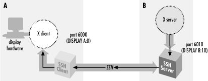

## 窗口系统
### X
### Wayland

当前Linux下主要的桌面环境如GNOME,KDE都支持X和Wayland。

## Remote GUI
通过连接方式可以分为两类：
1. 需要中转服务器来建立连接，基本上是商业软件。如向日葵(sunlogin)，todesk等
2. 不需要中转服务器建立连接，通过网络能直接访问。如ssh X forwarding, krfb，nomachine，x2go等

### ssh X11 forwarding
ssh客户端使用-X或-Y参数，sshd服务端需要配置：
```
X11Forwarding yes
```

#### X11 Forwarding的原理:
ssh 客户端连接时请求X Forwarding，ssh server会把自己设置为代理X server，并且设置DISPLAY环境变量，指向该server。
当在ssh session中执行X client程序时，该X client会根据DISPLAY环境变量，连接到该代理。该代理在X client看来就是一个X server，但它不是直接在当前屏幕上显示。
相反，它把X client的请求转发到ssh client端，而ssh client则作为代理X client，连接到本地的X server，从而进行显示。

相当于ssh 连接充当了X protocol的隧道。remote的X client如同直接连到本地屏幕一样直接显示在本地。




#### X authentication
当X client连接到X server时，X系统需要进行认证。有两种认证方式：
1. Host-based：通过`xhost`可以添加，删除允许连接X server的hostname。只认证hostname，而不会认证用户。即，授权主机的所有用户都可以连接。
2. Key-based: 使用`xauth`来管理X client的authentication key。存储在XAUTHORITY环境变量指定的文件中，默认为`~/.Xauthority`。当X client连接server时，需要提供对应DISPLAY的credential。

请参考 [X Forwarding](https://docstore.mik.ua/orelly/networking_2ndEd/ssh/ch09_03.htm)

### 命令行启动krfb
要想访问远程机器的桌面，最简单的方法是提前在远程机器本地开启桌面共享服务端，然后在后续需要时远程连接。

当我们有ssh连接，但是没有提前运行远程连接服务端时，可以用比较hack的方式通过ssh session启动krfb。方法为：

1. 配置krfb，允许Unattended access，并设置密码。这一步可以提前在图形界面配置好，或者直接拷贝krfb的配置文件(~/.config/.krfbrc)。
2. ssh 连接到远程服务器，配置GUI相关的环境变量：
   2.1 wayland
   `export XDG_SESSION_TYPE=wayland`
   2.2 X
   `export DISPLAY=:1`
   `XAUTHORITY`应该不用配，如果是XWayland，它使用的xauth文件在`/run/user/<userid>/xauth_<xxx>`下。
3. 在上面ssh session中执行`krfb`，然后通过KRDC等客户端即可连接。

> 注意如果远程机器的屏幕配置了空闲自动关闭电源(KDE plasma默认配置)，需要在执行`krfb`前先打开屏幕电源：
> `kscreen-doctor --dpms on`

## 键盘鼠标输入仿真
### [xdotool](https://github.com/jordansissel/xdotool)
只支持X11，不支持wayland。可以用来模拟键盘和鼠标输入，实现移动窗口等操作。

### [ydotool](https://github.com/ReimuNotMoe/ydotool)
通用的Linux 命令行自动化工具，不依赖X或wayland。

### [evemu](https://www.freedesktop.org/wiki/Evemu/)
可以记录和重放输入事件，也可以手动模拟键盘鼠标输入。通过操作kernel的/dev/input设备来实现，不依赖窗口系统。
